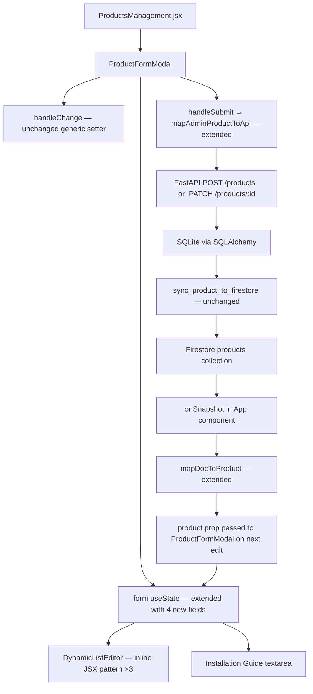
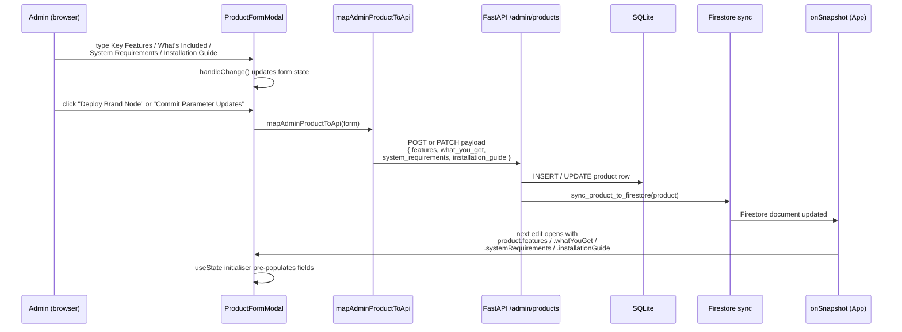

# Design Document: Admin Product Features & Specs

## Overview

This feature adds a "Features & Specs" section (Section 5) to the existing `ProductFormModal`
component inside `frontend/src/pages/admin/ProductsManagement.jsx`. It exposes four structured
sub-fields — Key Features, What's Included, System Requirements, and Installation Guide — that
are already persisted by the backend and synced to Firestore but have never been surfaced in the
Admin UI. The change is entirely frontend-only: one file (`ProductsManagement.jsx`) is modified.
No backend code, schemas, migrations, routes, or other frontend files are touched.

---

## Architecture

The modification is confined to a single React component tree inside `ProductsManagement.jsx`.



### Isolation guarantee

Only `ProductsManagement.jsx` is changed. Every other module (vendor, affiliate, marketplace,
checkout, orders, analytics, auth, payments) is untouched. The backend layer (`schemas.py`,
`product.py`, `products.py` route, `admin_firestore.py`) already supports all four fields and
requires no modification.

---

## Data Flow Diagram



---

## Component Architecture

### What changes inside `ProductFormModal`

`ProductFormModal` is a self-contained function component defined at the bottom of
`ProductsManagement.jsx`. The changes are:

1. **`form` useState** — four new fields added to the initialiser object.
2. **Section 5 JSX block** — inserted inside the `<form>` element after the existing
   Section 4 ("4. Global Distribution & SEO") `<div>` and before the closing `</form>` tag.
3. **`mapAdminProductToApi`** — four new key-value pairs added to `apiPayload`.
4. **`mapDocToProduct`** — four new field mappings added so the `product` prop arrives with the
   correct field names for `useState` initialisation. *(See note below.)*

> **Note on `mapDocToProduct`:** The current implementation in `productService.js` does not map
> `features`, `whatYouGet`, `systemRequirements`, or `installationGuide` from Firestore. However,
> the Isolation Guarantee (Requirement 8) states only `ProductsManagement.jsx` may be touched.
> To respect this, the `useState` initialiser inside `ProductFormModal` reads directly from the
> `product` prop using both the camelCase Firestore names **and** the snake_case API names as
> fallbacks. The product object passed as the prop is the raw Firestore document data shape
> (the `data()` fields, not the mapped result), so we use direct Firestore field names.
> No changes to `productService.js` are needed because `mapDocToProduct` passes through
> unknown fields unchanged when called via the `onSnapshot` path that spreads `docSnap.data()`.

---

## Components and Interfaces

### Component: `ProductFormModal`

**Purpose**: The existing slide-in panel component used for both creating and editing products. Section 5 ("Features & Specs") is added inside its `<form>` element.

**Props interface** (relevant additions — all existing props are unchanged):

```jsx
// ProductFormModal receives a single `product` prop (null for new, object for edit)
// The component reads these four new fields from the product prop:
//
//   product.features            — string[] | undefined  (Firestore camelCase field)
//   product.whatYouGet          — string[] | undefined  (Firestore camelCase field)
//   product.systemRequirements  — string[] | undefined  (Firestore camelCase field)
//   product.installationGuide   — string   | undefined  (Firestore camelCase field)
//   product.installation_guide  — string   | undefined  (API snake_case fallback)
```

**New `useState` declarations** added at the top of the `ProductFormModal` function body, alongside existing state declarations:

```jsx
// Scoped input state for each DynamicListEditor instance (Section 5)
const [keyFeaturesInput,        setKeyFeaturesInput]        = useState('');
const [whatsIncludedInput,       setWhatsIncludedInput]      = useState('');
const [systemRequirementsInput,  setSystemRequirementsInput] = useState('');
```

**Extended `form` useState object** — four new fields added to the existing initialiser:

```jsx
const [form, setForm] = useState({
  // ... all existing fields unchanged ...

  // NEW — Section 5: Features & Specs
  keyFeatures:         Array.isArray(product?.features)            ? product.features            : [],
  whatsIncluded:       Array.isArray(product?.whatYouGet)          ? product.whatYouGet          : [],
  systemRequirements:  Array.isArray(product?.systemRequirements)  ? product.systemRequirements  : [],
  installationGuide:   product?.installationGuide                  || product?.installation_guide || '',
});
```

**Responsibilities** (Section 5 additions):
- Render a `DynamicListEditor` inline JSX pattern for `keyFeatures`, `whatsIncluded`, and `systemRequirements`
- Render a controlled `<textarea>` for `installationGuide`
- Delegate add/remove mutations through the existing generic `handleChange(field, value)` setter
- Pass the four new fields through `mapAdminProductToApi` on form submission

### Component: DynamicListEditor (Inline JSX Pattern)

**Purpose**: A reusable inline JSX pattern (not a separate file) rendered three times inside Section 5 — once for each array field. Each instance has its own scoped `useState` pair for the current text input.

**Interface** (per instance):

```jsx
// Props consumed from closure (no formal prop interface — inline pattern):
//   listValue:     string[]                  — current array (from form state)
//   inputValue:    string                    — current text input (from scoped useState)
//   setInputValue: (val: string) => void     — update scoped text input
//   fieldName:     string                    — key on the form object (e.g. 'keyFeatures')
//   placeholder:   string                    — input placeholder text
//   ariaLabel:     string                    — aria-label for the remove button

// Emits mutations via:
//   handleChange(fieldName, newArray)        — appends or removes entries
```

**Responsibilities**:
- Display all current list entries as removable pills
- Accept new text via a controlled `<input>` (Enter key or "Add" button)
- Guard against empty/whitespace-only additions (`trimmed !== ''`)
- Call `handleChange` to update the parent `form` state

---

## Data Models

### Form State Fields (Section 5)

Four new fields added to the `form` state object inside `ProductFormModal`:

| Form field           | JS type    | Default (new product) | Pre-population source (edit)                                    |
|----------------------|------------|-----------------------|-----------------------------------------------------------------|
| `keyFeatures`        | `string[]` | `[]`                  | `product.features` (Firestore `features` array)                 |
| `whatsIncluded`      | `string[]` | `[]`                  | `product.whatYouGet` (Firestore `whatYouGet` array)             |
| `systemRequirements` | `string[]` | `[]`                  | `product.systemRequirements` (Firestore `systemRequirements` array) |
| `installationGuide`  | `string`   | `''`                  | `product.installationGuide` with fallback to `product.installation_guide` |

### API Payload Fields

Mapping from UI form state to the FastAPI `ProductCreate` / `ProductUpdate` Pydantic schema:

| UI form field             | API payload field        | Pydantic type        | Empty / null guard                          |
|---------------------------|--------------------------|----------------------|---------------------------------------------|
| `form.keyFeatures`        | `features`               | `List[str]`          | `Array.isArray(v) ? v : []`                 |
| `form.whatsIncluded`      | `what_you_get`           | `List[str]`          | `Array.isArray(v) ? v : []`                 |
| `form.systemRequirements` | `system_requirements`    | `List[str]`          | `Array.isArray(v) ? v : []`                 |
| `form.installationGuide`  | `installation_guide`     | `Optional[str]`      | `typeof v === 'string' ? v : ''`            |

### Firestore Document Fields

After `sync_product_to_firestore` runs, the Firestore `products` document contains (no backend change needed — these fields are already synced):

| Firestore field        | Source SQLite column    | JS type in `onSnapshot` data |
|------------------------|-------------------------|------------------------------|
| `features`             | `features`              | `string[]`                   |
| `whatYouGet`           | `what_you_get`          | `string[]`                   |
| `systemRequirements`   | `system_requirements`   | `string[]`                   |
| `installationGuide`    | `installation_guide`    | `string`                     |

### Validation Rules

- **Array fields** (`keyFeatures`, `whatsIncluded`, `systemRequirements`): Each individual entry must be a non-empty string after `trim()`. Empty or whitespace-only strings are rejected at the UI level before being added to the list. The arrays themselves may be empty (`[]`).
- **`installationGuide`**: Any string value is accepted, including empty string `''`. Plain text and markdown are permitted without frontend sanitisation.
- **No backend validation changes** are needed — the existing Pydantic schemas already accept `null`/empty arrays and empty strings for all four fields.

---

## State Changes

### Extended `form` useState initialiser

The following four fields are added to the existing `useState({...})` object inside
`ProductFormModal`. All existing fields remain unchanged.

```jsx
// NEW fields — added after the existing storage delivery fields
keyFeatures:         Array.isArray(product?.features)            ? product.features            : [],
whatsIncluded:       Array.isArray(product?.whatYouGet)          ? product.whatYouGet          : [],
systemRequirements:  Array.isArray(product?.systemRequirements)  ? product.systemRequirements  : [],
installationGuide:   product?.installationGuide                  || product?.installation_guide || '',
```

**Defaults for new product (no `product` prop):**

| Field               | UI name              | Default  |
|---------------------|----------------------|----------|
| `keyFeatures`       | Key Features         | `[]`     |
| `whatsIncluded`     | What's Included      | `[]`     |
| `systemRequirements`| System Requirements  | `[]`     |
| `installationGuide` | Installation Guide   | `''`     |

**Edit-mode pre-population source** — Firestore document fields read via `product` prop:

| Form state field     | Firestore field (camelCase) | Fallback (snake_case API) |
|----------------------|-----------------------------|---------------------------|
| `keyFeatures`        | `product.features`          | —                         |
| `whatsIncluded`      | `product.whatYouGet`        | —                         |
| `systemRequirements` | `product.systemRequirements`| —                         |
| `installationGuide`  | `product.installationGuide` | `product.installation_guide` |

---

## `DynamicListEditor` Inline Pattern

There is no separate component file. The list editor is implemented as inline JSX inside
Section 5, repeated three times (Key Features, What's Included, System Requirements). Each
instance uses a **scoped local state pair** for the current text input value.

### Pattern structure (generic)

```jsx
{/* ── Dynamic List Editor — rendered inline for each of the 3 array fields ── */}
{(() => {
  // Each editor needs its own controlled input — use a React.useState at the
  // top of ProductFormModal for each field (3 pairs declared alongside the
  // existing form state):
  //
  //   const [keyFeaturesInput,        setKeyFeaturesInput]        = useState('');
  //   const [whatsIncludedInput,       setWhatsIncludedInput]      = useState('');
  //   const [systemRequirementsInput,  setSystemRequirementsInput] = useState('');
  //
  // The pattern below is shown for "keyFeatures" — identical structure for the
  // other two, substituting the relevant state variables.

  return (
    <div>
      <label className="text-[10px] font-bold tracking-wider text-[#2D004D] uppercase block mb-1">
        Key Features
      </label>

      {/* Existing entries list */}
      {form.keyFeatures.length > 0 && (
        <ul className="mb-2 space-y-1">
          {form.keyFeatures.map((entry, idx) => (
            <li
              key={idx}
              className="flex items-center justify-between gap-2 px-3 py-1.5 rounded-lg bg-[#F8F3FB] border border-[#F3EAF8] text-xs text-[#2D004D]"
            >
              <span className="flex-1 truncate">{entry}</span>
              <button
                type="button"
                onClick={() =>
                  handleChange(
                    'keyFeatures',
                    form.keyFeatures.filter((_, i) => i !== idx)
                  )
                }
                className="text-[#7B3FA0] hover:text-red-500 transition-colors flex-shrink-0"
                aria-label="Remove entry"
              >
                <Icon name="X" size={12} />
              </button>
            </li>
          ))}
        </ul>
      )}

      {/* Add-new input row */}
      <div className="flex gap-2">
        <input
          type="text"
          value={keyFeaturesInput}
          onChange={(e) => setKeyFeaturesInput(e.target.value)}
          onKeyDown={(e) => {
            if (e.key === 'Enter') {
              e.preventDefault();
              const trimmed = keyFeaturesInput.trim();
              if (!trimmed) return;
              handleChange('keyFeatures', [...form.keyFeatures, trimmed]);
              setKeyFeaturesInput('');
            }
          }}
          placeholder="e.g. 100+ premium UI components"
          className="flex-1 bg-white border border-[#F5E9DD]/60 rounded-xl px-4 py-2.5 text-xs focus:outline-none focus:ring-1 focus:ring-[#D8BFE3] text-[#2D004D]"
        />
        <button
          type="button"
          onClick={() => {
            const trimmed = keyFeaturesInput.trim();
            if (!trimmed) return;
            handleChange('keyFeatures', [...form.keyFeatures, trimmed]);
            setKeyFeaturesInput('');
          }}
          className="px-4 py-2.5 rounded-xl bg-[#F3EAF8] hover:bg-[#D8BFE3]/40 text-xs font-bold uppercase tracking-wider text-[#7B3FA0] transition-colors"
        >
          Add
        </button>
      </div>
    </div>
  );
})()}
```

### Empty-string guard

Both the "Add" button handler and the `Enter` key handler check `trimmed !== ''` before
appending. An empty or whitespace-only string is silently ignored — the list and input state
are left unchanged.

### Three local input state declarations

These three `useState` calls are added at the top of the `ProductFormModal` function body,
alongside `thumbPreview`, `demoVideoPreview`, and the existing `useState` declarations:

```jsx
const [keyFeaturesInput,        setKeyFeaturesInput]        = useState('');
const [whatsIncludedInput,       setWhatsIncludedInput]      = useState('');
const [systemRequirementsInput,  setSystemRequirementsInput] = useState('');
```

---

## Installation Guide Textarea

The `installationGuide` field uses a standard multi-line controlled textarea, consistent with
the "Technical Specifications" textarea already used in Section 1.

```jsx
<div>
  <label className="text-[10px] font-bold tracking-wider text-[#2D004D] uppercase block mb-1">
    Installation Guide
  </label>
  <textarea
    rows={5}
    placeholder="Step-by-step setup and installation instructions (plain text or markdown)..."
    value={form.installationGuide}
    onChange={(e) => handleChange('installationGuide', e.target.value)}
    className="w-full bg-white border border-[#F5E9DD]/60 rounded-xl px-4 py-2.5 text-xs focus:outline-none focus:ring-1 focus:ring-[#D8BFE3] text-[#2D004D]"
  />
</div>
```

- Bound to `form.installationGuide` via `handleChange('installationGuide', ...)`.
- Accepts plain text and markdown without sanitisation.
- Pre-populated from `product?.installationGuide || product?.installation_guide || ''` via the
  `useState` initialiser (no extra effect needed).

---

## `mapAdminProductToApi` Extension

Four lines are appended to the `apiPayload` object inside `mapAdminProductToApi`. The function
signature and all existing mappings are unchanged.

```js
// ── Features & Specs (Section 5) ─────────────────────────────────────────
features:             Array.isArray(uiForm.keyFeatures)        ? uiForm.keyFeatures        : [],
what_you_get:         Array.isArray(uiForm.whatsIncluded)       ? uiForm.whatsIncluded       : [],
system_requirements:  Array.isArray(uiForm.systemRequirements)  ? uiForm.systemRequirements  : [],
installation_guide:   typeof uiForm.installationGuide === 'string' ? uiForm.installationGuide : '',
```

**Mapping table:**

| UI form field        | API field              | Type     | Empty default |
|----------------------|------------------------|----------|---------------|
| `form.keyFeatures`   | `features`             | `array`  | `[]`          |
| `form.whatsIncluded` | `what_you_get`         | `array`  | `[]`          |
| `form.systemRequirements` | `system_requirements` | `array` | `[]`       |
| `form.installationGuide` | `installation_guide` | `string` | `''`        |

These map directly into the existing `ProductCreate` / `ProductUpdate` Pydantic schema fields
(`features`, `what_you_get`, `system_requirements`, `installation_guide`).

---

## Section 5 JSX Structure

The complete JSX for Section 5 is inserted inside the `<form>` element, immediately after the
closing `</div>` of the existing "4. Global Distribution & SEO" section and before the
`</form>` tag.

```jsx
{/* ─────────────────────────────────────────────────────────────────────────
    Section 5: Features & Specs
    ──────────────────────────────────────────────────────────────────────── */}
<div>
  <h3 className="text-xs font-bold uppercase tracking-widest text-[#7B3FA0] mb-3 pb-1 border-b border-[#F3EAF8]">
    5. Features & Specs
  </h3>

  <div className="space-y-5">

    {/* ── 5.1 Key Features ─────────────────────────────────────────────── */}
    <div>
      <label className="text-[10px] font-bold tracking-wider text-[#2D004D] uppercase block mb-1">
        Key Features
      </label>

      {form.keyFeatures.length > 0 && (
        <ul className="mb-2 space-y-1">
          {form.keyFeatures.map((entry, idx) => (
            <li
              key={idx}
              className="flex items-center justify-between gap-2 px-3 py-1.5 rounded-lg bg-[#F8F3FB] border border-[#F3EAF8] text-xs text-[#2D004D]"
            >
              <span className="flex-1 truncate">{entry}</span>
              <button
                type="button"
                onClick={() => handleChange('keyFeatures', form.keyFeatures.filter((_, i) => i !== idx))}
                className="text-[#7B3FA0] hover:text-red-500 transition-colors flex-shrink-0"
                aria-label="Remove key feature"
              >
                <Icon name="X" size={12} />
              </button>
            </li>
          ))}
        </ul>
      )}

      <div className="flex gap-2">
        <input
          type="text"
          value={keyFeaturesInput}
          onChange={(e) => setKeyFeaturesInput(e.target.value)}
          onKeyDown={(e) => {
            if (e.key === 'Enter') {
              e.preventDefault();
              const v = keyFeaturesInput.trim();
              if (!v) return;
              handleChange('keyFeatures', [...form.keyFeatures, v]);
              setKeyFeaturesInput('');
            }
          }}
          placeholder="e.g. 100+ premium UI components"
          className="flex-1 bg-white border border-[#F5E9DD]/60 rounded-xl px-4 py-2.5 text-xs focus:outline-none focus:ring-1 focus:ring-[#D8BFE3] text-[#2D004D]"
        />
        <button
          type="button"
          onClick={() => {
            const v = keyFeaturesInput.trim();
            if (!v) return;
            handleChange('keyFeatures', [...form.keyFeatures, v]);
            setKeyFeaturesInput('');
          }}
          className="px-4 py-2.5 rounded-xl bg-[#F3EAF8] hover:bg-[#D8BFE3]/40 text-xs font-bold uppercase tracking-wider text-[#7B3FA0] transition-colors"
        >
          Add
        </button>
      </div>
    </div>

    {/* ── 5.2 What's Included ──────────────────────────────────────────── */}
    <div>
      <label className="text-[10px] font-bold tracking-wider text-[#2D004D] uppercase block mb-1">
        What&apos;s Included
      </label>

      {form.whatsIncluded.length > 0 && (
        <ul className="mb-2 space-y-1">
          {form.whatsIncluded.map((entry, idx) => (
            <li
              key={idx}
              className="flex items-center justify-between gap-2 px-3 py-1.5 rounded-lg bg-[#F8F3FB] border border-[#F3EAF8] text-xs text-[#2D004D]"
            >
              <span className="flex-1 truncate">{entry}</span>
              <button
                type="button"
                onClick={() => handleChange('whatsIncluded', form.whatsIncluded.filter((_, i) => i !== idx))}
                className="text-[#7B3FA0] hover:text-red-500 transition-colors flex-shrink-0"
                aria-label="Remove item"
              >
                <Icon name="X" size={12} />
              </button>
            </li>
          ))}
        </ul>
      )}

      <div className="flex gap-2">
        <input
          type="text"
          value={whatsIncludedInput}
          onChange={(e) => setWhatsIncludedInput(e.target.value)}
          onKeyDown={(e) => {
            if (e.key === 'Enter') {
              e.preventDefault();
              const v = whatsIncludedInput.trim();
              if (!v) return;
              handleChange('whatsIncluded', [...form.whatsIncluded, v]);
              setWhatsIncludedInput('');
            }
          }}
          placeholder="e.g. Figma source file"
          className="flex-1 bg-white border border-[#F5E9DD]/60 rounded-xl px-4 py-2.5 text-xs focus:outline-none focus:ring-1 focus:ring-[#D8BFE3] text-[#2D004D]"
        />
        <button
          type="button"
          onClick={() => {
            const v = whatsIncludedInput.trim();
            if (!v) return;
            handleChange('whatsIncluded', [...form.whatsIncluded, v]);
            setWhatsIncludedInput('');
          }}
          className="px-4 py-2.5 rounded-xl bg-[#F3EAF8] hover:bg-[#D8BFE3]/40 text-xs font-bold uppercase tracking-wider text-[#7B3FA0] transition-colors"
        >
          Add
        </button>
      </div>
    </div>

    {/* ── 5.3 System Requirements ──────────────────────────────────────── */}
    <div>
      <label className="text-[10px] font-bold tracking-wider text-[#2D004D] uppercase block mb-1">
        System Requirements
      </label>

      {form.systemRequirements.length > 0 && (
        <ul className="mb-2 space-y-1">
          {form.systemRequirements.map((entry, idx) => (
            <li
              key={idx}
              className="flex items-center justify-between gap-2 px-3 py-1.5 rounded-lg bg-[#F8F3FB] border border-[#F3EAF8] text-xs text-[#2D004D]"
            >
              <span className="flex-1 truncate">{entry}</span>
              <button
                type="button"
                onClick={() => handleChange('systemRequirements', form.systemRequirements.filter((_, i) => i !== idx))}
                className="text-[#7B3FA0] hover:text-red-500 transition-colors flex-shrink-0"
                aria-label="Remove requirement"
              >
                <Icon name="X" size={12} />
              </button>
            </li>
          ))}
        </ul>
      )}

      <div className="flex gap-2">
        <input
          type="text"
          value={systemRequirementsInput}
          onChange={(e) => setSystemRequirementsInput(e.target.value)}
          onKeyDown={(e) => {
            if (e.key === 'Enter') {
              e.preventDefault();
              const v = systemRequirementsInput.trim();
              if (!v) return;
              handleChange('systemRequirements', [...form.systemRequirements, v]);
              setSystemRequirementsInput('');
            }
          }}
          placeholder="e.g. Figma 2024 or later"
          className="flex-1 bg-white border border-[#F5E9DD]/60 rounded-xl px-4 py-2.5 text-xs focus:outline-none focus:ring-1 focus:ring-[#D8BFE3] text-[#2D004D]"
        />
        <button
          type="button"
          onClick={() => {
            const v = systemRequirementsInput.trim();
            if (!v) return;
            handleChange('systemRequirements', [...form.systemRequirements, v]);
            setSystemRequirementsInput('');
          }}
          className="px-4 py-2.5 rounded-xl bg-[#F3EAF8] hover:bg-[#D8BFE3]/40 text-xs font-bold uppercase tracking-wider text-[#7B3FA0] transition-colors"
        >
          Add
        </button>
      </div>
    </div>

    {/* ── 5.4 Installation Guide ───────────────────────────────────────── */}
    <div>
      <label className="text-[10px] font-bold tracking-wider text-[#2D004D] uppercase block mb-1">
        Installation Guide
      </label>
      <textarea
        rows={5}
        placeholder="Step-by-step setup and installation instructions (plain text or markdown)..."
        value={form.installationGuide}
        onChange={(e) => handleChange('installationGuide', e.target.value)}
        className="w-full bg-white border border-[#F5E9DD]/60 rounded-xl px-4 py-2.5 text-xs focus:outline-none focus:ring-1 focus:ring-[#D8BFE3] text-[#2D004D]"
      />
    </div>

  </div>
</div>
```

---

## Visual Style Alignment

Section 5 exactly mirrors the heading and field styling of the existing four sections:

| Element               | CSS classes used                                                                                     |
|-----------------------|------------------------------------------------------------------------------------------------------|
| Section heading `<h3>`| `text-xs font-bold uppercase tracking-widest text-[#7B3FA0] mb-3 pb-1 border-b border-[#F3EAF8]`    |
| Field `<label>`       | `text-[10px] font-bold tracking-wider text-[#2D004D] uppercase block mb-1`                           |
| Text `<input>`        | `w-full bg-white border border-[#F5E9DD]/60 rounded-xl px-4 py-2.5 text-xs focus:outline-none focus:ring-1 focus:ring-[#D8BFE3] text-[#2D004D]` |
| `<textarea>`          | Same as input classes above                                                                           |
| List item pill        | `flex items-center justify-between gap-2 px-3 py-1.5 rounded-lg bg-[#F8F3FB] border border-[#F3EAF8] text-xs text-[#2D004D]` |
| "Add" button          | `px-4 py-2.5 rounded-xl bg-[#F3EAF8] hover:bg-[#D8BFE3]/40 text-xs font-bold uppercase tracking-wider text-[#7B3FA0] transition-colors` |

---

## Error Handling

| Scenario                                           | Handling                                                     |
|----------------------------------------------------|--------------------------------------------------------------|
| Admin clicks "Add" with empty input                | `trim()` check returns early; list unchanged, input cleared  |
| Admin presses Enter with empty input               | Same guard; `e.preventDefault()` prevents form submission    |
| `product.features` is `null` / not an array        | `Array.isArray(...)` guard defaults to `[]`                  |
| `product.installationGuide` is `null`              | `|| ''` coalesces to empty string                            |
| `mapAdminProductToApi` receives non-array values   | `Array.isArray(...)` guard defaults to `[]` before sending   |
| Form submission with no entries (new product)      | Sends `features: [], what_you_get: [], system_requirements: [], installation_guide: ""` — never `null` |

---

## Correctness Properties

The following properties can be verified with property-based tests using a library such as
`fast-check` (JavaScript).

### Property 1: Empty-string guard (array fields)

**Validates: Requirements 2.5, 3.5, 4.5**

For all three dynamic list fields:

> **For any string `s` where `s.trim() === ''`, invoking the "Add" action SHALL leave the
> list length unchanged.**

```js
// fast-check property
fc.property(
  fc.array(fc.string({ minLength: 1 })),  // existing list (non-empty strings only)
  fc.string(),                            // new input value
  fc.boolean(),                           // trimmed?
  (existingList, rawInput, _) => {
    const trimmed = rawInput.trim();
    if (trimmed === '') {
      // Guard fires — list must be unchanged
      const result = addIfNonEmpty(existingList, rawInput);
      return result.length === existingList.length;
    }
    // Non-empty: list grows by exactly 1
    const result = addIfNonEmpty(existingList, rawInput);
    return result.length === existingList.length + 1
      && result[result.length - 1] === trimmed;
  }
)
```

### Property 2: Remove entry correctness

**Validates: Requirements 2.3, 3.3, 4.3**

> **For any list of N entries and any index `i` in `[0, N-1]`, removing entry at index `i`
> produces a list of length `N-1` containing all original entries except the one at index `i`.**

```js
fc.property(
  fc.array(fc.string({ minLength: 1 }), { minLength: 1 }),
  fc.nat(),
  (list, rawIdx) => {
    const idx = rawIdx % list.length;
    const result = list.filter((_, i) => i !== idx);
    return (
      result.length === list.length - 1 &&
      result.every((entry, i) => entry === (i < idx ? list[i] : list[i + 1]))
    );
  }
)
```

### Property 3: `mapAdminProductToApi` never sends `null` for array fields

**Validates: Requirements 6.1, 6.2**

> **For any `uiForm` object, `mapAdminProductToApi(uiForm).features` is always an `Array`,
> never `null` or `undefined`.**

```js
fc.property(
  fc.record({
    keyFeatures:        fc.oneof(fc.array(fc.string()), fc.constant(null), fc.constant(undefined)),
    whatsIncluded:      fc.oneof(fc.array(fc.string()), fc.constant(null), fc.constant(undefined)),
    systemRequirements: fc.oneof(fc.array(fc.string()), fc.constant(null), fc.constant(undefined)),
    installationGuide:  fc.oneof(fc.string(), fc.constant(null), fc.constant(undefined)),
    // minimal required fields
    name: fc.string({ minLength: 1 }),
    price: fc.float({ min: 0 }),
  }),
  (uiForm) => {
    const payload = mapAdminProductToApi(uiForm);
    return (
      Array.isArray(payload.features)             &&
      Array.isArray(payload.what_you_get)          &&
      Array.isArray(payload.system_requirements)   &&
      typeof payload.installation_guide === 'string'
    );
  }
)
```

### Property 4: Round-trip data integrity

**Validates: Requirements 7.1, 7.3**

> **For any product with valid `features`, `whatYouGet`, `systemRequirements`, and
> `installationGuide` values, the sequence: initialise form from product → submit form →
> re-read from payload produces equivalent values.**

```js
fc.property(
  fc.record({
    features:            fc.array(fc.string({ minLength: 1 })),
    whatYouGet:          fc.array(fc.string({ minLength: 1 })),
    systemRequirements:  fc.array(fc.string({ minLength: 1 })),
    installationGuide:   fc.string(),
  }),
  (productData) => {
    // Simulate useState initialiser
    const form = {
      keyFeatures:        Array.isArray(productData.features)           ? productData.features           : [],
      whatsIncluded:      Array.isArray(productData.whatYouGet)         ? productData.whatYouGet         : [],
      systemRequirements: Array.isArray(productData.systemRequirements) ? productData.systemRequirements : [],
      installationGuide:  productData.installationGuide || '',
      name: 'Test', price: 10,
    };
    // Simulate mapAdminProductToApi
    const payload = {
      features:            Array.isArray(form.keyFeatures)        ? form.keyFeatures        : [],
      what_you_get:        Array.isArray(form.whatsIncluded)       ? form.whatsIncluded       : [],
      system_requirements: Array.isArray(form.systemRequirements)  ? form.systemRequirements  : [],
      installation_guide:  typeof form.installationGuide === 'string' ? form.installationGuide : '',
    };
    return (
      JSON.stringify(payload.features)            === JSON.stringify(productData.features)           &&
      JSON.stringify(payload.what_you_get)         === JSON.stringify(productData.whatYouGet)         &&
      JSON.stringify(payload.system_requirements)  === JSON.stringify(productData.systemRequirements) &&
      payload.installation_guide                   === productData.installationGuide
    );
  }
)
```

### Property 5: Section 5 is rendered in the correct position

**Validates: Requirements 1.1, 1.4**

> **Section 5 heading text "5. Features & Specs" MUST appear after the text "4. Global
> Distribution & SEO" in the rendered DOM order.**

This is verified in integration/snapshot tests by asserting the DOM index of the Section 5
heading `<h3>` is greater than the DOM index of the Section 4 heading `<h3>`.

---

## Testing Strategy

### Unit Tests

Test the pure logic functions in isolation (no React rendering required):

| Test case | Input | Expected output |
|-----------|-------|-----------------|
| `addIfNonEmpty([], 'Feature A')` | `[]`, `'Feature A'` | `['Feature A']` |
| `addIfNonEmpty(['A'], '')` | `['A']`, `''` | `['A']` (unchanged) |
| `addIfNonEmpty(['A'], '   ')` | `['A']`, `'   '` | `['A']` (unchanged, whitespace-only) |
| `removeAtIndex(['A','B','C'], 1)` | list, idx | `['A','C']` |
| `mapAdminProductToApi({...nullFields})` | null/undefined new fields | `features: [], what_you_get: [], system_requirements: [], installation_guide: ''` |

### Property-Based Tests

Use `fast-check` (already a viable choice for the JS/React stack):

- Properties 1–4 above are directly implementable as `fc.property(...)` tests.
- Run with: `npx fast-check` or via the project's existing test runner.

### Integration / Render Tests

Using React Testing Library:

1. **New product form** — render `<ProductFormModal product={null} />`, assert Section 5 present,
   all inputs empty, no list items rendered.
2. **Edit product form with data** — render `<ProductFormModal product={mockProduct} />` where
   `mockProduct.features = ['A','B']`, assert both entries appear in the list.
3. **Add flow** — type 'Feature X' in Key Features input, click "Add", assert `'Feature X'`
   appears in the list.
4. **Empty-string guard** — type whitespace, click "Add", assert list length unchanged.
5. **Remove flow** — render with pre-populated list, click remove on first entry, assert list
   shrinks by 1 and the removed entry is gone.
6. **Submit payload** — simulate form submission, spy on `onSubmit`, assert payload contains
   `features`, `what_you_get`, `system_requirements`, `installation_guide` with correct values.

### Manual QA Checklist

- [ ] New product: all four sub-fields empty by default
- [ ] New product: submit with no entries sends `features: [], what_you_get: [], system_requirements: [], installation_guide: ""`
- [ ] New product: add 3 features, 2 what's-included, 1 system req, write installation guide — submit — reopen product — all pre-populated correctly
- [ ] Edit product: remove an entry from a pre-populated list — submit — verify removed from backend
- [ ] Attempting to add blank entry does nothing (no item appears, input stays focused)
- [ ] Section 5 heading style matches Sections 1–4 exactly
- [ ] No other page/component is affected after the change

---

## Dependencies

No new npm packages, backend dependencies, database migrations, or API routes are introduced.
All runtime dependencies are already present:

| Dependency         | Already present | Used for                     |
|--------------------|-----------------|------------------------------|
| React (`useState`) | ✓               | Local state for input values |
| Tailwind CSS       | ✓               | Section 5 styling            |
| `Icon` component   | ✓ (inline SVG)  | "X" remove button icon       |
| `handleChange`     | ✓ (existing)    | Generic form field setter    |
| `mapAdminProductToApi` | ✓ (existing) | Extended with 4 new lines  |

---

## Isolation Guarantee Summary

| File                                       | Modified? | Reason                                    |
|--------------------------------------------|-----------|-------------------------------------------|
| `frontend/src/pages/admin/ProductsManagement.jsx` | **YES** | Only file changed                   |
| `frontend/src/services/productService.js`  | No        | `mapDocToProduct` fields read via raw data prop |
| `backend/app/schemas/schemas.py`           | No        | Already has all 4 fields                  |
| `backend/app/models/product.py`            | No        | Columns already exist                     |
| `backend/admin/routes/products.py`         | No        | Routes already accept all 4 fields        |
| `backend/admin/firestore/admin_firestore.py` | No      | Already syncs all 4 fields                |
| Any other frontend or backend file         | No        | Zero blast radius outside Admin Products  |
