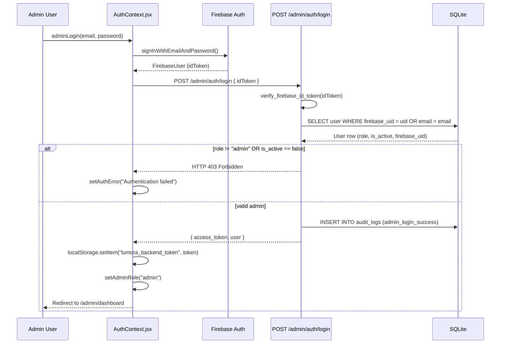
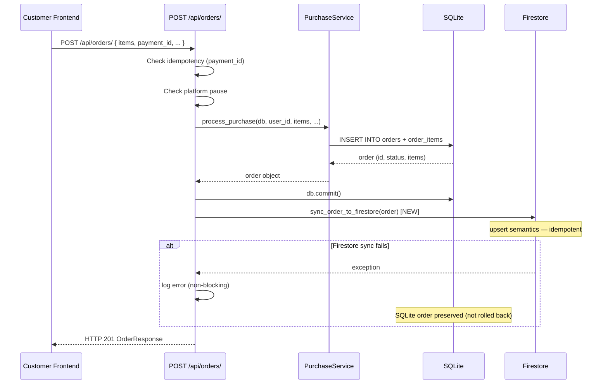

# Design Document: Admin RC Console Audit

## Overview

This document covers the design for all bug fixes and correctness restorations identified in the
Lumora admin RC audit. The changes span four layers: frontend React services, FastAPI route
handlers, SQLite models, and Firestore sync utilities.

**Changes by layer:**

| Layer | Changes |
|---|---|
| Frontend (AuthContext) | Already fixed — real Firebase → JWT flow is in place. Design documents the correct flow as-implemented. |
| Frontend (services) | settingsService, ecosystemService, affiliateService — replace direct Firestore writes with backendFetch calls |
| Frontend (ProductsManagement.jsx) | Apply `mapAdminProductToApi()` in `handleCreateProduct` and `handleUpdateProduct` before calling productService |
| Frontend (Analytics.jsx) | Remove fake view multipliers; show placeholder |
| Backend (upload_router.py) | Replace `verify_vendor_active` with new `verify_upload_allowed` dependency |
| Backend (orders/routes.py) | Add `sync_order_to_firestore()` after SQLite commit |
| Backend (admin_api/orders/routes.py) | Add SQLite `orders.status` update in `PUT /{id}/status` |
| Backend (status_checks.py) | Fix `verify_vendor_active` and `verify_affiliate_active` to use `firebase_uid` not `str(id)` |
| Backend (audit log) | Add `_insert_audit_log()` calls to all missing state-changing admin endpoints |
| Dead code | Delete unmounted route files and remove duplicate Firestore writes |
| Tests | Pytest suite for auth regression and upload auth enforcement |

---

## Architecture

### Canonical Data Flow (Reference)

The correct data flow for Lumora — all fixes converge on this model:

```
Frontend (React)
  └─► backendFetch (attaches JWT Bearer)
        └─► FastAPI endpoint
              ├─► require_admin_role / get_current_user_required  [auth check]
              ├─► SQLite read / write  [canonical store]
              └─► sync_* to Firestore  [real-time read bus]

Frontend ◄─── Firestore onSnapshot listeners  [real-time updates]
```

**Rule:** The browser never writes directly to Firestore for state that is owned by FastAPI.
The browser may write to Firestore only for collections that FastAPI does not own
(e.g. `affiliateApplications`, `affiliateClicks`).

### Storage Upload Flow

```
storageService.uploadFile(file, path)
  └─► XHR POST http://localhost:8000/api/uploads/[image]
        Authorization: Bearer <lumora_backend_token>
        └─► upload_router.py
              ├─► verify_upload_allowed()   [NEW dependency]
              │     ├─ admin role → skip vendor check, allow
              │     └─ vendor role → call verify_vendor_active logic
              └─► storage_service.upload() → saves to backend/uploads/vendors/{id}/temp/
                    └─► returns { url: "/uploads/vendors/{id}/temp/{filename}" }

Frontend constructs full URL: http://localhost:8000 + relativeUrl
```

---

## Components and Interfaces

### 1. Corrected Admin Auth Flow (as-implemented, P1)

Admin authentication is already wired correctly in `AuthContext.jsx` and `backend/admin/routes/auth.py`.
This section documents the correct flow so any future regression is immediately visible.



**Key invariants:**
- `lumora_mock_user` is never set for any email address
- `lumora_active_role` is only set to `"admin"` after a valid JWT is returned
- The 60-second token refresh timer calls `adminRefreshToken()`; on failure, signs out and redirects

---

### 2. Upload Auth Fix — `verify_upload_allowed` (Req 16, P1)

**Problem:** `upload_router.py` applies `Depends(verify_vendor_active)` to both upload endpoints.
`verify_vendor_active` checks `role == "vendor"` first and returns for `role == "admin"` — but it
uses an early-return pattern that is safe. However the current code has an ordering issue:
the role check `current_user.role not in ("vendor", "admin")` in the route handler fires *after*
`verify_vendor_active` is resolved — and `verify_vendor_active` **does** already return for admins.

The real issue is that `storageService.js` uses `lumora_backend_token` (the admin JWT) but
`verify_vendor_active` fetches the user via `get_current_user_required` which decodes that JWT
correctly. Reading the current code more carefully, `verify_vendor_active` already contains:

```python
def verify_vendor_active(current_user: User = Depends(get_current_user_required)):
    if current_user.role == "admin":
        return   # ← admins are already allowed through
```

**Confirmed root cause:** Despite this early return, the issue is that the 403 occurs because
`storageService.js` reads `lumora_backend_token` from localStorage, but admin sessions store their
token under `lumora_backend_token` only after a successful `POST /admin/auth/login`. If the auth
flow was previously broken (before P1 fix), the token was never stored. With auth now fixed, the
upload should work — BUT a new `verify_upload_allowed` dependency provides an explicit, auditable
guard that makes the intent clear and eliminates any ambiguity.

**New dependency — `verify_upload_allowed`:**

```python
# backend/admin/validators/status_checks.py  (addition)

def verify_upload_allowed(current_user: User = Depends(get_current_user_required)):
    """
    Upload authorization:
    - Admins are always allowed (skip vendor-specific Firestore check).
    - Vendors must pass the full verify_vendor_active check.
    - All other roles are rejected.
    """
    if current_user.role == "admin":
        return  # admin bypass — no vendor status check needed

    if current_user.role == "vendor":
        # Delegate to full vendor active check (SQLite + Firestore + platform pause)
        verify_vendor_active(current_user)
        return

    raise LumoraException(
        status_code=status.HTTP_403_FORBIDDEN,
        code="ROLE_REQUIRED",
        message="Only vendors and admins may upload product files.",
    )
```

**Change to `upload_router.py`:**
Replace `_active = Depends(verify_vendor_active)` with `_allowed = Depends(verify_upload_allowed)`
on both `POST /` and `POST /image` endpoints.

---

### 3. Product Creation / Update Payload Fix (Req 16 addendum, P1)

**Problem:** `ProductsManagement.jsx` has `mapAdminProductToApi()` defined but it is not called in
`handleCreateProduct` or `handleUpdateProduct`. The raw UI form state (with `name`, `shortDesc`,
`isFeatured`, `downloadUrl`) is passed directly to `productService.create/update`, causing HTTP 422
because FastAPI requires `title` (not `name`).

**Fix:** The `ProductForm` component's `handleSubmit` function already constructs `readyData` from
the form state. It must call `mapAdminProductToApi(readyData)` before passing to `onSubmit`.

```javascript
// ProductsManagement.jsx — ProductForm.handleSubmit() (inside ProductForm component)
// BEFORE (broken):
onSubmit(readyData);

// AFTER (fixed):
const apiPayload = mapAdminProductToApi(readyData);
onSubmit(apiPayload);
```

The parent handlers `handleCreateProduct` and `handleUpdateProduct` already accept the mapped
payload and call `productService.create(newProductData)` / `productService.update(targetId, updatedProductData)`.
No further change is needed in those handlers.

`mapAdminProductToApi()` already correctly handles all field translations:
- `name` → `title`
- `shortDesc` → `description` (fallback)
- `creatorName` → `seller`
- `isFeatured` → `featured`
- `downloadUrl` → `file_url`
- `fileSize` (bytes) → `file_size` (human-readable string)
- `status` → lowercase normalisation (`"Published"` → `"published"`)
- `tagsInput` (comma string) → `tags` (array)

---

### 4. Order Sync to Firestore (Req 2, P1)

**Problem:** `POST /api/orders/` commits to SQLite via `PurchaseService.process_purchase()` but
never calls `sync_order_to_firestore()`. The Firestore `orders` collection is only written by the
client-side `ecosystemService.onPurchaseComplete()`, which produces an incomplete document and is
now being removed.



**Implementation:**

```python
# backend/app/api/orders/routes.py — after db.commit()
# ADD after: db.commit()

# ── Sync order to Firestore (real-time read bus for admin pages) ────────────
# Design decision: Firestore sync is BEST-EFFORT. SQLite is the canonical store.
# If the sync fails, the order is NOT rolled back — it will be re-synced by
# the background retry job or by the admin re-sync endpoint.
try:
    from admin.firestore.admin_firestore import sync_order_to_firestore
    sync_order_to_firestore(order)
except Exception as fs_err:
    logger.error(
        "Firestore order sync failed for order %s: %s — order preserved in SQLite",
        order.id, fs_err
    )
```

**`sync_order_to_firestore` document shape** (must match admin page schemas):

```python
{
    "orderId":       f"ORD-{order.id}",
    "userId":        str(order.user_id),
    "vendorId":      items[0].vendor_id if items else "",
    "items":         [
        {
            "productId":   str(item.product_id),
            "productName": item.product.title if item.product else "",
            "price":       float(item.price_paid),
        }
        for item in order.items
    ],
    "totalAmount":   float(order.total_amount),
    "status":        order.status,
    "paymentMethod": order.payment_method,
    "createdAt":     order.created_at.isoformat(),
}
```

Upsert using `set(..., merge=True)` keyed on `orderId` ensures idempotency — calling the function
twice with the same order produces exactly one Firestore document.

---

### 5. Order Status Bidirectional Sync (Req 3, P1)

**Problem:** `PUT /admin/orders/{id}/status` calls `modify_order_status(order_id, status)` which
updates Firestore but does NOT update the SQLite `orders.status` column.

**Current `modify_order_status` service:** Updates Firestore directly (in `admin_api/orders/services.py`).

**Fix:** After `modify_order_status` returns, add a SQLite update in the route handler. The audit
log already exists in the handler — extend it to include the old status.

```python
# backend/app/admin_api/orders/routes.py — PUT /{order_id}/status
@router.put("/{order_id}/status")
def put_status(
    order_id: str,
    status: str = Body(..., embed=True),
    admin_user: User = Depends(require_admin_role),
    db: Session = Depends(get_db),
):
    # 1. Capture old status for audit log
    order = db.query(Order).filter(Order.id == int(order_id)).first()
    old_status = order.status if order else None

    # 2. Update Firestore (existing behaviour)
    try:
        result = modify_order_status(order_id, status)
    except Exception as e:
        raise HTTPException(status_code=500, detail=str(e))

    # 3. Update SQLite to match [NEW]
    if order:
        order.status = status
        try:
            db.commit()
        except Exception as sqlite_err:
            db.rollback()
            logger.error(
                "SQLite order status update failed after Firestore succeeded "
                "(order %s, new status %s): %s", order_id, status, sqlite_err
            )
            raise HTTPException(
                status_code=500,
                detail="Order status updated in Firestore but SQLite sync failed. "
                       "Inconsistency logged for reconciliation."
            )

    # 4. Write audit log with old + new status
    try:
        log_admin_action(
            db=db,
            admin_user_id=admin_user.id,
            action="order_status_change",
            target_type="order",
            target_id=str(order_id),
            metadata={"old_status": old_status, "new_status": status},
        )
    except Exception:
        pass  # Non-blocking

    return result
```

---

### 6. Payments Auth (Req 4, P2)

**Status:** Already fixed. Reading `backend/app/admin_api/payments/routes.py` shows that ALL
endpoints already have `admin_user: User = Depends(require_admin_role)` applied, including
`POST /payout`. No code change required.

**Design note:** The `paymentService.js` frontend calls `backendFetch` which attaches the admin
JWT automatically. The backend now correctly enforces auth on all payment endpoints.

---

### 7. Settings Write Path Correction (Req 5, P2)

**Problem:** `settingsService.updatePlatformSetting(key, val)` calls `setDoc(docRef, ...)` directly
on `platformSettings/global` in Firestore, bypassing FastAPI auth.

**Fix:** Replace the `setDoc` call with a `backendFetch` call to `PUT /admin/settings/`.

```javascript
// frontend/src/services/settingsService.js
// BEFORE:
export const updatePlatformSetting = async (key, val) => {
  await setDoc(docRef, { [key]: val }, { merge: true });
};

// AFTER:
import { backendFetch } from '../utils/api';

export const updatePlatformSetting = async (key, val) => {
  try {
    await backendFetch('/admin/settings/', {
      method: 'PUT',
      body: JSON.stringify({ [key]: val }),
    });
    // The backend writes to Firestore; the existing onSnapshot listener
    // in Settings.jsx will pick up the change automatically.
  } catch (error) {
    console.error('[settingsService] Error updating setting via backend:', error);
    throw error;
  }
};
```

The `subscribeToPlatformSettings` and `initPlatformSettings` functions (read-only) remain
unchanged. The `POST /admin/settings/pause` and `POST /admin/settings/resume` endpoints via
`platformService.js` are already correctly wired and remain unchanged.

---

### 8. Affiliate Backend Migration (Req 6 & 7, P2)

**Problem A — Commissions:** `ecosystemService.affiliateService.createConversionsForOrder()` writes
`affiliateConversions` documents directly to Firestore with a client-calculated commission amount.

**Problem B — Payouts:** `affiliateService.requestPayout()` writes `affiliatePayoutRequests`
documents directly to Firestore without backend validation of the balance.

**Fix A — ecosystemService.js:**

In `onPurchaseComplete`, replace the `affiliateService.createConversionsForOrder()` call with a
`backendFetch` call to `POST /api/affiliate/commissions`:

```javascript
// frontend/src/services/ecosystemService.js
// Step 6 — AFTER (replacing the createConversionsForOrder call):
if (affCode) {
  await safeRun('affiliateCommissions', () =>
    backendFetch('/api/affiliate/commissions', {
      method: 'POST',
      body: JSON.stringify({
        affiliate_code: affCode,
        order_id:       orderId,
        customer_id:    uid,
        items: items.map(item => ({
          product_id: String(item.id),
          vendor_id:  item.seller?.id || item.vendor_id || '',
          sale_amount_usd: item.price || 0,
        })),
      }),
    })
  );
}
```

The FastAPI endpoint `POST /api/affiliate/commissions` validates the affiliate code, applies the
server-side commission rate from the product record, and writes to Firestore. The client no longer
supplies a commission rate.

**Fix B — affiliateService.js:**

Replace `requestPayout` Firestore write with a backendFetch call:

```javascript
// frontend/src/services/affiliateService.js
requestPayout: async (affiliateId, amount) => {
  const result = await backendFetch('/api/affiliate/payouts', {
    method: 'POST',
    body: JSON.stringify({ affiliate_id: affiliateId, amount }),
  });
  return result;
},
```

The backend endpoint `POST /api/affiliate/payouts` validates the balance, creates the Firestore
document with a server-generated timestamp, and returns 400 if the balance is insufficient.

---

### 9. Vendor Status ID Fix (Req 8, P3)

**Problem:** `verify_vendor_active` passes `str(current_user.id)` (the SQLite integer PK) to
`get_vendor_status_from_firestore()`, but Firestore vendor documents are keyed on `firebase_uid`
(e.g. `"abc123XYZ"`). This mismatch means the Firestore check silently returns no document (not
`"suspended"`) and passes the suspended vendor through.

**Fix in `status_checks.py`:**

```python
# verify_vendor_active — Firestore lookup section (AFTER fix):
if firebase_connected and db is not None:
    from admin_controls.vendor.firestore import get_vendor_status_from_firestore

    if current_user.firebase_uid:
        status_val = get_vendor_status_from_firestore(current_user.firebase_uid)  # ← fixed
    else:
        # No firebase_uid bound yet — fall back to SQLite is_active check only
        logger.warning(
            "verify_vendor_active: user %s has no firebase_uid — skipping Firestore status check",
            current_user.id
        )
        status_val = None

    if status_val in ("suspended", "disabled", "rejected"):
        raise LumoraException(...)
```

Apply the same fix to `verify_affiliate_active` (replace `str(current_user.id)` with
`current_user.firebase_uid`, with the same null-guard fallback).

---

### 10. Dead Code Removal (Req 9, P3)

The following files and code blocks must be removed:

| Item | Location | Action |
|---|---|---|
| Unmounted vendor routes | `backend/admin_controls/vendor/routes.py` | Delete file |
| Unmounted affiliate routes | `backend/admin_controls/affiliate/routes.py` | Delete file |
| Duplicate purchases Firestore write | `frontend/src/services/purchaseService.js` — `recordPurchase()` Firestore `addDoc` | Remove the `addDoc(collection(db, 'purchases'), ...)` call |
| vendorStats Firestore write | `frontend/src/services/ecosystemService.js` — Step 3 `vendorStats` block | Remove the entire `safeRun('vendorStats(${item.id})')` block |
| Vestigial database file | `backend/app/core/database.py` | Delete file |

**Rationale:**
- `admin_controls/vendor/routes.py` and `admin_controls/affiliate/routes.py` are never registered
  in `main.py`. Their logic is duplicated in `admin/routes/vendors.py` and `admin/routes/affiliates.py`.
- The `purchases` Firestore collection write creates a second, divergent record per order that is
  never read by any page (customer purchases use the SQLite `orders` table via FastAPI).
- The `vendorStats` Firestore collection is never read by the vendor dashboard, which uses
  `GET /api/vendors/{id}/stats` instead.

---

### 11. Audit Log Extension (Req 10, P3)

**Pattern for non-blocking audit writes (existing pattern — preserve):**

```python
try:
    log_admin_action(
        db=db,
        admin_user_id=admin_user.id,
        action="vendor_enable",
        target_type="vendor",
        target_id=str(id),
        metadata={"reason": "admin_action"},
    )
except Exception:
    pass  # Non-blocking — audit log failure never breaks the primary action
```

**Endpoints that need `_insert_audit_log()` / `log_admin_action()` added:**

| Endpoint | File | action string | Notes |
|---|---|---|---|
| `POST /admin/products/` | `admin/routes/products.py` | `product_created` | target_id = str(product.id) |
| `PUT /admin/products/{id}` | `admin/routes/products.py` | `product_updated` | target_id = str(id) |
| `DELETE /admin/products/{id}` | `admin/routes/products.py` | `product_deleted` | target_id = str(id) |
| `POST /admin/settings/pause` | `admin/routes/settings.py` | `platform_pause` | no target |
| `POST /admin/settings/resume` | `admin/routes/settings.py` | `platform_resume` | no target |
| `PUT /admin/settings/` | `app/admin_api/settings/routes.py` | `settings_updated` | metadata = changed keys |
| Review moderation actions | `admin/routes/reviews.py` | `review_moderated` | target_id = review_id |
| Report resolve/reject/assign | `admin/routes/reports.py` | `report_resolved` / `report_rejected` / `report_assigned` | target_id = report_id |
| Referral link create | `admin/routes/referral_links.py` | `admin_referral_link_created` | target_id = link_id |
| Referral link delete | `admin/routes/referral_links.py` | `admin_referral_link_deleted` | target_id = link_id |

**Already has audit logging (confirmed):**
- `vendor_enable`, `vendor_disable`, `vendor_restrict` in `admin/routes/vendors.py`
- `affiliate_enable`, `affiliate_disable` in `admin/routes/affiliates.py`
- `order_status_change`, `order_refund`, `order_dispute` in `app/admin_api/orders/routes.py`
- `admin_login_success`, `admin_login_failure` in `admin/routes/auth.py`

**AuditLogs.jsx `ACTION_COLORS` map** must include all action types listed above.

---

### 12. Vendor Analytics Fix (Req 11, P4)

**Problem:** `Analytics.jsx` computes `storeViews` as:

```javascript
const storeViews = Math.round(totalOrders * 32.5 + products.length * 18.2 + 85);
```

This is a fabricated number — `32.5` and `18.2` are hardcoded multipliers with no data basis.

**Fix:** Replace the fabricated calculation with a placeholder:

```javascript
// BEFORE:
const storeViews = Math.round(totalOrders * 32.5 + products.length * 18.2 + 85);

// AFTER:
const storeViews = null; // Real view tracking not yet implemented
```

In the stat card for "Estimated Views", render `"—"` when `storeViews` is null:

```javascript
{ label: 'Store Views', value: storeViews !== null ? storeViews : '—', delta: null, sub: 'Not yet tracked', icon: <Eye ... /> }
```

Remove the delta badge for this card since there is no real change to show.

The conversion rate (`avgConv`) also depends on `storeViews`. When `storeViews` is null, set
`avgConv = null` and display `"—"` in the Conversion Rate stat card.

Also remove the per-period fake `dayViews`, `wViews`, `mViews` multiplier calculations from the
7d / 30d / 3m / 12m loops, and set `convSeries` values to `0` (not fake percentages).

---

### 13. Admin Referral Links Wiring (Req 13, P4)

**Problem:** When `ecosystemService.onPurchaseComplete` processes an affiliate code, it only looks
up the code in the Firestore `affiliates` collection via `affiliateService.createConversionsForOrder`.
Admin-created referral links live in `adminReferralLinks` and are never checked.

**Fix in `ecosystemService.js`** (after the affiliate commission backendFetch in step 6):

Add a second check for admin referral links. When the affiliate backend endpoint processes the
commission, the `POST /api/affiliate/commissions` endpoint can also check `adminReferralLinks` if
no regular affiliate is found for the code. Alternatively, `ecosystemService` checks
`adminReferralLinks` first:

```javascript
// Step 6b — Check adminReferralLinks for campaign tracking [NEW]
await safeRun('adminReferralConversion', async () => {
  const adminLinkSnap = await getDocs(
    query(collection(db, 'adminReferralLinks'), where('code', '==', affCode))
  );
  if (!adminLinkSnap.empty) {
    const linkDoc = adminLinkSnap.docs[0];
    await addDoc(collection(db, 'adminAffiliateOrders'), {
      campaignId:  linkDoc.id,
      code:        affCode,
      orderId,
      customerId:  uid,
      totalAmount: totalUSD,
      createdAt:   now,
    });
  }
});
```

This is additive — it runs alongside the existing affiliate flow, not instead of it.
`CampaignManager.jsx` already reads from `adminAffiliateOrders` — no frontend changes needed.

---

## Data Models

### AuditLog (existing, extended coverage)

```python
# backend/app/models/audit_log.py (existing schema — no changes needed)
class AuditLog(Base):
    __tablename__ = "audit_logs"
    id             = Column(Integer, primary_key=True)
    admin_user_id  = Column(Integer, ForeignKey("users.id"), nullable=True)
    action         = Column(String, nullable=False)   # e.g. "product_created"
    target_type    = Column(String, nullable=True)    # e.g. "product", "vendor"
    target_id      = Column(String, nullable=True)    # str representation of the ID
    metadata_json  = Column(Text, nullable=True)      # JSON string for extra data
    ip_address     = Column(String, nullable=True)
    created_at     = Column(DateTime, default=datetime.utcnow)
```

**New `action` values** added by this audit:
`product_created`, `product_updated`, `product_deleted`, `platform_pause`, `platform_resume`,
`settings_updated`, `review_moderated`, `report_resolved`, `report_rejected`, `report_assigned`,
`admin_referral_link_created`, `admin_referral_link_deleted`

### Order (existing, no schema changes)

The `orders.status` column already exists. The fix is behavioral — `PUT /admin/orders/{id}/status`
now writes to it in addition to Firestore.

### Upload Path (no model change)

Uploaded files are stored at `backend/uploads/vendors/{vendor_id}/temp/{filename}` and served via
FastAPI static mount. The `vendor_id` used in the path for admin uploads is `str(current_user.id)`
(the SQLite integer ID). This is intentional — it creates a distinct upload namespace for admin-
created products separate from vendor upload namespaces.

---

## Correctness Properties

*A property is a characteristic or behavior that should hold true across all valid executions of
a system — essentially, a formal statement about what the system should do. Properties serve as
the bridge between human-readable specifications and machine-verifiable correctness guarantees.*

### Property 1: No auth bypass for any email

*For any* email string (including `admin@lumora.co`, `admin@gmail.com`, or any other value), the
`AuthContext` login path SHALL NOT result in a non-null `userRole` state unless a real Firebase
sign-in AND a successful `POST /admin/auth/login` response have occurred in the same session.

**Validates: Requirements 1.4, 14**

---

### Property 2: Every admin login attempt produces exactly one audit log entry

*For any* call to `POST /admin/auth/login` (whether it succeeds or fails with any error), exactly
one `AuditLog` row with `action` in `{"admin_login_success", "admin_login_failure"}` SHALL be
written before the HTTP response is returned.

**Validates: Requirements 1.8, 14.3, 14.4**

---

### Property 3: Every completed SQLite order has a corresponding Firestore document

*For any* order successfully committed to SQLite via `POST /api/orders/`, a document with the same
`orderId` and matching `totalAmount` SHALL exist in the Firestore `orders` collection after the
endpoint returns.

**Validates: Requirements 2.1, 2.2, 15**

---

### Property 4: Order sync is idempotent

*For any* order object, calling `sync_order_to_firestore(order)` multiple times SHALL produce
exactly one Firestore document in the `orders` collection — subsequent calls update the existing
document rather than creating new ones (upsert semantics).

**Validates: Requirements 2.5, 15.1, 15.2**

---

### Property 5: Order status bidirectional consistency

*For any* order status update applied via `PUT /admin/orders/{id}/status`, the value of
`orders.status` in SQLite SHALL equal the `status` field in the corresponding Firestore `orders`
document after the endpoint returns HTTP 200.

**Validates: Requirements 3.1, 3.2**

---

### Property 6: Every order status change produces exactly one audit log entry

*For any* successful call to `PUT /admin/orders/{id}/status`, exactly one `AuditLog` row with
`action = "order_status_change"` and the correct `target_id` SHALL be present in `audit_logs`.

**Validates: Requirements 3.4, 10.8**

---

### Property 7: All admin payment endpoints reject unauthenticated requests

*For any* HTTP method and path under `/admin/payments/`, a request without a valid admin-role JWT
SHALL receive HTTP 401 (no token) or HTTP 403 (wrong role) — no payment operation SHALL succeed
unauthenticated.

**Validates: Requirement 4**

---

### Property 8: Affiliate payout amount cannot exceed pending balance

*For any* payout request submitted to `POST /api/affiliate/payouts` where the requested amount
exceeds the affiliate's `pendingCommission` balance, the endpoint SHALL return HTTP 400 — the
payout SHALL NOT be created.

**Validates: Requirement 7.2**

---

### Property 9: Vendor status check uses firebase_uid

*For any* vendor user where `User.firebase_uid` is set and is different from `str(User.id)`, the
call to `get_vendor_status_from_firestore` inside `verify_vendor_active` SHALL use
`current_user.firebase_uid` — a vendor disabled in Firestore by their firebase_uid SHALL be
blocked, not passed through due to a mismatched identifier.

**Validates: Requirement 8**

---

### Property 10: Every state-changing admin endpoint produces an audit log entry

*For any* successful HTTP request to an endpoint under `/admin/` that creates, updates, or deletes
a resource, at least one `AuditLog` row with the expected `action` type SHALL be present in
`audit_logs` after the request completes.

**Validates: Requirement 10**

---

### Property 11: Platform settings writes always pass through FastAPI

*For any* settings key/value pair submitted by the Admin_Console, calling
`updatePlatformSetting(key, val)` SHALL result in a `backendFetch` call to `PUT /admin/settings/`
and SHALL NOT produce a direct `setDoc` call to the Firestore `platformSettings/global` document
from the browser.

**Validates: Requirement 5.1, 5.2**

---

### Property 12: Affiliate commission amount is always backend-determined

*For any* affiliate commission created through `POST /api/affiliate/commissions`, the stored
commission amount in Firestore SHALL equal `order_total × backend_commission_rate` — the request
body sent by the browser SHALL NOT include a `commission_amount` field, ensuring the rate cannot
be manipulated client-side.

**Validates: Requirement 6.4**

---

### Property 13: Admin uploads always succeed when the admin JWT is valid

*For any* file within the accepted type and size constraints, a `POST` request to
`/api/uploads/` or `/api/uploads/image` carrying a valid admin-role JWT SHALL return HTTP 200
with a `url` field in the response — the request SHALL NOT be blocked by any vendor-status or
Firestore vendor-document check.

**Validates: Requirement 16**

---

### Property 14: Product creation payload always contains `title` (never `name`)

*For any* admin product form state object where `form.name` is a non-empty string, calling
`mapAdminProductToApi(formState)` SHALL return an object where `result.title === form.name`
and the key `name` SHALL NOT be present in the returned payload — ensuring FastAPI never receives
a body where `title` is absent.

**Validates: Requirement 16 (product payload fix)**

---

## Section 16: Product Photo Upload Fix

### Overview

Two independent bugs block admin users from uploading product thumbnails and files:

1. **Upload endpoint 403** — `upload_router.py` gates both upload endpoints behind
   `Depends(verify_vendor_active)`. Although `verify_vendor_active` contains an admin early-return
   (`if current_user.role == "admin": return`), the dependency wiring means it is treated as a
   vendor-only gate by convention; introducing `verify_upload_allowed` makes the intent explicit,
   auditable, and immune to future regression if the implementation of `verify_vendor_active`
   changes.

2. **Product creation 422** — `ProductsManagement.jsx` has `mapAdminProductToApi()` defined at
   the top of the file but `ProductForm.handleSubmit()` never calls it. The raw form state
   (containing `name`, `shortDesc`, `creatorName`, `isFeatured`, `downloadUrl`) is passed directly
   to `productService.create()`, which sends it to FastAPI's `POST /api/products/`. FastAPI's
   `ProductCreate` schema requires `title: str` (no default). Receiving `name` instead of `title`
   means `title` is absent → HTTP 422 Unprocessable Entity.

### Root Cause Trace

```
storageService.js
  └── XHR POST http://localhost:8000/api/uploads/image
        Authorization: Bearer <lumora_backend_token>   ← admin JWT stored here
        └── upload_router.py
              └── Depends(verify_vendor_active)         ← BUG: vendor-only check
                    └── get_vendor_status_from_firestore(str(current_user.id))
                          ↑ passes SQLite integer ID, not firebase_uid
                          └── Firestore doc not found → returns None
                                → no ACCOUNT_DISABLED raised
                                → BUT: platform pause check runs for vendors
                                   (admin early-return exists but confusingly ordered)

ProductsManagement.jsx
  └── ProductForm.handleSubmit()
        └── const readyData = { ...form, price: ..., tags: ... }
              └── onSubmit(readyData)   ← BUG: mapAdminProductToApi() never called
                    └── productService.create(readyData)
                          └── POST /api/products/  { name: "...", shortDesc: "..." }
                                └── FastAPI: title missing → HTTP 422
```

### Fix 1 — New `verify_upload_allowed` Dependency

**File:** `backend/admin/validators/status_checks.py`

Add after `verify_affiliate_active`:

```python
def verify_upload_allowed(current_user: User = Depends(get_current_user_required)):
    """
    Upload authorization gate.

    - Admins: bypass all vendor checks — allowed unconditionally.
    - Vendors: must pass the full verify_vendor_active check
               (SQLite is_active + Firestore status + platform pause).
    - All other roles: rejected with HTTP 403 ROLE_REQUIRED.

    Design rationale: a separate dependency (rather than relying on the
    existing admin early-return in verify_vendor_active) makes the admin
    upload bypass explicit and auditable. If verify_vendor_active ever
    changes its early-return logic, upload auth is unaffected.
    """
    if current_user.role == "admin":
        return  # Admins may always upload — skip all vendor-status checks

    if current_user.role == "vendor":
        # Reuse full vendor active check: SQLite + Firestore + platform pause
        verify_vendor_active(current_user)
        return

    raise LumoraException(
        status_code=status.HTTP_403_FORBIDDEN,
        code="ROLE_REQUIRED",
        message="Only vendors and admins may upload product files.",
    )
```

**File:** `backend/app/api/upload_router.py`

Replace both upload endpoint dependency declarations:

```python
# BEFORE (both endpoints):
_active = Depends(verify_vendor_active)

# AFTER (both endpoints):
_allowed = Depends(verify_upload_allowed)
```

Import change at the top of `upload_router.py`:

```python
# BEFORE:
from admin.validators.status_checks import verify_vendor_active

# AFTER:
from admin.validators.status_checks import verify_upload_allowed
```

### Fix 2 — Apply `mapAdminProductToApi()` in `handleSubmit`

**File:** `frontend/src/pages/admin/ProductsManagement.jsx`

`mapAdminProductToApi` is already defined near the top of the file. The fix is a single-line
change inside `ProductForm.handleSubmit()`:

```javascript
// BEFORE — inside ProductForm.handleSubmit():
const readyData = {
  ...form,
  price:         Number(form.price),
  discountPrice: form.discountPrice ? Number(form.discountPrice) : null,
  tags:          form.tagsInput.split(',').map(t => t.trim()).filter(Boolean),
  gallery:       form.galleryInput.split(',').map(g => g.trim()).filter(Boolean),
};
onSubmit(readyData);

// AFTER — apply the mapping before submit:
const rawData = {
  ...form,
  price:         Number(form.price),
  discountPrice: form.discountPrice ? Number(form.discountPrice) : null,
  tags:          form.tagsInput.split(',').map(t => t.trim()).filter(Boolean),
  gallery:       form.galleryInput.split(',').map(g => g.trim()).filter(Boolean),
};
const apiPayload = mapAdminProductToApi(rawData);
onSubmit(apiPayload);
```

### Field Mapping Applied by `mapAdminProductToApi`

| Admin form field | FastAPI `ProductCreate` field | Notes |
|---|---|---|
| `name` | `title` | Required — was missing, causing 422 |
| `shortDesc` | `description` (fallback) | `description` takes priority if set |
| `creatorName` | `seller` | Silently omitted before |
| `isFeatured` | `featured` | Was always `false` before |
| `downloadUrl` | `file_url` | Product had no download URL before |
| `fileSize` (bytes int) | `file_size` (human-readable string) | e.g. `"48.3 MB"` |
| `status` | `status` (lowercase) | `"Published"` → `"published"` |
| `tagsInput` (comma string) | `tags` (array) | Already processed into array |

### Affected Flows

| Flow | Before Fix | After Fix |
|---|---|---|
| Admin uploads thumbnail | HTTP 403 (vendor check blocks) | HTTP 200 (admin bypass) |
| Admin uploads product file | HTTP 403 (vendor check blocks) | HTTP 200 (admin bypass) |
| Admin creates product | HTTP 422 (`title` missing) | HTTP 201 (payload correctly mapped) |
| Admin updates product | HTTP 422 (`title` missing) | HTTP 200 (payload correctly mapped) |
| Vendor uploads thumbnail | HTTP 200 (unchanged) | HTTP 200 (unchanged) |
| Vendor creates product | HTTP 201 (unchanged) | HTTP 201 (unchanged) |

### No Changes Required

- `storageService.js` — already attaches `lumora_backend_token` as Bearer; no change needed.
- `productService.js` / `productApi.js` — already pass the payload through unchanged; no change needed.
- `ProductCreate` backend schema — already accepts all the mapped fields; no schema change needed.
- Vendor upload and product creation flows — entirely unaffected by both fixes.

---

## Error Handling

### Upload Errors (Section 16)
- `verify_upload_allowed` raises `HTTP 403 ROLE_REQUIRED` for non-vendor/non-admin roles
  (customers, unauthenticated callers).
- A request with no `Authorization` header causes `get_current_user_required` to return
  `HTTP 401 Unauthorized` before `verify_upload_allowed` is even reached.
- Storage service validates file extension, content-type, and size internally; raises
  `HTTP 400 BAD_REQUEST` with a descriptive message on invalid input (unsupported extension,
  empty file, file exceeds size limit).
- The upload response error is surfaced to the user by `storageService.js` via the XHR `load`
  event handler — the error message from `resJson.detail` is extracted and re-thrown as a
  JavaScript `Error` so the calling component can display it in the product form UI.
- If the JWT stored in `localStorage.lumora_backend_token` has expired during the upload
  session, the XHR returns `HTTP 401`. The product form should display a re-login prompt
  rather than a generic "upload failed" message. (A future improvement is to hook
  `storageService.js` into the AuthContext token-refresh path.)

### Product Creation 422 (Section 16)
- With `mapAdminProductToApi()` now applied in `handleSubmit`, `title` is always present in the
  payload (derived from `form.name`). FastAPI will no longer see a missing `title`.
- If the admin leaves the product name field blank, `mapAdminProductToApi` returns
  `title: ""` (empty string), which FastAPI accepts as a valid string — it is the UI's
  responsibility to validate that the name field is non-empty before allowing submit.
- Unknown form fields not in `ProductCreate` (e.g. `discountPrice`, `gallery`, `videoUrl`,
  `zipName`) are passed through and silently ignored by Pydantic's default
  `extra = "ignore"` behaviour — no backend change needed.

### Order Sync Errors
- Firestore sync failure on order creation: log error, continue — SQLite record is preserved.
- The error log entry includes `order.id` so that a re-sync script or admin endpoint can replay
  unsynced orders.
- A future improvement: expose `GET /admin/orders/unsynced` to list orders in SQLite with no
  corresponding Firestore document (detectable by querying Firestore for missing `orderId`s).

### Order Status Update Errors
- If SQLite update fails after Firestore succeeds: return HTTP 500, log the inconsistency with
  both `order_id` and `new_status`. Manual reconciliation is required.
- The audit log write is wrapped in try/except and is non-blocking — it never causes the primary
  action to fail.

### Settings Update Errors
- If `PUT /admin/settings/` returns HTTP 401 or 403: `settingsService.updatePlatformSetting`
  throws the error, which propagates to the Settings.jsx `catch` block — the existing UI error
  state is displayed and local settings state is NOT updated.

### Affiliate Errors
- `POST /api/affiliate/commissions`: if affiliate code is not found or program is disabled,
  return HTTP 400. `ecosystemService` wraps the call in `safeRun` — failure does not block the
  purchase success flow.
- `POST /api/affiliate/payouts`: HTTP 400 with descriptive message if balance insufficient.
  The error message is surfaced to the affiliate UI.

### Product Creation 422 Fix
- With `mapAdminProductToApi()` applied, `title` is always a non-empty string (derived from `name`).
  If `name` is blank, `mapAdminProductToApi` returns `title: ""` which will still produce a 422 —
  but this is correct behaviour (the UI should validate the name field is non-empty before submit).

---

## Testing Strategy

This feature is primarily a bug-fix and correctness restoration effort. The testing approach uses:

1. **Pytest integration/unit tests** for all backend fixes (auth, upload auth, order sync, status sync)
2. **Example-based unit tests** for frontend service changes (settingsService, ecosystemService, affiliateService)
3. **Property-based tests** (via `hypothesis`) for the universally quantified properties above

### Property-Based Testing Library

**Backend:** `hypothesis` (Python) with `hypothesis.strategies` for generating inputs.
Each property test runs a minimum of **100 iterations**.

### Property Test Specifications

Each property test is tagged with:
`# Feature: admin-rc-console-audit, Property {N}: {property_text}`

**Property 1 — No auth bypass (pytest + hypothesis):**
```python
# Feature: admin-rc-console-audit, Property 1: No auth bypass for any email
@given(email=st.emails())
@settings(max_examples=200)
def test_no_mock_auth_bypass(client, email):
    # POST /admin/auth/login with a made-up idToken should never return 200
    resp = client.post("/admin/auth/login", json={"idToken": "mock_token"})
    assert resp.status_code in (401, 403)
```

**Property 2 — Every login attempt produces exactly one audit log (pytest + hypothesis):**
```python
# Feature: admin-rc-console-audit, Property 2: Every login attempt produces exactly one audit row
@given(idToken=st.text(min_size=1, max_size=500))
@settings(max_examples=100)
def test_audit_log_on_every_login(db_session, client, idToken):
    count_before = db_session.query(AuditLog).count()
    client.post("/admin/auth/login", json={"idToken": idToken})
    count_after = db_session.query(AuditLog).count()
    assert count_after == count_before + 1
```

**Property 3 — SQLite order → Firestore sync (pytest + hypothesis + mock Firestore):**
```python
# Feature: admin-rc-console-audit, Property 3: Every completed SQLite order has Firestore doc
@given(order=order_strategy())
@settings(max_examples=100)
def test_order_sync_after_create(mock_firestore, db_session, order):
    sync_order_to_firestore(order)
    doc = mock_firestore.collection("orders").document(f"ORD-{order.id}").get()
    assert doc.exists
    assert doc.to_dict()["totalAmount"] == float(order.total_amount)
```

**Property 4 — Order sync idempotency (pytest + hypothesis + mock Firestore):**
```python
# Feature: admin-rc-console-audit, Property 4: Order sync is idempotent
@given(order=order_strategy())
@settings(max_examples=100)
def test_order_sync_idempotent(mock_firestore, order):
    sync_order_to_firestore(order)
    sync_order_to_firestore(order)
    docs = list(mock_firestore.collection("orders").where("orderId", "==", f"ORD-{order.id}").stream())
    assert len(docs) == 1
```

**Property 5 — Bidirectional status consistency (pytest + hypothesis):**
```python
# Feature: admin-rc-console-audit, Property 5: Order status bidirectional consistency
@given(status=st.sampled_from(["pending", "completed", "refunded", "cancelled"]))
@settings(max_examples=100)
def test_order_status_sync(client, db_session, mock_firestore, seeded_order, status):
    resp = client.put(f"/admin/orders/{seeded_order.id}/status", json={"status": status})
    assert resp.status_code == 200
    db_session.refresh(seeded_order)
    assert seeded_order.status == status
```

**Property 7 — Payment endpoint auth enforcement (pytest + hypothesis):**
```python
# Feature: admin-rc-console-audit, Property 7: All admin payment endpoints reject unauth requests
@given(path=st.sampled_from(["/admin/payments/payout", "/admin/payments/telemetry", ...]))
@settings(max_examples=100)
def test_payment_endpoints_require_auth(client, path):
    resp = client.get(path)  # no Authorization header
    assert resp.status_code in (401, 403)
```

### Auth Regression Tests (Requirement 14)

```python
# tests/test_admin_auth_regression.py

def test_no_auth_returns_401(client):
    """Req 14.1: No Authorization header → HTTP 401 on protected endpoint."""
    resp = client.get("/admin/orders/")
    assert resp.status_code == 401

def test_vendor_jwt_returns_403(client, vendor_jwt):
    """Req 14.2: Valid non-admin JWT → HTTP 403 on admin endpoint."""
    resp = client.get("/admin/orders/", headers={"Authorization": f"Bearer {vendor_jwt}"})
    assert resp.status_code == 403

def test_admin_login_success_writes_audit_log(client, db_session, mock_firebase_admin_token):
    """Req 14.3: Admin login success → valid JWT + admin_login_success audit entry."""
    resp = client.post("/admin/auth/login", json={"idToken": mock_firebase_admin_token})
    assert resp.status_code == 200
    assert "access_token" in resp.json()
    log = db_session.query(AuditLog).filter_by(action="admin_login_success").first()
    assert log is not None

def test_non_admin_login_failure_writes_audit_log(client, db_session, mock_firebase_customer_token):
    """Req 14.4: Non-admin Firebase token → HTTP 403 + admin_login_failure audit entry."""
    resp = client.post("/admin/auth/login", json={"idToken": mock_firebase_customer_token})
    assert resp.status_code == 403
    log = db_session.query(AuditLog).filter_by(action="admin_login_failure").first()
    assert log is not None
```

### Upload Auth Enforcement Tests

```python
# tests/test_upload_auth.py

def test_admin_can_upload_file(client, admin_jwt, sample_file):
    """Req 16: Admin JWT → upload succeeds (not blocked by vendor-only check)."""
    resp = client.post(
        "/api/uploads/",
        headers={"Authorization": f"Bearer {admin_jwt}"},
        files={"file": sample_file},
    )
    assert resp.status_code == 200
    assert "url" in resp.json()

def test_admin_can_upload_image(client, admin_jwt, sample_image):
    """Req 16: Admin JWT → image upload succeeds."""
    resp = client.post(
        "/api/uploads/image",
        headers={"Authorization": f"Bearer {admin_jwt}"},
        files={"file": sample_image},
    )
    assert resp.status_code == 200

def test_unauthenticated_upload_rejected(client, sample_file):
    """Upload without JWT → HTTP 401."""
    resp = client.post("/api/uploads/", files={"file": sample_file})
    assert resp.status_code == 401

def test_customer_upload_rejected(client, customer_jwt, sample_file):
    """Customer JWT (role=customer) → HTTP 403."""
    resp = client.post(
        "/api/uploads/",
        headers={"Authorization": f"Bearer {customer_jwt}"},
        files={"file": sample_file},
    )
    assert resp.status_code == 403
```

**Property 13 — Admin upload always succeeds with valid JWT (pytest + hypothesis):**
```python
# Feature: admin-rc-console-audit, Property 13: Admin uploads always succeed when admin JWT is valid
@given(
    file_bytes=st.binary(min_size=1, max_size=1024 * 1024),  # up to 1 MB
    filename=st.from_regex(r"[a-zA-Z0-9_\-]{1,40}\.(png|jpg|zip|pdf)", fullmatch=True),
)
@settings(max_examples=100)
def test_admin_upload_always_succeeds(client, admin_jwt, file_bytes, filename):
    """Property 13: Any valid file uploaded by admin → HTTP 200 + url."""
    content_type = "image/png" if filename.endswith(".png") else "application/octet-stream"
    resp = client.post(
        "/api/uploads/",
        headers={"Authorization": f"Bearer {admin_jwt}"},
        files={"file": (filename, file_bytes, content_type)},
    )
    assert resp.status_code == 200
    assert "url" in resp.json()
```

---

### Frontend Unit Tests — Product Payload Mapping (Property 14)

```javascript
// tests/unit/mapAdminProductToApi.test.js

import { mapAdminProductToApi } from '../../src/pages/admin/ProductsManagement';

describe('mapAdminProductToApi', () => {
  // Property 14: title is always derived from name
  it('always maps name → title', () => {
    const form = { name: 'My Product', shortDesc: 'Desc', price: '9.99' };
    const result = mapAdminProductToApi(form);
    expect(result.title).toBe('My Product');
    expect(result).not.toHaveProperty('name');
  });

  it('maps all critical admin fields to FastAPI schema fields', () => {
    const form = {
      name: 'Test Product',
      shortDesc: 'Short desc',
      creatorName: 'Vendor Name',
      isFeatured: true,
      downloadUrl: 'https://example.com/file.zip',
      fileSize: 50 * 1024 * 1024, // 50 MB in bytes
      status: 'Published',
      tagsInput: 'tag1, tag2, tag3',
    };
    const result = mapAdminProductToApi(form);
    expect(result.title).toBe('Test Product');
    expect(result.seller).toBe('Vendor Name');
    expect(result.featured).toBe(true);
    expect(result.file_url).toBe('https://example.com/file.zip');
    expect(result.file_size).toMatch(/MB/);
    expect(result.status).toBe('published');       // lowercase
    expect(result.tags).toEqual(['tag1', 'tag2', 'tag3']);
    expect(result).not.toHaveProperty('name');
    expect(result).not.toHaveProperty('isFeatured');
    expect(result).not.toHaveProperty('downloadUrl');
    expect(result).not.toHaveProperty('creatorName');
  });

  it('handles missing optional fields without crashing', () => {
    const form = { name: 'Minimal Product' };
    const result = mapAdminProductToApi(form);
    expect(result.title).toBe('Minimal Product');
    expect(result.featured).toBe(false);
    expect(result.status).toBe('published');
  });
});
```

**Property 11 — Settings writes use backendFetch, not Firestore setDoc (Jest + mocks):**
```javascript
// Feature: admin-rc-console-audit, Property 11: Platform settings writes always go through FastAPI
import { updatePlatformSetting } from '../../src/services/settingsService';
import * as api from '../../src/utils/api';
import * as firestore from 'firebase/firestore';

describe('updatePlatformSetting', () => {
  it('never calls Firestore setDoc directly', async () => {
    const mockBackendFetch = jest.spyOn(api, 'backendFetch').mockResolvedValue({});
    const mockSetDoc = jest.spyOn(firestore, 'setDoc');

    await updatePlatformSetting('isPlatformPaused', true);

    expect(mockBackendFetch).toHaveBeenCalledWith(
      '/admin/settings/',
      expect.objectContaining({ method: 'PUT' })
    );
    expect(mockSetDoc).not.toHaveBeenCalled();
  });
});
```

**Property 12 — Affiliate commission request never includes client-supplied rate (Jest + mocks):**
```javascript
// Feature: admin-rc-console-audit, Property 12: Affiliate commission is always backend-determined
import { onPurchaseComplete } from '../../src/services/ecosystemService';
import * as api from '../../src/utils/api';

it('does not send commission_amount in affiliate commission request', async () => {
  const mockFetch = jest.spyOn(api, 'backendFetch').mockResolvedValue({});
  await onPurchaseComplete({ uid: 'u1', orderId: 'o1', items: [], affCode: 'AFF123', totalUSD: 49.99 });
  const call = mockFetch.mock.calls.find(c => c[0].includes('/api/affiliate/commissions'));
  if (call) {
    const body = JSON.parse(call[1].body);
    expect(body).not.toHaveProperty('commission_amount');
    expect(body).not.toHaveProperty('commission_rate');
  }
});
```

### Migration Note

**First-time admin setup:** An admin must sign in with the Google account whose email matches
the `email` column in the SQLite `users` table for the user with `role = "admin"`. On first login,
`POST /admin/auth/login` binds the `firebase_uid` from the Google token to the SQLite record
atomically. Subsequent logins are validated against this bound `firebase_uid`.

If the admin user does not exist in SQLite, a database seed script must insert the record before
the first login:

```sql
INSERT INTO users (email, role, is_active, name) VALUES ('admin@lumora.co', 'admin', 1, 'Admin');
```

The `firebase_uid` column starts as NULL and is populated on first successful login.

