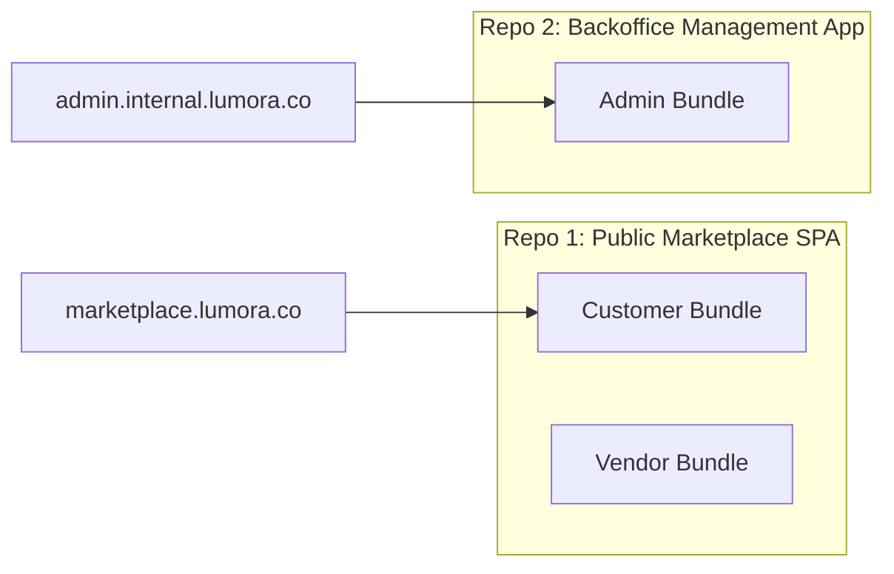
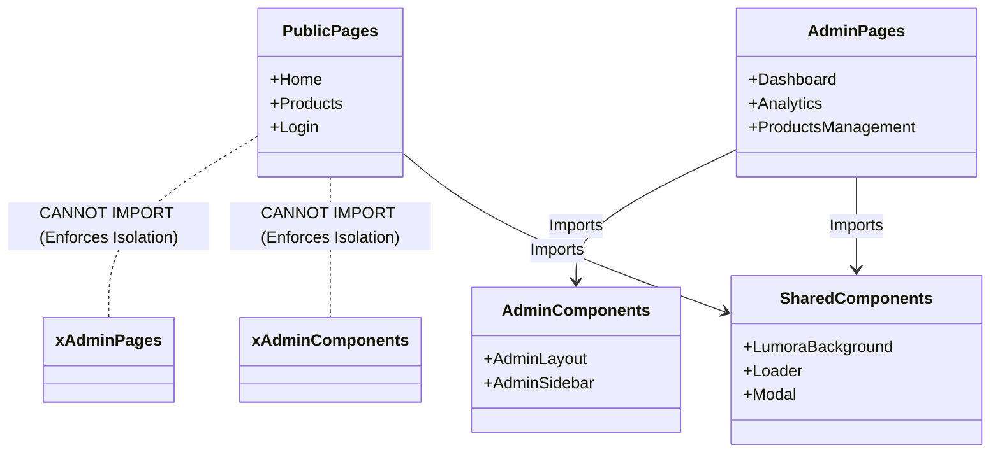

# Admin Architecture Diagram & Isolation Strategy

This document outlines the architectural design, physical boundaries, and isolation policies of the internal Lumora Admin Portal.

---

## 🏛️ System High-Level Architecture

```mermaid
graph TB
    subgraph Client Application (Vite SPA)
        subgraph Public Marketplace Apps
            CustomerView["Customer App (/customer)"]
            VendorView["Vendor Dashboard (/vendor)"]
            AffiliateView["Affiliate Dashboard (/affiliate)"]
        end

        subgraph Secure Internal App
            AdminView["Admin Portal (/admin)"]
        end
    end

    subgraph Authentication Gateways
        FirebaseAuth["Firebase Auth SDK"]
    end

    subgraph Secure REST Backend
        FastAPIApp["FastAPI Backend (Uvicorn)"]
        SQLiteDB["PostgreSQL / SQLite Metadata"]
    end

    subgraph Realtime Data Storage
        FirestoreDB["Google Cloud Firestore"]
        FirebaseStorage["Firebase Storage Buckets"]
    end

    %% Routing Boundaries
    AdminView -.->|Role Verification| FirebaseAuth
    Public Marketplace Apps -->|Public Authenticated| FirebaseAuth

    %% Data Boundary Connections
    AdminView ===>|REST APIs / Admin JWT| FastAPIApp
    AdminView ===>|Direct Listeners / Read-Write| FirestoreDB
    FastAPIApp --->|Read-Write| SQLiteDB
    FastAPIApp -.->|Firebase Admin SDK| FirestoreDB
```

---

## 📂 Project Organization & Isolation Audit

### Current Folder Layout
```
/frontend
  /src
    /pages
      /admin           <-- Isolated Admin pages (12 views)
      /customer        <-- Customer UI bundle
      /vendor          <-- Vendor UI bundle
      /affiliate       <-- Affiliate UI bundle
    /services          <-- Shared and individual service bridges
/backend
  /app
    /admin_api         <-- FastAPI Admin REST endpoints
```

---

## ⚖️ Future Recommendations: Monorepo vs. Multi-App Separation

For production readiness, it is recommended to split the Admin Portal into a completely separate React application in the future.

### Trade-offs & Analysis Table

| Dimension | Option A: Combined SPA (Current) | Option B: Physical Micro-App / Separate Bundle (Recommended) |
| :--- | :--- | :--- |
| **Security & Leakage** | **High Risk**: Admin Javascript bundles, routes, and API models are physically present in the main public client build. | **Zero Leakage**: Admin codebase is physically decoupled. Customers cannot access Admin source files. |
| **Initial Load Time** | **Higher**: Even with lazy-loading, dependency metadata and CSS files bloat the bundle size for mobile customers. | **Optimized**: Marketplace load times are kept minimal. Internal assets only load for backoffice computers. |
| **CI/CD Pipeline** | Any deploy of the public marketplace requires rebuilding/testing the admin assets, increasing build durations. | Independent release cycles. Admin dashboard fixes can be rolled out without triggering customer site deployments. |
| **Firestore Rules** | Requires strict user-role-conditional rules inside firestore.rules to prevent user spoofing. | Easier isolation rules (can lock down collection write permissions specifically). |

### Proposed Physical Separation Architecture



---

## 🧩 Component & Bundle Leakage Analysis

To prevent bundle leakage in the current structure, strict boundary rules must be followed:



---

*For detailed auth gate information, refer to [ADMIN_AUTHENTICATION.md](file:///d:/SAM(DIGI)/digital-marketplace/Digi/digital-marketplace/ADMIN_AUTHENTICATION.md).*
