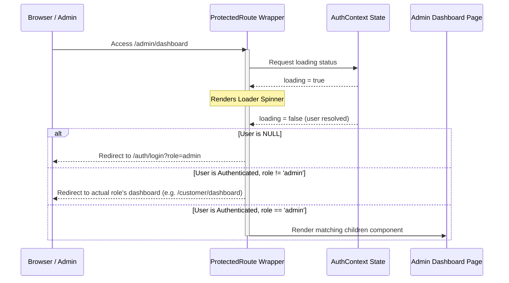

# Admin Authentication & Access Control

This document outlines the authentication pathways, route guards, and local verification mechanisms for the admin panel.

---

## 🔐 Authentication Separation Architecture

The admin portal operates on a distinct credentials portal. Admin authentication is isolated from the marketplace's public login flow.

```mermaid
graph TD
    subgraph Entrance Portals
        PublicEntrance["Public Portal Route (/auth/login-selection)"]
        InternalEntrance["Internal Backoffice Url (/auth/login?role=admin)"]
    end

    subgraph Firebase Auth Gateways
        AuthClient["Firebase Auth client-side SDK"]
    end

    subgraph User Role Mapping
        DBCheck{"Read Firestore 'users/{uid}' role"}
        AdminRedirect["Access Approved -> Redirect /admin/dashboard"]
        PublicRedirect["Redirect /customer/dashboard OR /vendor/dashboard"]
        RejectGate["Force Logout & HTTP 403 / Redirect to Selection"]
    end

    PublicEntrance -->|Customer/Vendor/Affiliate Credentials| AuthClient
    InternalEntrance -->|Admin Credentials| AuthClient

    AuthClient --> DBCheck
    
    DBCheck -->|role == 'admin'| AdminRedirect
    DBCheck -->|role in ['customer', 'vendor', 'affiliate']| PublicRedirect
    
    %% Mismatches
    PublicRedirect -.->|Attempts to load /admin/*| RejectGate
```

---

## 🛡️ Route Guard Sequence (`ProtectedRoute`)

All paths matching `/admin/*` are wrapped by the `ProtectedRoute` component, which checks login state and resolves authorization recursively:



---

## 🛠️ Backoffice Local Development Session Bypass

To support quick evaluations and testing on local environments, the `AuthContext.jsx` includes a mock admin credentials bypass:

### Quick Fill Credentials
* **Email**: `admin@lumora.co` or `admin@gmail.com`
* **Password**: Any string with 6+ characters (e.g., `admin123`)

### Execution Details
When these credentials are submitted, the login handler intercepts the request locally:

```javascript
if (email === 'admin@lumora.co' || email === 'admin@gmail.com') {
  const mockUser = {
    uid: 'admin-mock-uid',
    email: email,
    displayName: 'Lumora Admin',
    emailVerified: true
  };
  setUser(mockUser);
  setUserRole('admin');
  localStorage.setItem('lumora_active_role', 'admin');
  localStorage.setItem('lumora_mock_user', JSON.stringify(mockUser));
  return mockUser;
}
```

This bypasses remote Firebase auth calls, persists the user role locally under `lumora_mock_user`, and keeps the admin page accessible on browser refreshes.
