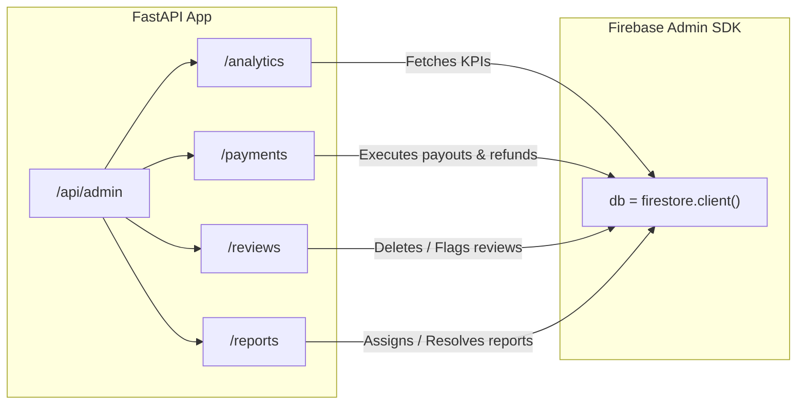
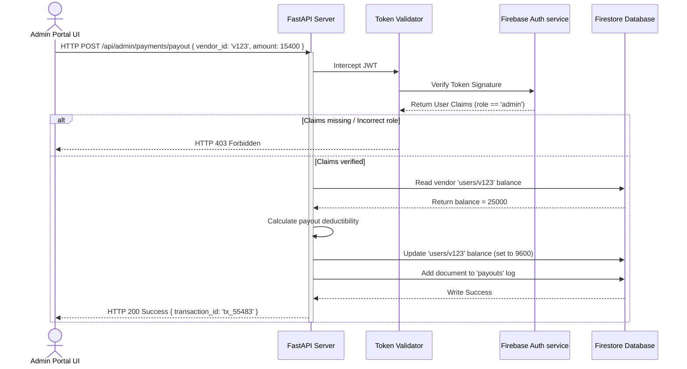

# Admin Backend REST API Flow

This document details the FastAPI admin routers, request payloads, and backend-to-Firestore execution sequences.

---

## 🔌 Admin API Endpoints

The Admin router is mounted in [main.py](file:///d:/SAM(DIGI)/digital-marketplace/Digi/digital-marketplace/backend/app/main.py) under the prefix `/api/admin` and splits endpoints into sub-routers:



---

## 🛠️ Detailed Endpoint Specs

| Sub-Router | Endpoint | Method | Payload / Params | Action / Firestore Operations |
| :--- | :--- | :--- | :--- | :--- |
| **Analytics** | `/dashboard` | `GET` | None | Returns global metrics, revenue totals, conversions, trends. |
| **Payments** | `/telemetry` | `GET` | None | Returns total processed revenue, net balances, sparklines. |
| **Payments** | `/overview` | `GET` | None | Returns aggregate transaction totals and conversion ratios. |
| **Payments** | `/vendor-payouts` | `GET` | None | Returns list of vendor payout requests. |
| **Payments** | `/payout` | `POST` | `{ "vendor_id": string, "amount": number }` | Processes vendor payout, logs ledger entry. |
| **Reviews** | `/dashboard` | `GET` | None | Returns rating distributions, sentiment flags, and review lists. |
| **Reports** | `/analytics` | `GET` | None | Returns report counts, categories, and priority metrics. |
| **Reports** | `/resolve` | `POST` | `{ "report_id": string }` | Marks report document status as `'Resolved'`. |
| **Reports** | `/reject` | `POST` | `{ "report_id": string }` | Marks report document status as `'Rejected'`. |

---

## 🔄 Sequence Diagram: Vendor Payout Command

This sequence displays the execution logic when the Admin triggers a payout approval:



---

## 🌁 Firebase Admin Initialization Bridge

In [connection.py](file:///d:/SAM(DIGI)/digital-marketplace/Digi/digital-marketplace/backend/app/shared/firebase/connection.py), we initialize the admin connection. It gracefully switches between the environment JSON credentials and local config to prevent crashes:

```python
try:
    import firebase_admin
    from firebase_admin import credentials, firestore

    # Read credentials safely
    cert_path = "app/shared/firebase/serviceAccountKey.json"
    if os.path.exists(cert_path):
        cred = credentials.Certificate(cert_path)
        firebase_admin.initialize_app(cred)
    else:
        # Fallback to default credentials inside app container
        firebase_admin.initialize_app()
    
    db = firestore.client()
except Exception as e:
    logger.warning(f"Firebase Admin SDK initialization failed: {e}")
    db = None
```
