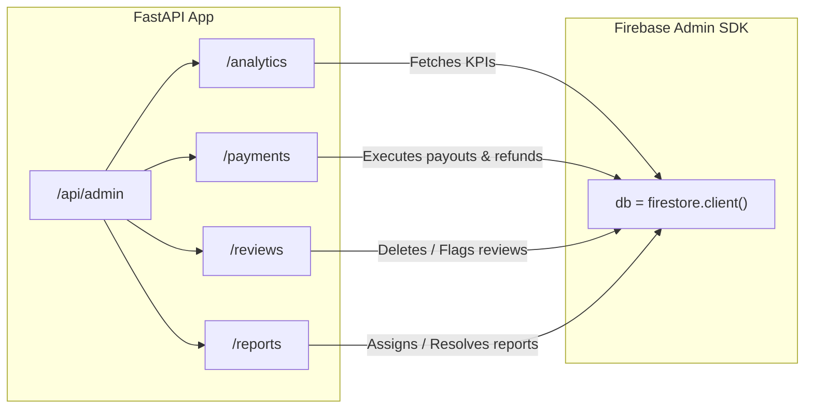
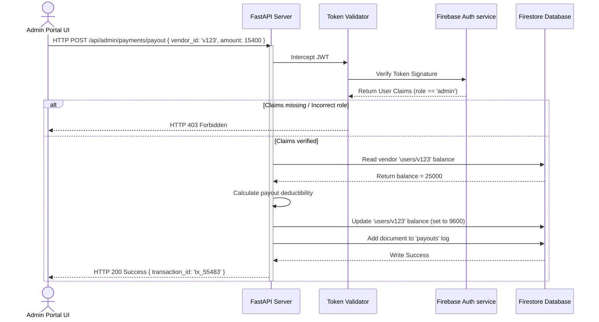
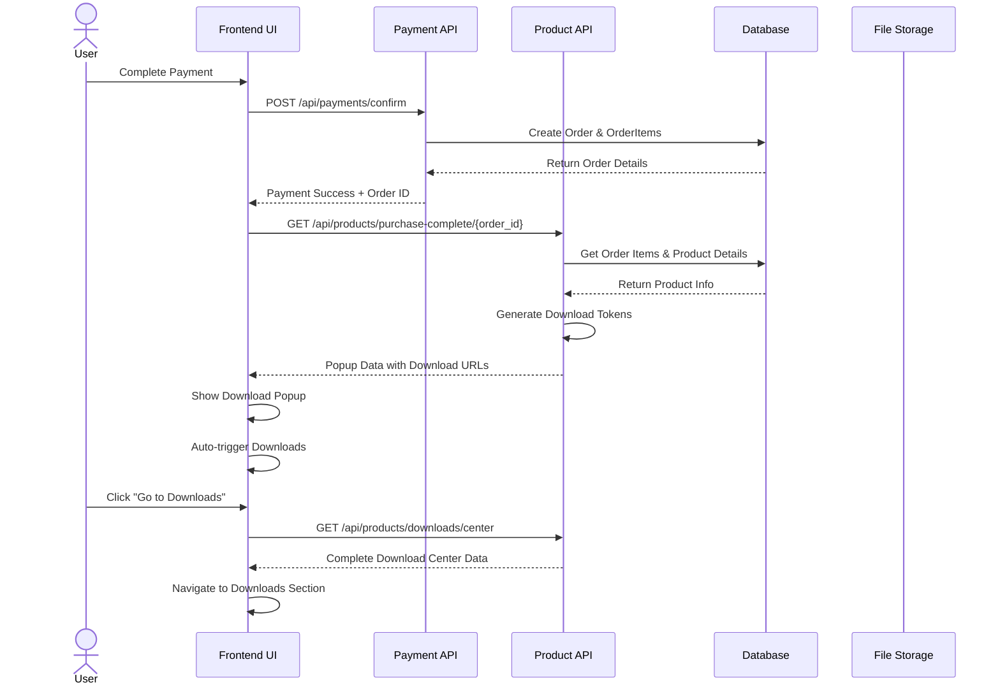

# Admin Backend REST API Flow

This document details the FastAPI admin routers, request payloads, and backend-to-Firestore execution sequences.

---

## 🔌 Admin API Endpoints

The Admin router is mounted in [main.py](file:///d:/SAM(DIGI)/digital-marketplace/Digi/digital-marketplace/backend/app/main.py) under the prefix `/api/admin` and splits endpoints into sub-routers:



---

## 🛠️ Detailed Endpoint Specs

| Sub-Router | Endpoint | Method | Payload / Params | Action / Firestore Operations |
| :--- | :--- | :--- | :--- | :--- |
| **Analytics** | `/dashboard` | `GET` | None | Returns global metrics, revenue totals, conversions, trends. |
| **Payments** | `/telemetry` | `GET` | None | Returns total processed revenue, net balances, sparklines. |
| **Payments** | `/overview` | `GET` | None | Returns aggregate transaction totals and conversion ratios. |
| **Payments** | `/vendor-payouts` | `GET` | None | Returns list of vendor payout requests. |
| **Payments** | `/payout` | `POST` | `{ "vendor_id": string, "amount": number }` | Processes vendor payout, logs ledger entry. |
| **Reviews** | `/dashboard` | `GET` | None | Returns rating distributions, sentiment flags, and review lists. |
| **Reports** | `/analytics` | `GET` | None | Returns report counts, categories, and priority metrics. |
| **Reports** | `/resolve` | `POST` | `{ "report_id": string }` | Marks report document status as `'Resolved'`. |
| **Reports** | `/reject` | `POST` | `{ "report_id": string }` | Marks report document status as `'Rejected'`. |

---

## 🔄 Sequence Diagram: Vendor Payout Command

This sequence displays the execution logic when the Admin triggers a payout approval:



---

## 🌁 Firebase Admin Initialization Bridge

In [connection.py](file:///d:/SAM(DIGI)/digital-marketplace/Digi/digital-marketplace/backend/app/shared/firebase/connection.py), we initialize the admin connection. It gracefully switches between the environment JSON credentials and local config to prevent crashes:

```python
try:
    import firebase_admin
    from firebase_admin import credentials, firestore

    # Read credentials safely
    cert_path = "app/shared/firebase/serviceAccountKey.json"
    if os.path.exists(cert_path):
        cred = credentials.Certificate(cert_path)
        firebase_admin.initialize_app(cred)
    else:
        # Fallback to default credentials inside app container
        firebase_admin.initialize_app()
    
    db = firestore.client()
except Exception as e:
    logger.warning(f"Firebase Admin SDK initialization failed: {e}")
    db = None
```

---

## 📦 Product Download Popup Flow

When a user completes a purchase, a popup appears with product details, automatically starts the download, and provides a direct link to the download section. This enhances user experience by providing immediate access to purchased content.

### 🔄 Post-Purchase Download Popup Sequence



### 📋 Post-Purchase Download API Endpoints

| Endpoint | Method | Purpose | Response |
|----------|--------|---------|----------|
| `/api/payments/confirm` | `POST` | Confirm payment & get order ID | Payment success + download popup trigger |
| `/api/products/purchase-complete/{order_id}` | `GET` | Get post-purchase popup data | Product details + auto-download URLs |
| `/api/products/downloads/center` | `GET` | Get user's downloads center | List of all purchased products |
| `/api/products/{id}/download-file` | `GET` | Stream actual file | File content stream |

### 🎨 Post-Purchase Download Popup Response

```json
{
  "success": true,
  "popup_type": "post_purchase_download",
  "order_details": {
    "order_id": 12345,
    "order_reference": "ORD-12345",
    "purchase_date": "2024-01-15T10:30:00Z",
    "total_items": 2,
    "total_value": 58.99,
    "customer_name": "John Doe"
  },
  "products": [
    {
      "product_id": 123,
      "name": "Premium UI Kit",
      "category": "Design Assets",
      "file_size": "48 MB",
      "version": "v1.0.0",
      "thumbnail": "https://example.com/thumb.jpg",
      "vendor": "DesignStudio Pro",
      "price_paid": 29.99,
      "description": "A comprehensive UI kit for modern web applications...",
      "download_url": "/api/products/123/download-file?token=eyJ0eXAi...",
      "auto_download": true,
      "token_expires_in": "15 minutes"
    }
  ],
  "popup_actions": {
    "download_all": true,
    "go_to_downloads": "/downloads",
    "continue_shopping": "/products"
  },
  "messages": {
    "title": "🎉 Purchase Complete!",
    "subtitle": "Your 2 products are ready for download",
    "download_message": "Your download will start automatically. You can also access all your purchases in the Downloads section.",
    "thank_you": "Thank you for your purchase!"
  }
}
```

### 🎨 Payment Confirmation Response (Modified)

```json
{
  "success": true,
  "order_id": 12345,
  "payment_ref": "pay_xyz123",
  "message": "Payment confirmed. Order ORD-12345 is ready. Your downloads are available in the vault.",
  "show_download_popup": true,
  "download_popup_data": {
    "order_details": {
      "order_id": 12345,
      "total_items": 2,
      "purchase_date": "2024-01-15T10:30:00Z"
    },
    "products": [
      {
        "product_id": 123,
        "download_url": "/api/products/123/download-file?token=eyJ0eXAi...",
        "product_name": "Premium UI Kit",
        "auto_download": true
      }
    ]
  },
  "items": [
    {
      "product_id": 123,
      "download_url": "/api/products/123/download-file?token=eyJ0eXAi..."
    }
  ]
}
```

### 🏛️ Download Center Response Structure

```json
{
  "downloads": [
    {
      "order_id": 12345,
      "purchase_date": "2024-01-15T10:30:00Z",
      "product_details": {
        "id": 123,
        "name": "Premium UI Kit",
        "category": "Design Assets",
        "file_size": "48 MB",
        "version": "v1.0.0",
        "thumbnail": "https://example.com/thumb.jpg",
        "vendor": "DesignStudio Pro",
        "price_paid": 29.99,
        "description": "A comprehensive UI kit for modern web applications..."
      },
      "download_url": "/api/products/123/download-file?token=eyJ0eXAi...",
      "can_download": true,
      "token_expires_in": "15 minutes"
    }
  ],
  "statistics": {
    "total_purchases": 15,
    "categories": ["Design Assets", "UI Kits", "Templates"],
    "total_value_purchased": 449.85,
    "user_id": 456,
    "user_name": "John Doe"
  }
}
```

### 🔧 Implementation Requirements

1. **Post-Purchase Trigger**: After payment confirmation, frontend receives `show_download_popup: true`
2. **Automatic Download**: Downloads start automatically when popup appears
3. **Product Details Display**: Show product thumbnails, names, file sizes, vendors
4. **Downloads Section Navigation**: "Go to Downloads" button navigates to user's library
5. **Multiple Products**: Handle multiple products in single purchase
6. **Download Tokens**: 15-minute secure tokens for each download
7. **User Experience**: Celebratory messaging with purchase confirmation

### 🚀 Frontend Integration Workflow

1. **Payment Success**: After `/api/payments/confirm` returns success
2. **Check Popup Flag**: If `show_download_popup: true`, fetch popup data
3. **Fetch Popup Data**: Call `/api/products/purchase-complete/{order_id}`
4. **Show Popup**: Display purchase celebration popup with product details
5. **Auto Download**: Trigger downloads automatically using provided URLs
6. **Navigation Options**: Provide "Go to Downloads" and "Continue Shopping" buttons
7. **Downloads Section**: Load user's complete download library

This flow ensures users immediately receive their purchases and are guided to their download library for future access.
