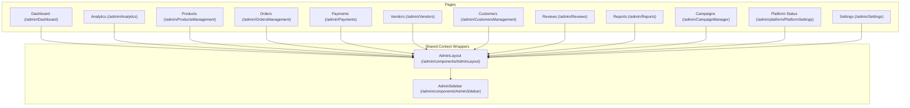

# Admin Frontend Module Mapping

This document lists the files, frontend structures, listeners, and business logic for all 12 modules in the Admin Portal.

---

## 🎨 Admin Views Core Architecture

---

## 📋 Comprehensive Module Breakdown

### 1. Dashboard (`Dashboard.jsx`)
* **Purpose**: Primary overview panel showcasing immediate action logs, critical reports, and platform health stats.
* **Files**: [Dashboard.jsx](file:///d:/SAM(DIGI)/digital-marketplace/Digi/digital-marketplace/frontend/src/pages/admin/Dashboard.jsx), [dashboardService.js](file:///d:/SAM(DIGI)/digital-marketplace/Digi/digital-marketplace/frontend/src/services/dashboardService.js)
* **Data Sources**: 
  - Real-time Firestore snapshot listener on `'orders'` (last 5 entries).
  - Real-time Firestore snapshot listener on `'reports'` (status == 'Open').
  - FastAPI `/api/admin/analytics/dashboard` REST fallback.
* **Auth Guard**: Required role = `'admin'`.

### 2. Analytics (`Analytics.jsx`)
* **Purpose**: Telemetry charting panel tracking conversion metrics, AOV growth, and region distributions.
* **Files**: [Analytics.jsx](file:///d:/SAM(DIGI)/digital-marketplace/Digi/digital-marketplace/frontend/src/pages/admin/Analytics.jsx), [analyticsService.js](file:///d:/SAM(DIGI)/digital-marketplace/Digi/digital-marketplace/frontend/src/services/analyticsService.js)
* **Execution Flow**: Mount event triggers `getAnalyticsDashboard()` load.
* **UI Update**: Feeds data into responsive SVG progress circles and custom CSS grid timelines.

### 3. Products Management (`ProductsManagement.jsx`)
* **Purpose**: Manage, approve, flag, or modify tags for products in the marketplace.
* **Files**: [ProductsManagement.jsx](file:///d:/SAM(DIGI)/digital-marketplace/Digi/digital-marketplace/frontend/src/pages/admin/ProductsManagement.jsx), [productService.js](file:///d:/SAM(DIGI)/digital-marketplace/Digi/digital-marketplace/frontend/src/services/productService.js)
* **Firestore**: Real-time snapshot listener on the `'products'` collection. Uses `mapDocToProduct` to format raw Firestore objects.
* **APIs**: Calls backend `productService.update` or `productService.remove` on changes.

### 4. Orders Management (`OrdersManagement.jsx`)
* **Purpose**: Track user checkouts, issue refunds, and manage license key expirations.
* **Files**: [OrdersManagement.jsx](file:///d:/SAM(DIGI)/digital-marketplace/Digi/digital-marketplace/frontend/src/pages/admin/OrdersManagement.jsx), [orderService.js](file:///d:/SAM(DIGI)/digital-marketplace/Digi/digital-marketplace/frontend/src/services/orderService.js), [downloadService.js](file:///d:/SAM(DIGI)/digital-marketplace/Digi/digital-marketplace/frontend/src/services/downloadService.js)
* **Firestore**: Snapshot listener on the `'orders'` collection.
* **APIs**: REST calls `/api/orders/{id}/refund` and `/api/orders/{id}/dispute` on status modifications.

### 5. Payments (`Payments.jsx`)
* **Purpose**: Monitor platform cash flows, commission balances, and handle payout cycles.
* **Files**: [Payments.jsx](file:///d:/SAM(DIGI)/digital-marketplace/Digi/digital-marketplace/frontend/src/pages/admin/Payments.jsx), [paymentService.js](file:///d:/SAM(DIGI)/digital-marketplace/Digi/digital-marketplace/frontend/src/services/paymentService.js)
* **Execution Flow**: Employs `subscribeToPaymentsTelemetry()` to listen to both `'orders'` and `'users'` databases concurrently.
* **Business Logic**: Computes total earnings and commissions dynamically:
  - Commission = 10% of Paid Sales
  - Vendor Share = 90% of Paid Sales

### 6. Vendors Approval (`Vendors.jsx`)
* **Purpose**: Approving or suspending seller profiles.
* **Files**: [Vendors.jsx](file:///d:/SAM(DIGI)/digital-marketplace/Digi/digital-marketplace/frontend/src/pages/admin/Vendors.jsx), [vendorService.js](file:///d:/SAM(DIGI)/digital-marketplace/Digi/digital-marketplace/frontend/src/services/vendorService.js)
* **Firestore**: Real-time subscription query for users where `role == 'vendor'`.
* **Actions**: Triggers writes setting user `accountStatus` to `'active'`, `'suspended'`, or `'disabled'`.

### 7. Customers Management (`CustomersManagement.jsx`)
* **Purpose**: View customer logs, count orders, and trace support threads.
* **Files**: [CustomersManagement.jsx](file:///d:/SAM(DIGI)/digital-marketplace/Digi/digital-marketplace/frontend/src/pages/admin/CustomersManagement.jsx)
* **Firestore**: Real-time subscription query for users where `role == 'customer'`.

### 8. Reviews Sentiment (`Reviews.jsx`)
* **Purpose**: Audit customer feedback and sentiments.
* **Files**: [Reviews.jsx](file:///d:/SAM(DIGI)/digital-marketplace/Digi/digital-marketplace/frontend/src/pages/admin/Reviews.jsx), [reviewAnalyticsService.js](file:///d:/SAM(DIGI)/digital-marketplace/Digi/digital-marketplace/frontend/src/services/reviewAnalyticsService.js)
* **Flow**: REST fetch `getReviewAnalytics()` outputs ratings summary and voice highlights (positive/constructive summaries).

### 9. Reports & Tickets (`Reports.jsx`)
* **Purpose**: Review user reporting violations (licensing abuse, defective products).
* **Files**: [Reports.jsx](file:///d:/SAM(DIGI)/digital-marketplace/Digi/digital-marketplace/frontend/src/pages/admin/Reports.jsx), [reportsService.js](file:///d:/SAM(DIGI)/digital-marketplace/Digi/digital-marketplace/frontend/src/services/reportsService.js)
* **Firestore**: Real-time subscriber to the `'reports'` collection.
* **Actions**: Calls REST POST `/api/admin/reports/resolve` or `/api/admin/reports/reject`.

### 10. Campaigns Manager (`CampaignManager.jsx`)
* **Purpose**: Oversee referral programs, commission links, and affiliate banners.
* **Files**: [CampaignManager.jsx](file:///d:/SAM(DIGI)/digital-marketplace/Digi/digital-marketplace/frontend/src/pages/admin/CampaignManager.jsx)

### 11. Platform Status (`PlatformSettings.jsx`)
* **Purpose**: Administer the Global Pause switch.
* **Files**: [PlatformSettings.jsx](file:///d:/SAM(DIGI)/digital-marketplace/Digi/digital-marketplace/frontend/src/pages/admin/platform/PlatformSettings.jsx), [settingsService.js](file:///d:/SAM(DIGI)/digital-marketplace/Digi/digital-marketplace/frontend/src/services/settingsService.js)
* **Firestore**: Listens to setting document `'settings/global'`.
* **Actions**: Switches `'maintenanceMode'` Boolean parameter.

### 12. Admin Profile Settings (`Settings.jsx`)
* **Purpose**: Manage password overrides and security configurations.
* **Files**: [Settings.jsx](file:///d:/SAM(DIGI)/digital-marketplace/Digi/digital-marketplace/frontend/src/pages/admin/Settings.jsx)
