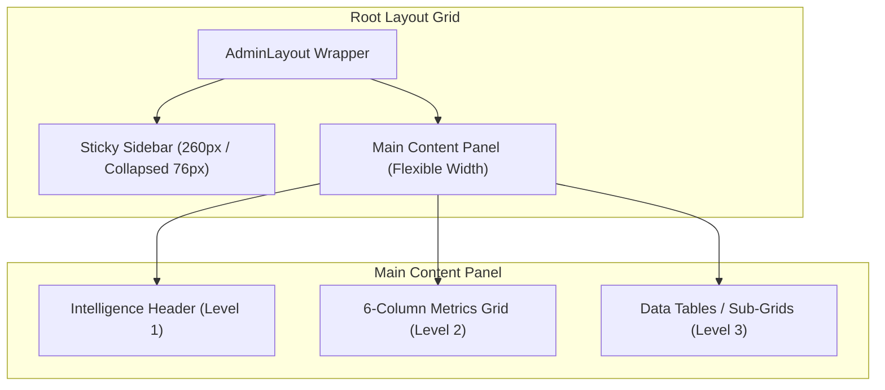
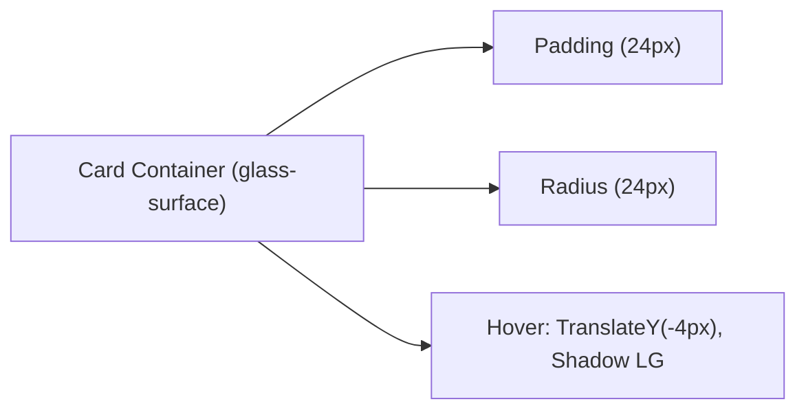

# Admin Layout Map

This document outlines the visual structure, layout hierarchy, and responsive grid layouts for the Admin Portal.

---

## 📐 Layout Spacing & Hierarchy



---

## 📊 Component & Grid Structures

### 1. Sticky Sidebar
* **Width**: `260px` (Expanded), `76px` (Collapsed).
* **Spacing**: `24px` top margin, `24px` internal container gap.
* **Menus**: Grouped by section labels (Overview, Commerce, Users, Platform) using a standard gap of `8px` between groups.

### 2. Header
* **Greeting Size**: `1.875rem` (Text 3xl font-serif).
* **Subtitle Size**: `0.75rem` (Text-xs).
* **Margins**: Bottom margins follow the `32px` spacing scale.

### 3. Metric Card Grid


* **Desktop**: Responsive 6-column grid wrapping down to 2-column or 1-column layouts on smaller devices.
* **Elements**: Features uniform card heights and absolute spacing gaps of `24px`.

### 4. Tables and Forms
* **Container**: Wrapped inside a unified `.admin-table-container` with overflow scrolling enabled.
* **Row Height**: Enforced `56px` cell padding height for clear scannability.
* **Inputs**: Height is locked at `42px` with a focused outline transition.

---

## 📱 Responsive Layout Adaptation

```mermaid
graph TD
    Viewport{"Viewport Width"}
    
    Viewport -->|>= 1025px (Desktop)| DesktopLayout["Flex Row Layout, Sidebar 260px, Content flexible"]
    Viewport -->|768px - 1024px (Tablet/Laptop)| MediumLayout["Flex Row Layout, Sidebar Collapsed (76px)"]
    Viewport -->|< 768px (Mobile)| MobileLayout["Flex Column Layout, Sidebar wraps to top full-width"]
```
