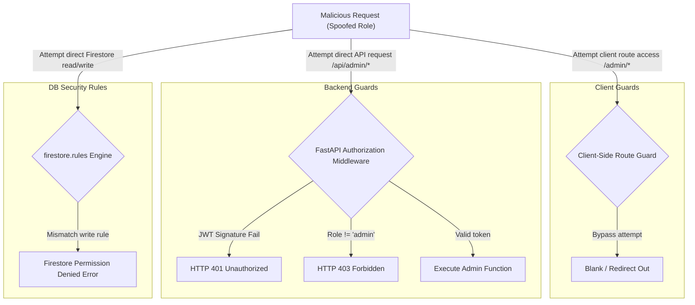

# Admin Platform Security Audit

This document contains a threat analysis, access validation matrix, and Firestore security configuration audit for the admin console.

---

## 🔒 Threat Model & Vulnerability Analysis



---

## 🛡️ Role-Based Access Control (RBAC) Audit Matrix

| Route / Resource | Customer | Vendor | Affiliate | Admin | Security Mechanism |
| :--- | :--- | :--- | :--- | :--- | :--- |
| `/admin/*` Client Views | 🚫 Blocked | 🚫 Blocked | 🚫 Blocked | ✅ Allowed | `ProtectedRoute` role check |
| `/api/admin/*` Endpoints | 🚫 Blocked | 🚫 Blocked | 🚫 Blocked | ✅ Allowed | JWT role claim validation |
| Write: `settings/global` | 🚫 Blocked | 🚫 Blocked | 🚫 Blocked | ✅ Allowed | Firestore Rules verification |
| Write: `users/{uid}` status| 🚫 Blocked | 🚫 Blocked | 🚫 Blocked | ✅ Allowed | Backend-signed Firestore updates |
| Read: `reports` collection | 🚫 Blocked | 🚫 Blocked | 🚫 Blocked | ✅ Allowed | Firestore `request.auth.token.role` |

---

## 🗄️ Firestore Security Assumptions (`firestore.rules`)

To enforce the above RBAC in production, the following Firestore rules structure should be deployed:

```javascript
rules_version = '2';
service cloud.firestore {
  match /databases/{database}/documents {

    // Helper: checks if user has admin claims
    function isAdmin() {
      return request.auth != null && 
        (request.auth.token.role == 'admin' || 
         get(/databases/$(database)/documents/users/$(request.auth.uid)).data.role == 'admin');
    }

    // Reports Collection Isolation
    match /reports/{reportId} {
      allow read, write: if isAdmin();
    }

    // Settings Collection Isolation
    match /settings/{settingId} {
      allow read: if true; // Publicly readable for marketplace maintenance checks
      allow write: if isAdmin(); // Only Admin can toggle global variables
    }

    // Users Collection Isolation
    match /users/{userId} {
      allow read: if request.auth != null;
      allow write: if request.auth != null && (request.auth.uid == userId || isAdmin());
    }
  }
}
```

---

## 🚨 API Validation & Endpoint Guarding Rules

* **Enforced Header**: All Admin HTTP requests to `/api/admin/*` MUST contain `Authorization: Bearer <Admin_Token>`.
* **JWT Claims**: The backend decoder verifies:
  1. The token signature is signed by our OAuth private key.
  2. The timestamp is active (not expired).
  3. The `role` claim matches exactly `'admin'`. If the token is hijacked but has `role: 'vendor'`, it is immediately rejected by the FastAPI handler.
