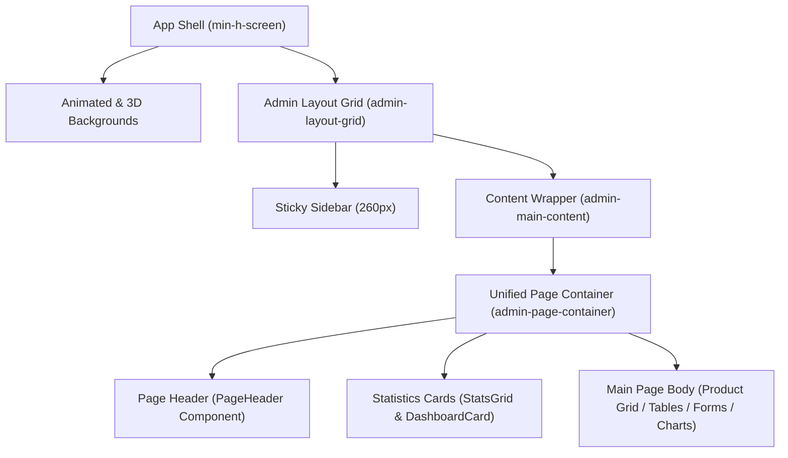
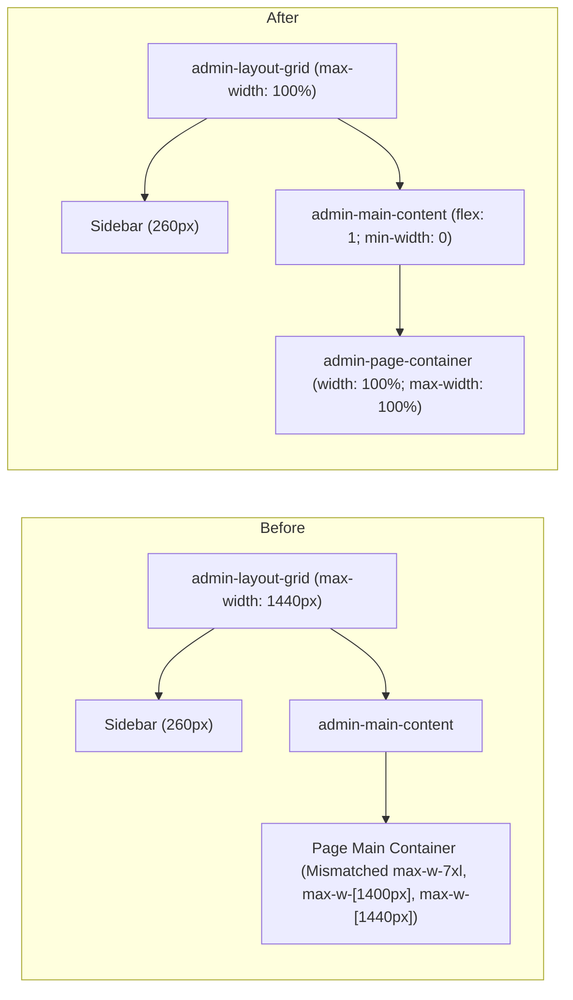

# Admin UI Layout Audit

## Root Cause of the Broken Layout
The structural layout issues in the Admin Console stemmed from a mismatch between the global flex wrappers and individual page margins:
1. **Narrow Width Constraints**: The parent grid system (`.admin-layout-grid` in [admin.css](file:///d:/SAM(DIGI)/digital-marketplace/Digi/digital-marketplace/frontend/src/pages/admin/styles/admin.css)) was strictly limited to a `max-width: 1440px`. Since the sidebar occupies a static `260px` with a `32px` column gap, the remaining viewport content was compressed on wide screens.
2. **Inconsistent Main Containers**: Mismapped `max-w-7xl` (`1280px`), `max-w-[1400px]`, and `max-w-[1440px]` rules were applied directly to individual `<main>` blocks across admin pages, causing misalignments, uneven margins, and empty layout voids on larger viewports.
3. **Product Card Compression**: The product card grid was limited to a maximum of 3 columns (`lg:grid-cols-3`), leading to squished cards and large empty spaces on standard desktops.

---

## Layout Hierarchy

---

## Inspected Files
- [AdminLayout.jsx](file:///d:/SAM(DIGI)/digital-marketplace/Digi/digital-marketplace/frontend/src/pages/admin/components/AdminLayout.jsx): Wrapper setting up the sidebar and content columns.
- [AdminSidebar.jsx](file:///d:/SAM(DIGI)/digital-marketplace/Digi/digital-marketplace/frontend/src/pages/admin/components/AdminSidebar.jsx): Side menu with responsive toggle state logic.
- [admin.css](file:///d:/SAM(DIGI)/digital-marketplace/Digi/digital-marketplace/frontend/src/pages/admin/styles/admin.css): Core layout overrides and glassmorphism cards.
- [ProductsManagement.jsx](file:///d:/SAM(DIGI)/digital-marketplace/Digi/digital-marketplace/frontend/src/pages/admin/ProductsManagement.jsx): Main dashboard list showing compressed product columns.

---

## Before vs After Architecture

