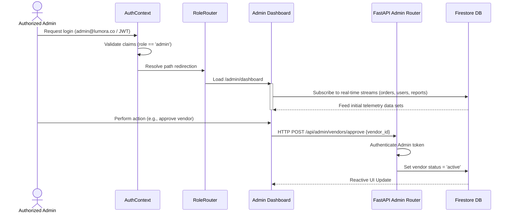
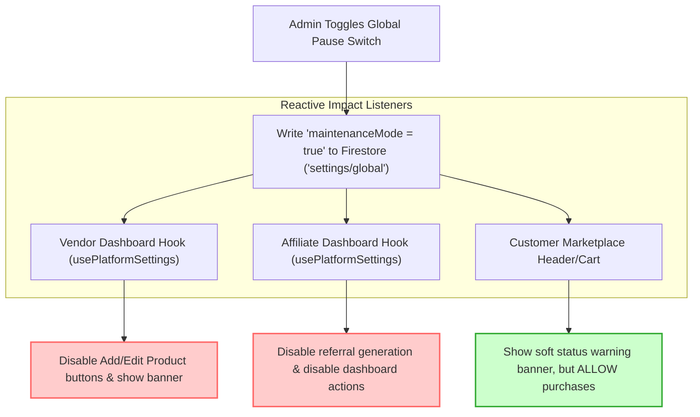
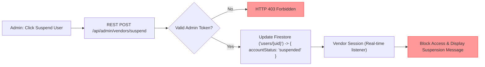

# Admin Portal Control Workflows

This document outlines the lifecycles, states, and operations of administrative controls in Lumora.

---

## 🔄 Complete Admin Lifecycle

---

## ⏸️ Global Platform Pause Workflow

Admins have the capability to execute a **Global Pause**. This stops vendor product creation and affiliate linking operations, but keeps the marketplace fully open for customers.

---

## 🚫 Individual Vendor & Affiliate Suspension Workflow

If a vendor or affiliate violates policies, they can be suspended individually without affecting any other sellers or customer orders.

---

*For backend integration details of these workflows, see [ADMIN_BACKEND_FLOW.md](file:///d:/SAM(DIGI)/digital-marketplace/Digi/digital-marketplace/ADMIN_BACKEND_FLOW.md).*
