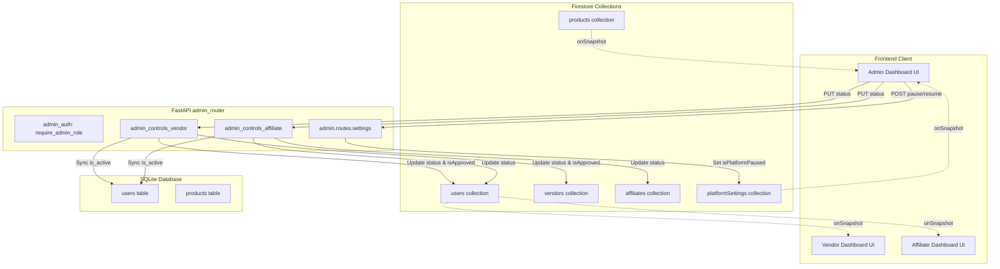

# Admin Backend Architecture — Lumora Platform

This document describes the design, directory structure, responsibilities, and integrations of the Lumora Platform Admin Control Layer.

## Directory Structure

All admin controls and modular admin endpoints are located within the following directories:

```text
backend/
├── admin/                     # Modular Admin Backend (Unified Control Tower)
│   ├── firestore/
│   │   └── admin_firestore.py # Platform settings & product Firestore syncing
│   ├── routes/
│   │   ├── analytics.py       # Wrapper for admin analytics endpoints
│   │   ├── reports.py         # Wrapper for customer reports endpoints
│   │   ├── reviews.py         # Wrapper for review moderation endpoints
│   │   ├── customers.py       # Wrapper for customer management endpoints
│   │   ├── orders.py          # Wrapper for order history and status
│   │   ├── products.py        # REST endpoints for admin product operations
│   │   ├── vendors.py         # Wrapper for vendor admin control routes
│   │   ├── affiliates.py      # Wrapper for affiliate admin control routes
│   │   └── settings.py        # Platform settings, pause, and resume control
│   ├── services/
│   │   ├── product_service.py
│   │   ├── vendor_service.py
│   │   └── affiliate_service.py
│   └── validators/
│       ├── admin_auth.py      # Role-based request guarding
│       └── status_checks.py   # Active status & global pause checks
├── admin_controls_vendor/     # Isolated Vendor Controls (Stable Bridge)
│   ├── firestore.py           # Sync status to Firestore 'users' & 'vendors'
│   ├── routes.py              # Status change REST API
│   ├── services.py            # SQLite user syncing & status mapping
│   └── validators.py          # Access intercept check functions
└── admin_controls_affiliate/  # Isolated Affiliate Controls (Stable Bridge)
    ├── firestore.py           # Sync status to Firestore 'users' & 'affiliates'
    ├── routes.py              # Status change REST API
    ├── services.py            # SQLite user & profile syncing
    └── validators.py          # Access intercept check functions
```

---

## Architecture Flow Diagram



---

## Integration Strategy & Isolation

1. **Isolation from Business Logic**: The core modules for referral loops, order processing, commission calculation, and simulator flow are untouched.
2. **Dependency Interception**: The `status_checks.py` validator contains FastAPI dependency check functions. These are injected into write routes to perform immediate pre-flight status validation.
3. **Real-time Firestore Telemetry**: Frontend dashboard interfaces use `onSnapshot` listeners to subscribe to Firestore collections. Any backend write updating Firestore propagates immediately to dashboards without page refresh.
