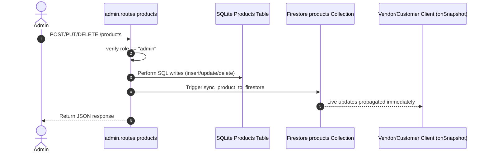
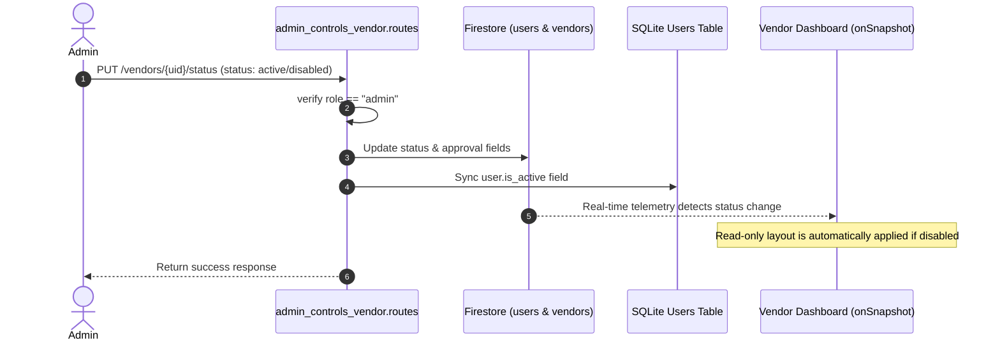
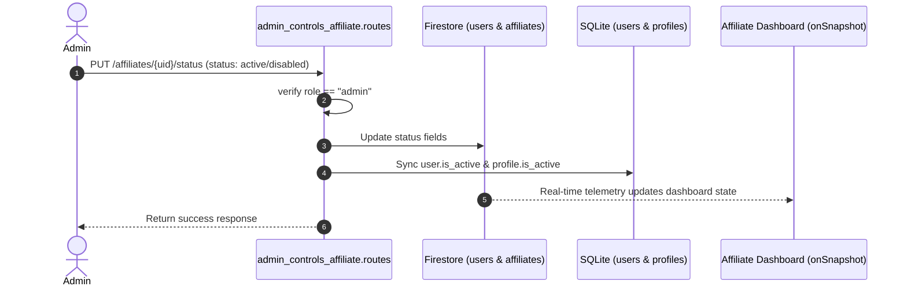
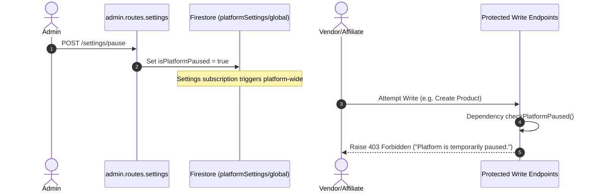
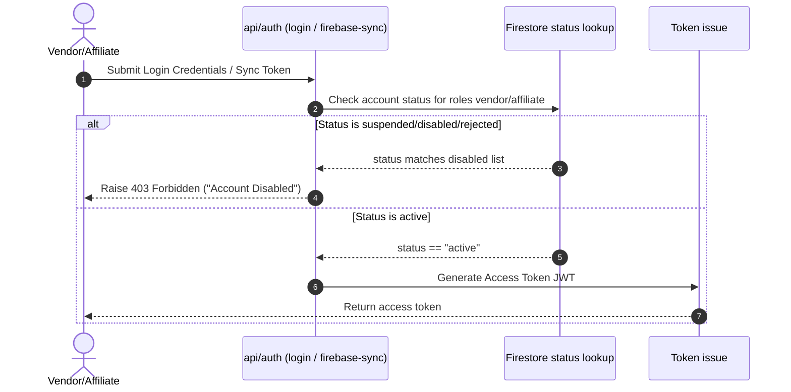
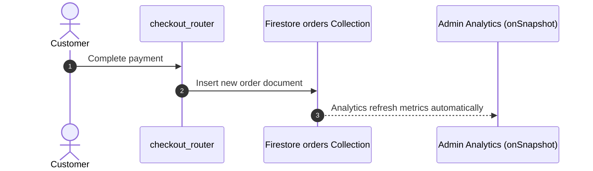

# Admin Backend Flowcharts — Lumora Platform

This document presents workflow visualisations of operations in the Lumora Admin Control Layer.

---

## 1. Product Management Flow

---

## 2. Vendor Management (Status Updates)

---

## 3. Affiliate Management (Status Updates)

---

## 4. Global Pause Flow

---

## 5. User Authentication Guard Flow

---

## 6. Real-time Analytics Update Flow

