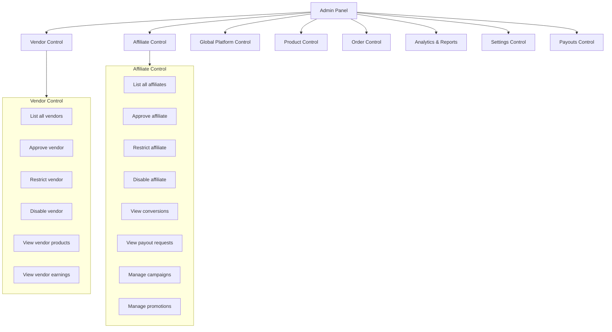
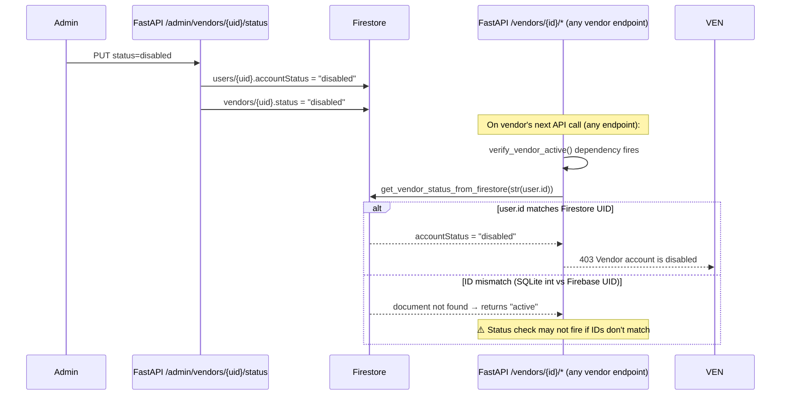
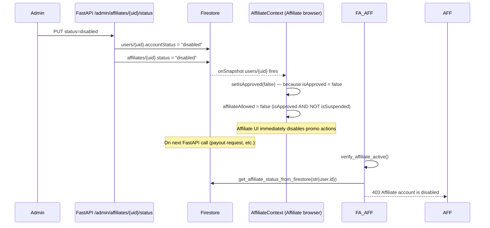
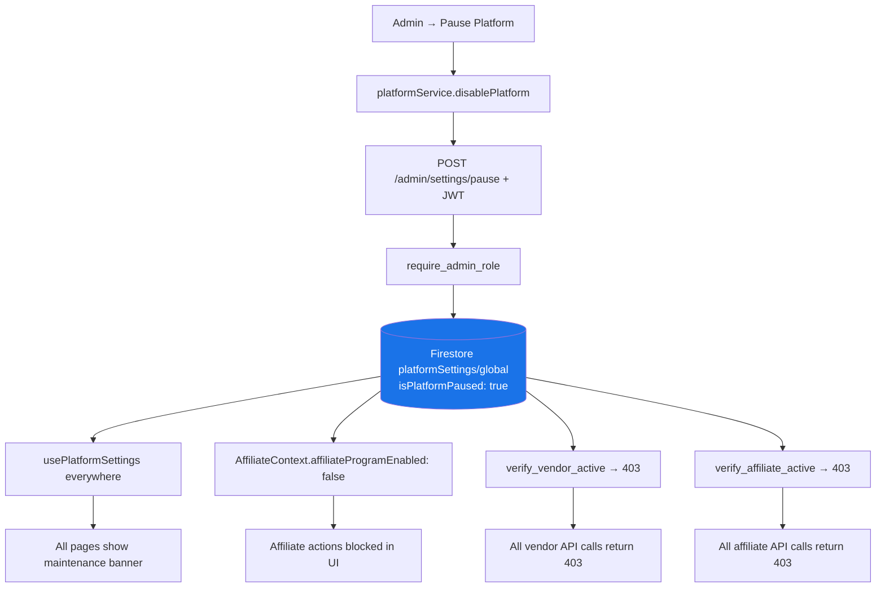
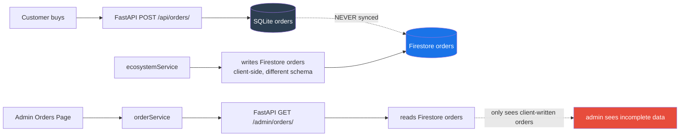
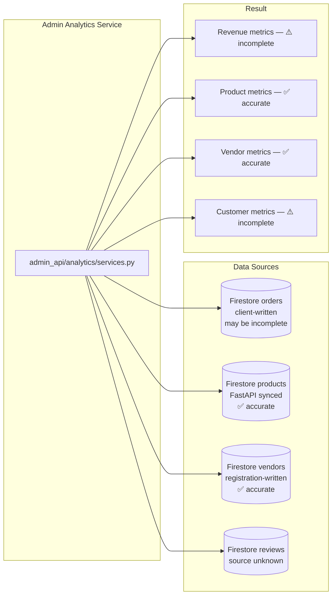
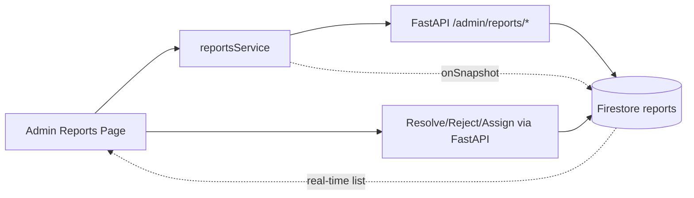
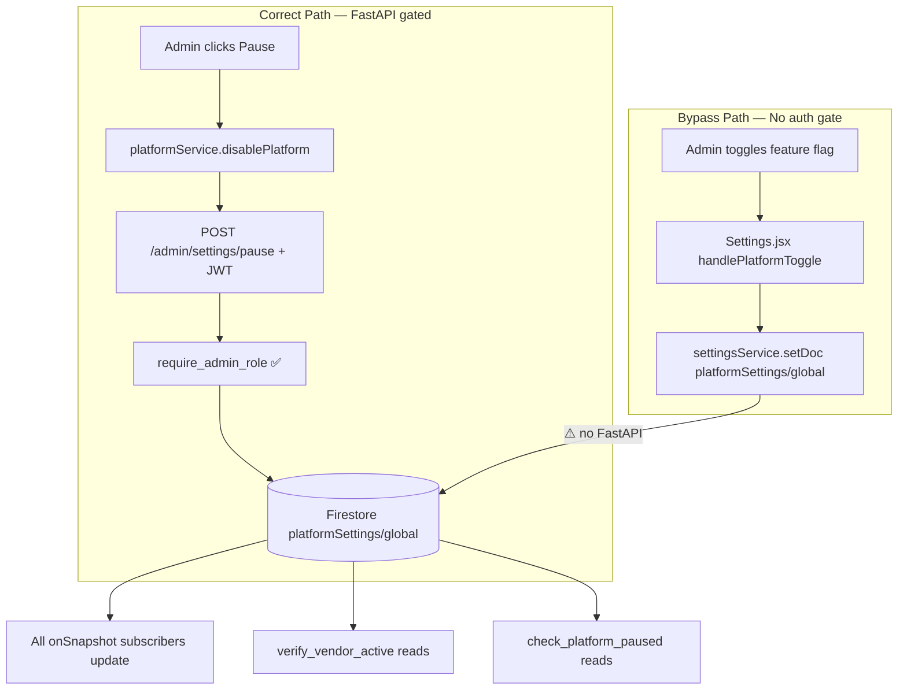

# Lumora — Admin Control Architecture
> Detailed design of every Admin → Vendor and Admin → Affiliate control flow.
> Includes current state, target state, and where FastAPI vs Firestore is required.
> Date: July 2, 2026

---

## Table of Contents

1. [Admin Control Surface Map](#1-admin-control-surface-map)
2. [Vendor Control Architecture](#2-vendor-control-architecture)
3. [Affiliate Control Architecture](#3-affiliate-control-architecture)
4. [Global Platform Control](#4-global-platform-control)
5. [Product Control](#5-product-control)
6. [Order Control](#6-order-control)
7. [Analytics & Reports Control](#7-analytics--reports-control)
8. [Settings Control](#8-settings-control)
9. [Payouts Control](#9-payouts-control)
10. [Where FastAPI is Required vs Firestore is Enough](#10-where-fastapi-is-required-vs-firestore-is-enough)
11. [Missing Admin Integrations](#11-missing-admin-integrations)

---

## 1. Admin Control Surface Map



---

## 2. Vendor Control Architecture

### Current Implementation

```mermaid
flowchart TD
    subgraph Frontend["Vendors.jsx (Admin)"]
        V1[Tab: Vendors]
        V2[List table — Firestore onSnapshot]
        V3[Action buttons: Approve / Restrict / Disable]
    end

    subgraph Service["vendorService.js"]
        VS1[approveVendor → PUT /admin/vendors/uid/status active]
        VS2[restrictVendor → PUT /admin/vendors/uid/status restricted]
        VS3[disableVendor → PUT /admin/vendors/uid/status disabled]
    end

    subgraph FastAPI_V["FastAPI /api/admin/vendors/"]
        FA1[GET / → list Firestore users where role=vendor]
        FA2[PUT /{uid}/status → update_vendor_status service]
    end

    subgraph Service_V["admin_controls_vendor/services.py"]
        SV1[update_vendor_status_in_firestore]
        SV2[UPDATE SQLite users is_active]
    end

    subgraph Firestore_V["Firestore"]
        FS1[users/{uid}.set accountStatus]
        FS2[vendors/{uid}.set status]
    end

    V2 -.->|onSnapshot via GET /| FA1 --> Firestore_V
    V3 --> Service --> FastAPI_V --> Service_V --> Firestore_V
    Service_V --> SQL[(SQLite users is_active)]
```

**Status:** ✅ Working. The full flow is implemented and connected.

### Vendor Enforcement Chain



**Known ID mismatch risk:** `verify_vendor_active()` passes `str(current_user.id)` (SQLite integer) to `get_vendor_status_from_firestore()`. The Firestore document is keyed by Firebase UID (string). These are different values unless the admin status update and the Firestore lookup both reference the same key. The admin controls vendor service resolves this by looking up the Firestore UID from the email. The status check uses the SQLite integer ID directly — **this can miss the status if the SQLite integer doesn't match the Firestore document key.**

### Vendor Control — What Each Status Does

| Status | Firestore users.accountStatus | Firestore vendors.status | SQLite is_active | FastAPI result |
|---|---|---|---|---|
| `active` | "active" | "active" | True | All vendor API calls allowed |
| `restricted` | "restricted" | "restricted" | False | All vendor API calls return 403 |
| `disabled` | "disabled" | "disabled" | False | All vendor API calls return 403 |
| `suspended` | "suspended" | "suspended" | False | All vendor API calls return 403 |

### What Admin Cannot Currently Do

| Admin Action | Available? | Missing |
|---|---|---|
| View vendor's products | ⚠️ Partial | Admin Products page shows all products, no vendor filter |
| View vendor's earnings | ❌ | No endpoint — would need GET /admin/vendors/{uid}/earnings |
| View vendor's orders | ❌ | Admin Orders reads all Firestore orders (broken) |
| View vendor's withdrawal requests | ❌ | No admin endpoint for vendor withdrawals |
| Send notification to vendor | ❌ | No admin notification system for vendors |

---

## 3. Affiliate Control Architecture

### Current Implementation

```mermaid
flowchart TD
    subgraph Frontend["Vendors.jsx — Affiliate Tab"]
        A1[Tab: Affiliates]
        A2[List table — GET /admin/affiliates/]
        A3[Action buttons: Approve / Restrict / Disable]
    end

    subgraph Service_A["vendorService.js"]
        AS1[approveAffiliate → PUT /admin/affiliates/uid/status active]
        AS2[disableAffiliate → PUT /admin/affiliates/uid/status disabled]
    end

    subgraph FastAPI_A["FastAPI /api/admin/affiliates/"]
        FA_A1[GET / → list Firestore users where role=affiliate]
        FA_A2[PUT /{uid}/status → update_affiliate_status service]
    end

    subgraph Service_CA["admin_controls_affiliate/services.py"]
        CA1[update_affiliate_status_in_firestore]
        CA2[UPDATE SQLite users + affiliate_profile is_active]
    end

    A2 --> FA_A1 --> Firestore_A[(Firestore users)]
    A3 --> Service_A --> FastAPI_A --> Service_CA
    Service_CA --> FS_AFF[(Firestore users + affiliates)]
    Service_CA --> SQL_AFF[(SQLite users + affiliate_profiles)]
```

**Status:** ✅ Working. Connected through the correct path.

### Affiliate Enforcement Chain — Real-time Update

When admin disables an affiliate, the AffiliateContext detects this in real-time:



**This is the most complete admin → user control loop in the project.** Both real-time UI blocking (via AffiliateContext onSnapshot) and API blocking (via verify_affiliate_active) are implemented.

### What Admin Cannot Currently Do (Affiliates)

| Admin Action | Available? | Missing |
|---|---|---|
| View affiliate's conversions | ⚠️ Indirect | Via AffiliateTransactions.jsx (deleted/stub) |
| View affiliate's payout requests | ❌ | No admin endpoint for Firestore affiliatePayoutRequests |
| Approve affiliate payout | ❌ | No endpoint |
| Set affiliate commission rate | ❌ | Currently hardcoded in client |
| View affiliate's referral links | ❌ | No admin endpoint |
| Send notification to affiliate | ❌ | No admin → affiliate notification path |

---

## 4. Global Platform Control

### Global Pause — Confirmed Working



### What Is NOT Blocked by Global Pause

| Operation | Blocked? | Reason |
|---|---|---|
| Vendor API calls | ✅ Blocked | verify_vendor_active checks platformSettings |
| Affiliate API calls | ✅ Blocked | verify_affiliate_active checks platformSettings |
| Customer checkout | ❌ NOT blocked | POST /api/orders/ has no platform pause check |
| Customer browse | ❌ NOT blocked | Public read endpoints have no auth |
| Admin API calls | ❌ NOT blocked | require_admin_role bypasses all status checks |
| Product reads | ❌ NOT blocked | No pause guard on GET /api/products/ |

**Design note:** Customers are intentionally not blocked by platform pause (they can still browse and buy). Only creator operations (vendor publishing, affiliate promotions) are paused. This appears to be an intentional design choice.

---

## 5. Product Control

### Admin Product CRUD — Working Correctly

```mermaid
flowchart TD
    A[Admin creates product] --> B[POST /api/admin/products/ + JWT]
    B --> C[INSERT SQLite products]
    C --> D[sync_product_to_firestore]
    D --> E[(Firestore products/id)]
    E --> F[Admin ProductsManagement onSnapshot]
    E --> G[Marketplace AppContext onSnapshot]

    H[Admin edits product] --> I[PUT /api/admin/products/{id} + JWT]
    I --> J[UPDATE SQLite products]
    J --> K[sync_product_to_firestore merge]
    K --> E

    L[Admin deletes product] --> M[DELETE /api/admin/products/{id} + JWT]
    M --> N[DELETE SQLite products]
    N --> O[delete_product_from_firestore]
    O --> P[DELETE Firestore products/id]
    P --> E
```

### Admin Product Controls — Missing Features

| Feature | Available? | Status |
|---|---|---|
| Approve/reject a vendor's product | ❌ | No endpoint to change product status by admin |
| Feature/unfeature a product | ⚠️ | Admin can PUT to update featured field |
| View products by vendor | ⚠️ | Admin Products shows all, no vendor filter |
| Download admin report on products | ⚠️ | UI has CSV export button |
| Bulk product status change | ❌ | No bulk endpoint |

---

## 6. Order Control

### Current State (Broken for Admin)



### What Admin Can Do With Orders (Currently)

| Action | Working? | Notes |
|---|---|---|
| List orders | ⚠️ | Only shows Firestore orders (client-written) |
| View order detail | ⚠️ | Same limitation |
| Update order status | ⚠️ | Updates Firestore only — SQLite not updated |
| Refund order | ⚠️ | Updates Firestore only |
| Dispute order | ⚠️ | Updates Firestore only |
| Download CSV | ⚠️ | Only exports Firestore data |
| Trigger affiliate conversion | ✅ | Works if Firestore order has ref code |

---

## 7. Analytics & Reports Control

### Analytics — Data Problem



### Reports — Working Correctly

Reports module (`Admin Reports page` ↔ `reportsService.js` ↔ `FastAPI /admin/reports/` ↔ Firestore `reports`) is the best-implemented admin module. Use it as the template for fixing other modules.



---

## 8. Settings Control

### Settings — Current Dual Write Problem



**What needs to change:** `settingsService.js` should call `PUT /api/admin/settings/` instead of writing to Firestore directly. The FastAPI endpoint already exists and is correct.

---

## 9. Payouts Control

### Vendor Payouts — Stub

```mermaid
flowchart LR
    ADM[Admin Payments Page] --> PAY[paymentService.triggerVendorPayout]
    PAY --> FA[POST /admin/payments/payout]
    FA -->|⚠️ No auth check| FS[(Firestore affiliatePayouts)]
    FA --> FS2[(Firestore vendors/{id})]
    
    Note[⚠️ No SQLite record<br/>⚠️ No auth on endpoint<br/>⚠️ Collection name is affiliatePayouts not vendorPayouts]
```

### Affiliate Payout Approval — Missing

Currently there is no admin interface to:
1. List affiliate payout requests from Firestore `affiliatePayoutRequests`
2. Approve or reject them
3. Mark them as paid

The `PromotionsManagement.jsx` has a "Disburse Cash" button for promotion rewards that directly updates `promotionTransactions` in Firestore — but this is promotion-specific, not general affiliate payout management.

---

## 10. Where FastAPI is Required vs Firestore is Enough

### Decision Matrix

| Operation | FastAPI Required? | Firestore Alone OK? | Reason |
|---|---|---|---|
| **Vendor enable/disable** | ✅ Yes | ❌ No | Requires JWT auth + SQLite sync + atomic dual write |
| **Affiliate enable/disable** | ✅ Yes | ❌ No | Same as vendor |
| **Platform pause/resume** | ✅ Yes | ❌ No | Must verify admin identity via JWT |
| **Feature flag toggles** | ✅ Yes | ❌ No | Admin auth required — settingsService bypass must be fixed |
| **Product CRUD (admin)** | ✅ Yes | ❌ No | Validation + dual write to SQLite + Firestore |
| **Order status updates** | ✅ Yes | ❌ No | Must update SQLite canonical record |
| **Payout triggers** | ✅ Yes | ❌ No | Financial — requires auth, validation, audit trail |
| **Commission calculation** | ✅ Yes | ❌ No | Financial — must be server-validated |
| **Affiliate profile creation** | ✅ Yes | ❌ No | Prevents abuse, sets validated commission rate |
| **Campaign/promotion CRUD** | ⚠️ Acceptable | ✅ OK for now | Admin-only tool; low financial risk |
| **Vendor list display** | — | ✅ Via FastAPI proxy | Read-only list from Firestore — correct pattern |
| **Platform settings read** | — | ✅ Yes | onSnapshot is the correct real-time pattern |
| **Analytics display** | — | ✅ Yes for KPIs | Real-time metrics should use Firestore |
| **Affiliate conversion display** | — | ✅ Yes | AffiliateContext onSnapshot is correct for display |

---

## 11. Missing Admin Integrations

Complete list of every missing connection between Admin and the rest of the platform.

### Critical Missing Integrations

| Gap | Admin Action | Expected Result | Current Actual Result |
|---|---|---|---|
| **Orders not in Firestore** | Admin views orders list | See all customer orders | Empty list |
| **Order status not synced to SQLite** | Admin updates order to Completed | SQLite + Firestore updated | Only Firestore updated |
| **Admin auth broken** | Admin calls any FastAPI endpoint | 200 OK | 401 Unauthorized |
| **Commission creation (client-side)** | Customer buys via affiliate link | Server creates validated commission | Browser creates unvalidated commission |
| **Affiliate payout approval** | Admin approves payout request | Affiliate gets paid | No admin payout approval UI |

### Important Missing Integrations

| Gap | Description | Impact |
|---|---|---|
| **Admin referral code not tracked** | `adminReferralLinks` not read by `ecosystemService` | Admin campaign conversions are not counted |
| **Vendor notifications not delivered** | `ecosystemService` writes to `vendorNotifications` collection but no vendor page reads it | Vendors never see new order alerts |
| **Reviews not synced to Firestore** | SQLite reviews never written to Firestore | Admin review analytics from Firestore may be empty or stale |
| **No admin → vendor notification** | Admin can disable a vendor but vendor has no notification | Vendor only knows they're disabled when their next API call fails |
| **Affiliate payout (Firestore) not linked to FastAPI** | `affiliatePayoutRequests` in Firestore vs `AffiliatePayout` in SQLite are separate records | Two payout tracking systems, neither authoritative |
| **vendorStats collection** | `ecosystemService` writes `vendorStats` but vendor dashboard reads from SQLite via FastAPI | Vendor revenue stats are split across two stores |

### Minor Missing Integrations

| Gap | Description |
|---|---|
| **Customer platform pause** | `POST /api/orders/` not gated by platform pause — intentional or oversight? |
| **Admin search/filter by vendor** | No way to filter products or orders by specific vendor in admin UI |
| **Bulk operations** | No bulk enable/disable for vendors or affiliates |
| **Audit log** | Admin actions not logged anywhere (no SQLite table, no Firestore collection) |
| **Admin → Customer communication** | No way for admin to message a customer |
| **Download tracking** | `downloadService.js` generates frontend-only mock download links — not server-validated |
