# Lumora — Admin Control Flow
> Exact sequence diagrams for every Admin control operation.
> Shows Admin → FastAPI → Firestore → Vendor/Affiliate listener chain.
> Date: July 2, 2026

---

## Table of Contents

1. [Vendor Control Flows](#1-vendor-control-flows)
2. [Affiliate Control Flows](#2-affiliate-control-flows)
3. [Product Control Flows](#3-product-control-flows)
4. [Platform Status Control Flows](#4-platform-status-control-flows)
5. [Order Control Flows](#5-order-control-flows)
6. [Analytics & Reports Control Flows](#6-analytics--reports-control-flows)
7. [Settings Control Flows](#7-settings-control-flows)
8. [Complete Control Layer Map](#8-complete-control-layer-map)

---

## 1. Vendor Control Flows

### Enable Vendor

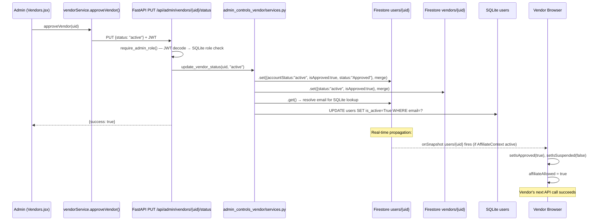

### Disable / Suspend Vendor

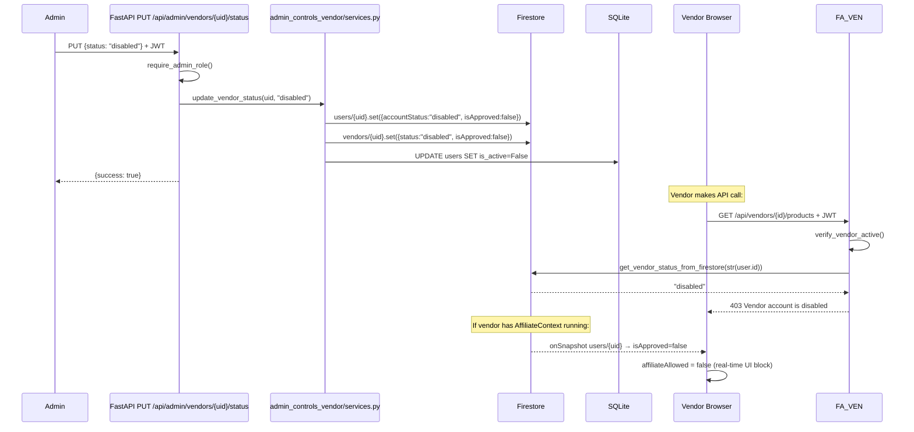

### Admin Vendor Control — What Each Status Enforces

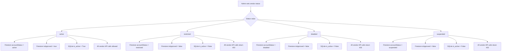

---

## 2. Affiliate Control Flows

### Enable Affiliate

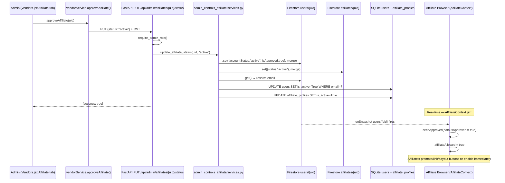

### Disable Affiliate

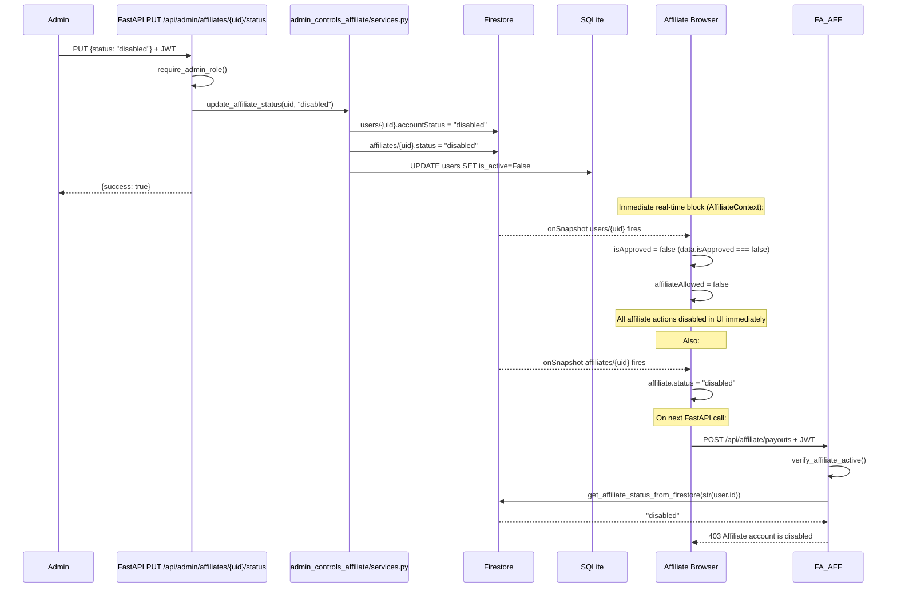

### The Affiliate Listener Chain (Why No Direct Coupling Needed)

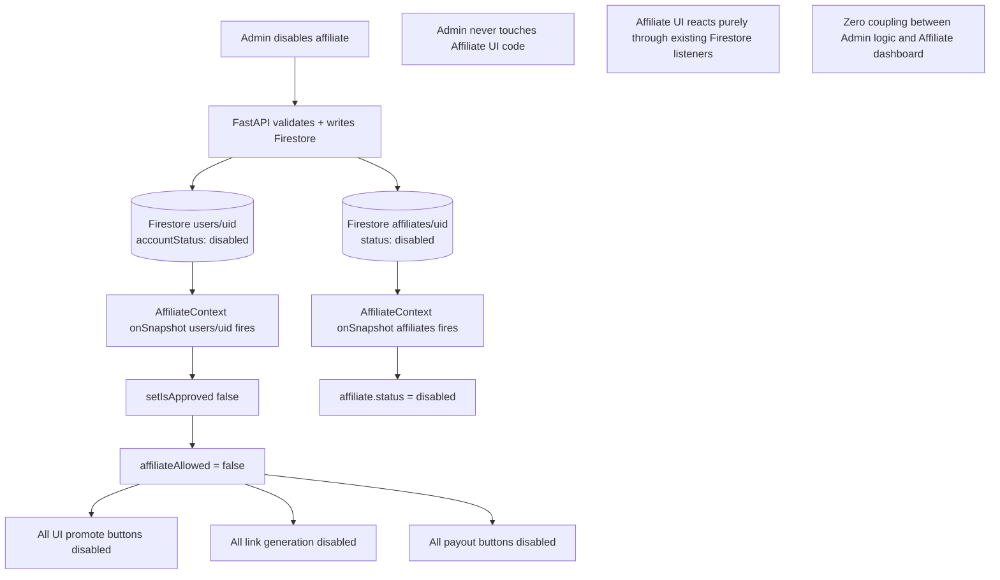

---

## 3. Product Control Flows

### Admin Creates Product

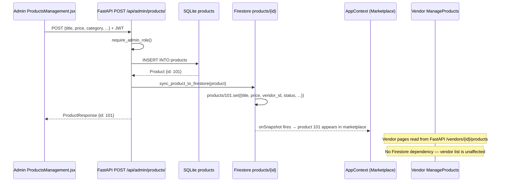

### Admin Updates Product

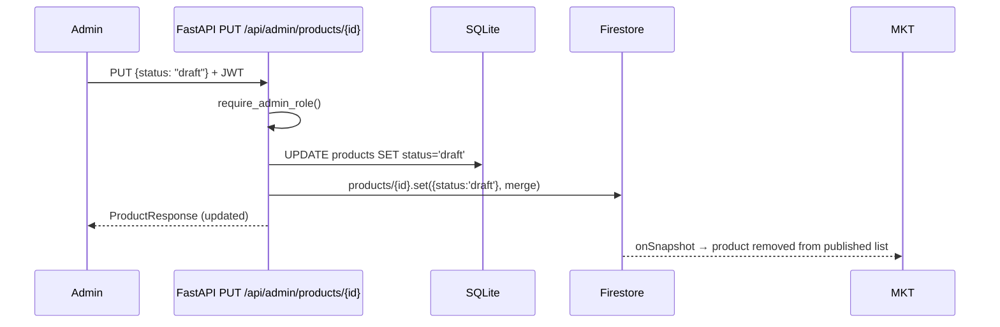

### Admin Deletes Product

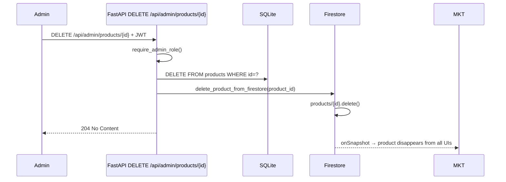

---

## 4. Platform Status Control Flows

### Global Pause

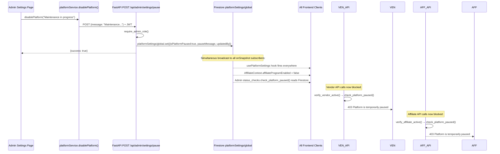

### Global Resume

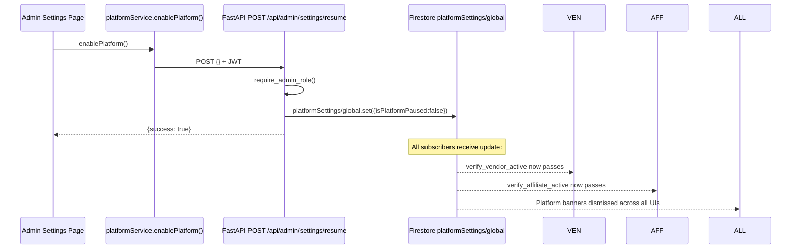

### Feature Flag Toggle

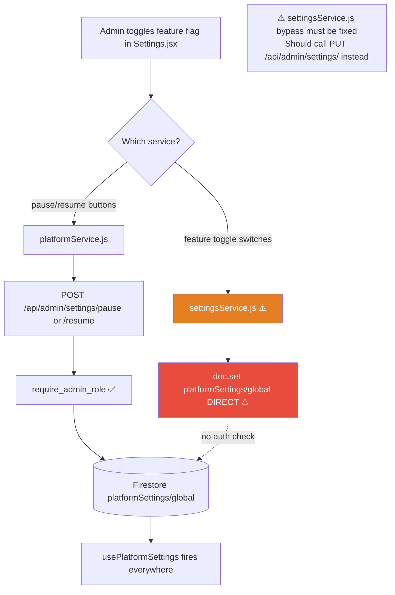

---

## 5. Order Control Flows

### Customer Checkout → Admin Visibility (Current Broken State)

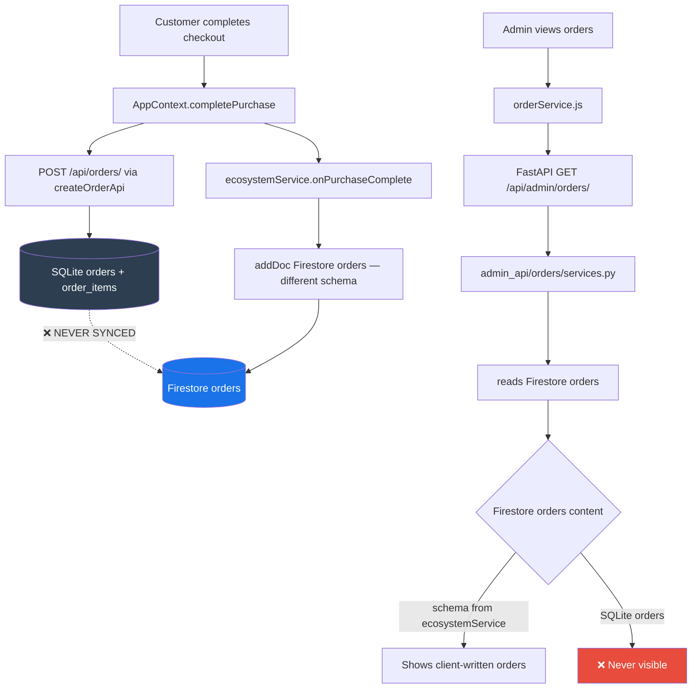

### Target: Customer Checkout → Admin Visibility (After Fix)

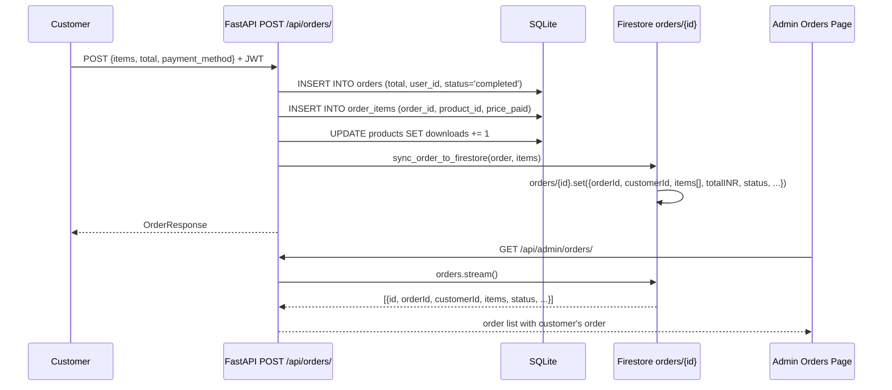

### Admin Updates Order Status

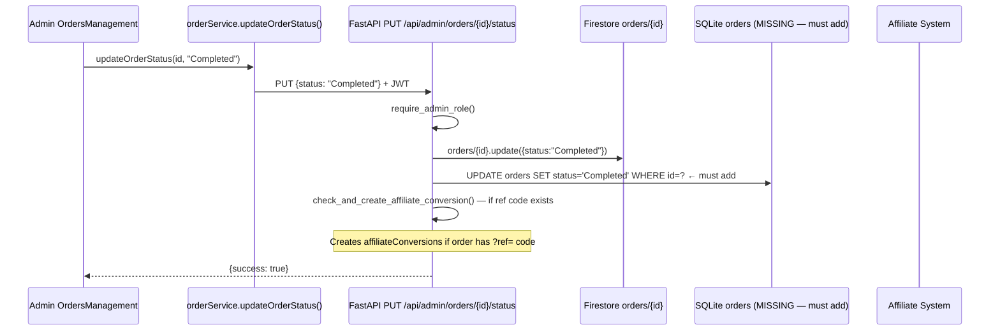

---

## 6. Analytics & Reports Control Flows

### Admin Dashboard Data Flow

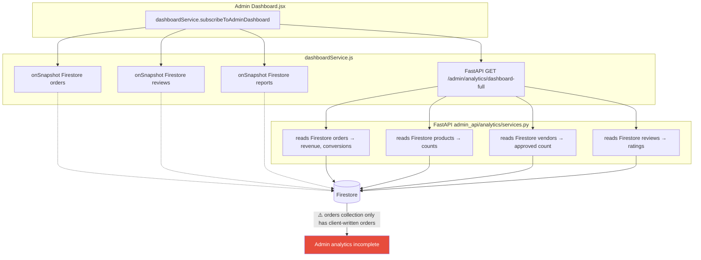

### Admin Reports — Correct Flow (Template for Other Modules)

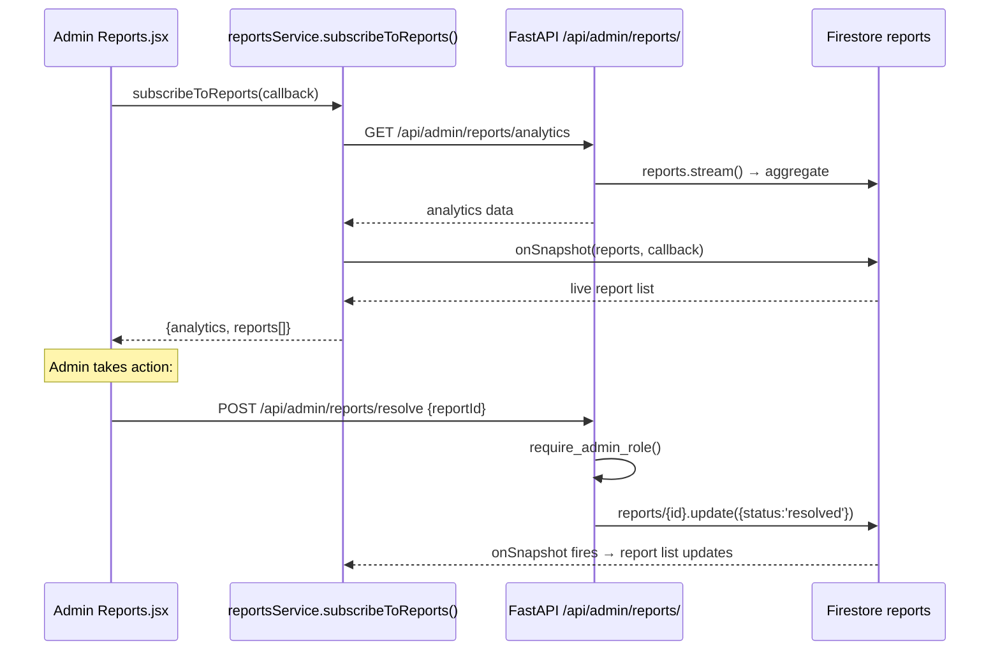

---

## 7. Settings Control Flows

### Platform Settings Read (Always Works)

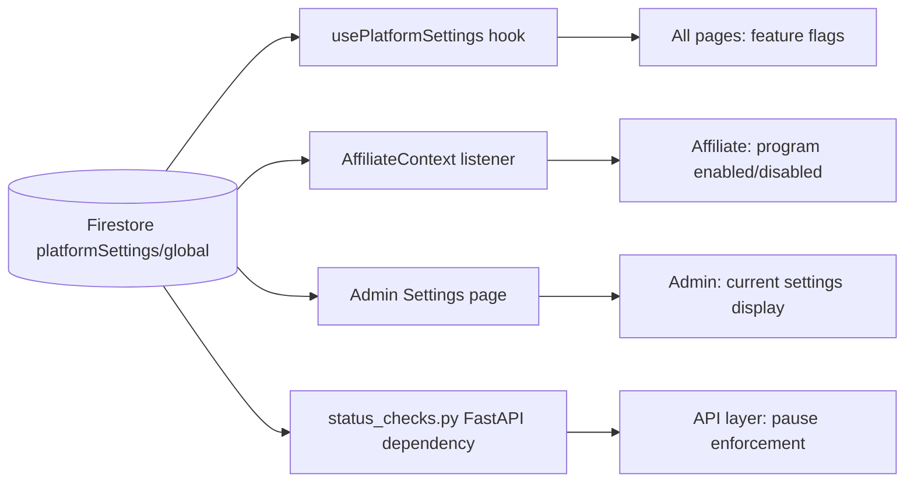

### Platform Settings Write — Target (All Through FastAPI)

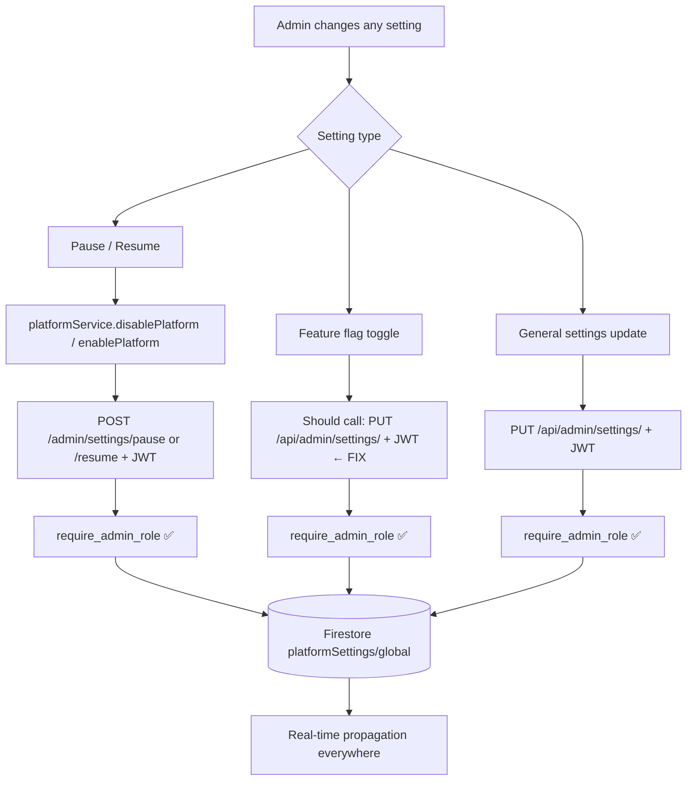

---

## 8. Complete Control Layer Map

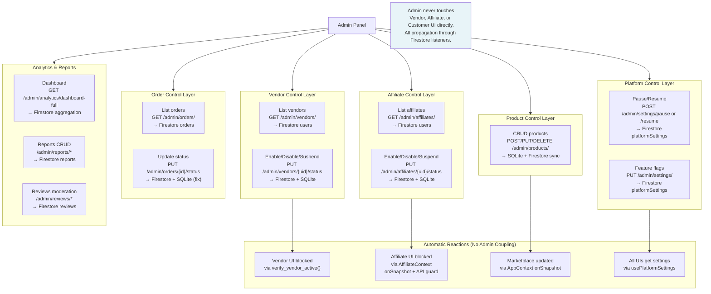
