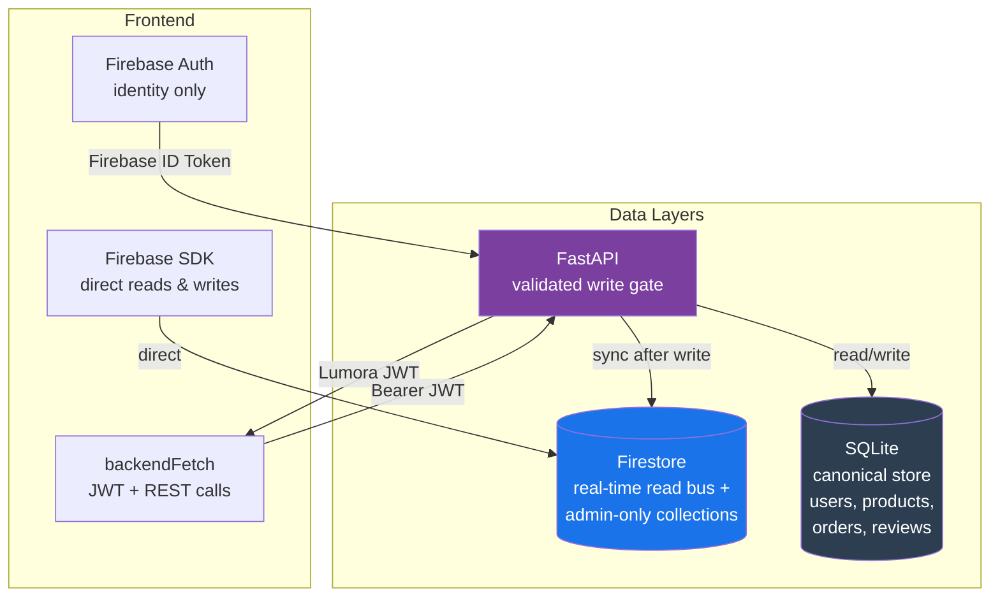
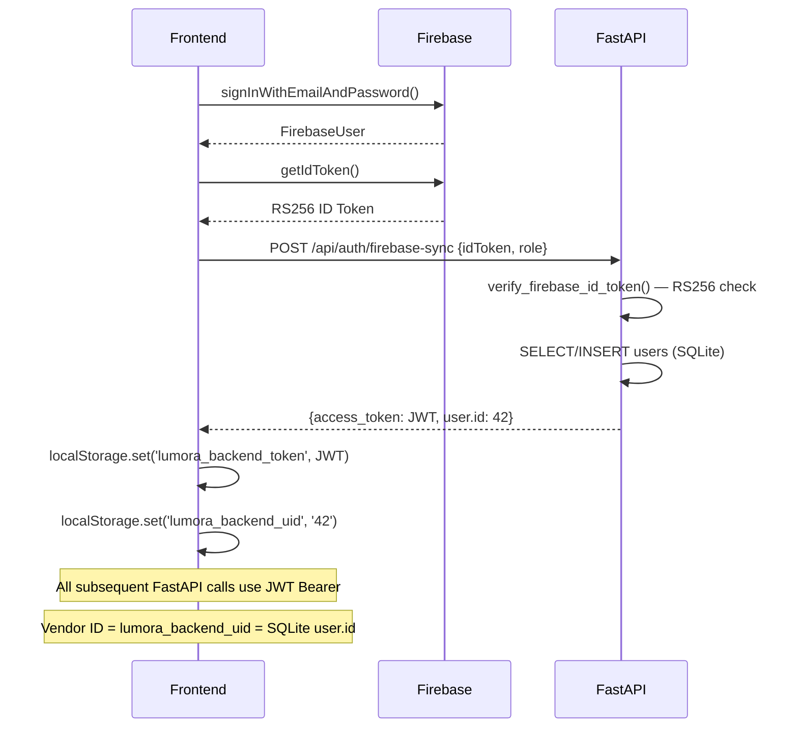

# Lumora — Backend Architecture Audit
> Complete architectural scan. Analysis only — no code was modified.
> Date: July 2, 2026

---

## Table of Contents

1. [Project Structure Map](#1-project-structure-map)
2. [Technology Layer Map](#2-technology-layer-map)
3. [Page-by-Page Dependency Analysis](#3-page-by-page-dependency-analysis)
4. [Firestore Collection Audit](#4-firestore-collection-audit)
5. [FastAPI Router Audit](#5-fastapi-router-audit)
6. [Authentication Audit](#6-authentication-audit)

---

## 1. Project Structure Map

```
digital-marketplace/
├── frontend/src/
│   ├── pages/
│   │   ├── admin/
│   │   │   ├── Dashboard.jsx           Hybrid  (FastAPI + Firestore)
│   │   │   ├── ProductsManagement.jsx  Hybrid  (Firestore read + FastAPI write)
│   │   │   ├── Vendors.jsx             Hybrid  (Firestore list + FastAPI status)
│   │   │   ├── Analytics.jsx           Hybrid  (FastAPI + Firestore onSnapshot)
│   │   │   ├── OrdersManagement.jsx    FastAPI → Firestore (broken — orders in SQLite)
│   │   │   ├── CustomersManagement.jsx Firestore onSnapshot
│   │   │   ├── Settings.jsx            Hybrid  (settingsService + platformService)
│   │   │   ├── Reports.jsx             Hybrid  (FastAPI + Firestore onSnapshot)
│   │   │   ├── Reviews.jsx             FastAPI only
│   │   │   ├── Payments.jsx            Firestore onSnapshot (paymentService)
│   │   │   ├── CampaignManager.jsx     Firestore only (adminReferralLinks, etc.)
│   │   │   └── PromotionsManagement.jsx Firestore only (adminPromotions, etc.)
│   │   ├── vendor/
│   │   │   ├── Dashboard.jsx           FastAPI only (/vendors/{id}/dashboard)
│   │   │   ├── ManageProducts.jsx      FastAPI only (/vendors/{id}/products)
│   │   │   ├── AddProduct.jsx          FastAPI only (POST /products/)
│   │   │   ├── EditProduct.jsx         FastAPI only (PUT /products/{id})
│   │   │   ├── Analytics.jsx           FastAPI only (with hardcoded view multipliers)
│   │   │   ├── Orders.jsx              FastAPI only (/vendors/{id}/orders)
│   │   │   ├── Earnings.jsx            FastAPI only (/vendors/{id}/stats)
│   │   │   ├── Reviews.jsx             FastAPI only (/vendors/{id}/reviews)
│   │   │   ├── Withdrawals.jsx         FastAPI only (/vendors/{id}/withdrawals)
│   │   │   ├── Profile.jsx             FastAPI only (/vendors/{id}/profile)
│   │   │   └── StoreSettings.jsx       FastAPI only (/vendors/{id}/store-settings)
│   │   ├── affiliate/
│   │   │   ├── AffiliateDashboard.jsx  FastAPI only (/affiliate/*)
│   │   │   ├── Dashboard.jsx           Props from AffiliateDashboard
│   │   │   ├── Products.jsx            AppContext (Firestore products)
│   │   │   ├── Earnings.jsx            Props + POST /affiliate/payouts
│   │   │   └── Profile.jsx             Props from AffiliateDashboard
│   │   └── customer/
│   │       ├── Dashboard.jsx           FastAPI only
│   │       ├── Orders.jsx              FastAPI only
│   │       ├── Downloads.jsx           FastAPI only
│   │       ├── Purchases.jsx           Firestore (purchases collection)
│   │       ├── Wishlist.jsx            FastAPI only
│   │       └── Settings.jsx            Hybrid (Firestore profile + FastAPI name)
│   ├── context/
│   │   ├── AuthContext.jsx             Firebase Auth + Firestore users/*
│   │   ├── AppContext.jsx              Hybrid (FastAPI products + Firestore onSnapshot)
│   │   └── AffiliateContext.jsx        Firestore only (7 onSnapshot listeners)
│   ├── services/
│   │   ├── analyticsService.js         Hybrid (FastAPI + Firestore onSnapshot)
│   │   ├── dashboardService.js         Hybrid (FastAPI + Firestore onSnapshot)
│   │   ├── vendorService.js            FastAPI only
│   │   ├── settingsService.js          Firestore only (DIRECT writes — bypass)
│   │   ├── reportsService.js           Hybrid (FastAPI actions + Firestore list)
│   │   ├── orderService.js             FastAPI only
│   │   ├── reviewAnalyticsService.js   FastAPI only
│   │   ├── affiliateService.js         Firestore only (client-side writes)
│   │   ├── ecosystemService.js         Firestore only (post-purchase writes)
│   │   ├── paymentService.js           Hybrid (Firestore telemetry + FastAPI payout)
│   │   ├── notificationService.js      Hybrid (FastAPI primary + Firestore fallback)
│   │   ├── userService.js              Hybrid (Firestore profile + FastAPI /auth/me)
│   │   ├── purchaseService.js          Firestore only (purchases collection)
│   │   └── storageService.js           FastAPI only (/uploads/*)
│   └── hooks/
│       ├── useVendorData.js            FastAPI only (all vendor data hooks)
│       └── usePlatformSettings.js      Firestore only (platformSettings/global)
│
└── backend/
    ├── app/
    │   ├── main.py                     FastAPI app — all routers registered here
    │   ├── api/
    │   │   ├── auth_router.py          SQLite + Firebase verify
    │   │   ├── products_router.py      SQLite + Firestore sync
    │   │   ├── orders/routes.py        SQLite only (NO Firestore sync — root cause)
    │   │   ├── vendors/routes.py       SQLite only
    │   │   ├── reviews/routes.py       SQLite only
    │   │   ├── affiliate/routes.py     SQLite only (full SQLAlchemy affiliate system)
    │   │   ├── cart_router.py          SQLite only
    │   │   ├── wishlist_router.py      SQLite only
    │   │   ├── notifications_router.py SQLite only
    │   │   └── upload_router.py        Local filesystem + Cloudflare R2
    │   ├── admin_api/
    │   │   ├── routes.py               Aggregates all admin sub-routers
    │   │   ├── analytics/              Firestore reads only
    │   │   ├── orders/                 Firestore reads + writes
    │   │   ├── customers/              Firestore reads
    │   │   ├── payments/               Firestore reads + writes
    │   │   ├── reports/                Firestore reads + writes
    │   │   └── reviews/                Firestore reads + writes
    │   ├── core/
    │   │   ├── firebase.py             Firebase ID token verifier (RS256)
    │   │   ├── security.py             JWT create/decode
    │   │   └── config.py               Settings (env vars)
    │   └── shared/firebase/
    │       └── connection.py           firebase_admin SDK init
    ├── admin/
    │   ├── routes/                     Admin CRUD routes (products, vendors, etc.)
    │   ├── validators/                 admin_auth.py, status_checks.py
    │   └── firestore/                  admin_firestore.py (sync helpers)
    ├── admin_controls_vendor/          Vendor status update service + Firestore ops
    └── admin_controls_affiliate/       Affiliate status update service + Firestore ops
```

---

## 2. Technology Layer Map



### Summary Table

| Module | Firestore | FastAPI | SQLite | Pattern |
|---|---|---|---|---|
| **Authentication** | Auth + users doc | firebase-sync → JWT | users table | Hybrid Bridge |
| **Products (marketplace)** | onSnapshot read | CRUD write + sync | products table | Correct Hybrid |
| **Products (vendor write)** | — | POST/PUT/DELETE + sync | products table | FastAPI → dual write |
| **Orders (customer)** | — | POST + read | orders table | FastAPI only |
| **Orders (admin)** | onSnapshot | reads Firestore | — | Broken (SQLite ≠ Firestore) |
| **Vendor Dashboard** | — | all reads | all tables | Pure FastAPI ✅ |
| **Affiliate (frontend)** | 7 onSnapshot | NOT USED | — | Firestore only |
| **Affiliate (FastAPI module)** | — | profile/stats/payouts | affiliate tables | Disconnected |
| **Admin Vendors** | list read | status write | is_active sync | Correct Hybrid |
| **Admin Analytics** | Firestore read | proxies Firestore | — | Broken (Firestore orders empty) |
| **Platform Settings** | onSnapshot read | pause/resume write | — | Correct Hybrid |
| **Campaigns/Promotions** | all reads/writes | — | — | Firestore only |
| **Payments (admin)** | onSnapshot | no auth! | — | Insecure Firestore |


---

## 3. Page-by-Page Dependency Analysis

### Admin Pages

| Page | Firestore Collections Read | Firestore Writes | FastAPI Endpoints | Real-time | Status |
|---|---|---|---|---|---|
| **Dashboard** | orders, reviews, reports (via services) | — | GET /admin/analytics/dashboard-full | ✅ 3 subscriptions | ⚠️ Partial (orders empty) |
| **ProductsManagement** | products (onSnapshot) | — | POST/PUT/DELETE /admin/products/ | ✅ 1 listener | ⚠️ Reads Firestore, writes FastAPI |
| **Vendors** | users (where role=vendor/affiliate) | — | GET /admin/vendors/, PUT /admin/vendors/{uid}/status | ❌ | ✅ Working |
| **Analytics** | orders, reviews (via services) | — | GET /admin/analytics/* | ✅ 2 subscriptions | ⚠️ Partial (orders empty) |
| **OrdersManagement** | — | — | GET/PUT/POST /admin/orders/* | ❌ | ❌ Broken (Firestore orders = []) |
| **CustomersManagement** | users, orders | — | — | ✅ 2 listeners | ⚠️ Orders empty |
| **Settings** | platformSettings/global (onSnapshot) | platformSettings/global | GET/PUT /admin/settings/, POST /pause, /resume | ✅ 1 listener | ✅ Working |
| **Reports** | reports (onSnapshot) | — | GET/POST /admin/reports/* | ✅ 1 listener | ✅ Working |
| **Reviews** | — (via FastAPI → Firestore) | — | GET /admin/reviews/dashboard | ❌ | ✅ Working |
| **Payments** | orders, users (via paymentService) | — | — | ✅ 2 listeners | ⚠️ No auth on FastAPI payments |
| **CampaignManager** | products, adminReferralLinks, adminAnalytics/global, adminAffiliateOrders | adminReferralLinks (add/update/delete) | — | ✅ 3 listeners | ⚠️ Pure Firestore — no validation |
| **PromotionsManagement** | adminPromotions, promotionParticipants, promotionTransactions | all 3 (add/update/delete) | — | ✅ 3 listeners | ⚠️ Pure Firestore — no validation |

### Vendor Pages

| Page | Firestore | FastAPI Endpoints | Real-time | Status |
|---|---|---|---|---|
| **Dashboard** | — | GET /vendors/{id}/dashboard | ❌ | ✅ Working |
| **ManageProducts** | — | GET /vendors/{id}/products | ❌ | ✅ Working |
| **AddProduct** | — | POST /products/ | ❌ | ✅ Working |
| **EditProduct** | — | PUT /products/{id} | ❌ | ✅ Working |
| **Analytics** | — | GET /vendors/{id}/orders + /products | ❌ | ⚠️ Views are fake multipliers |
| **Orders** | — | GET /vendors/{id}/orders, PATCH status | ❌ | ✅ Working |
| **Earnings** | — | GET /vendors/{id}/stats | ❌ | ✅ Working |
| **Reviews** | — | GET /vendors/{id}/reviews | ❌ | ✅ Working |
| **Withdrawals** | — | GET/POST /vendors/{id}/withdrawals | ❌ | ✅ Working |
| **Profile** | — | GET/PUT /vendors/{id}/profile | ❌ | ✅ Working |
| **Affiliate** | AffiliateContext (7 listeners) | — | ✅ | ✅ Working |

### Affiliate Pages

| Page | Firestore | FastAPI Endpoints | Real-time | Status |
|---|---|---|---|---|
| **AffiliateDashboard (shell)** | — | GET /affiliate/profile, /stats, /commissions, /payouts | ❌ | ✅ Working (but ignores AffiliateContext) |
| **Dashboard (inner)** | Props only | — | ❌ | ✅ Working |
| **Products** | AppContext (products) | — | ❌ onSnapshot via AppCtx | ✅ Working |
| **Earnings** | Props | POST /affiliate/payouts | ❌ | ✅ Working |
| **Profile** | Props | — | ❌ | ✅ Working |

### Customer Pages

| Page | Firestore | FastAPI Endpoints | Real-time | Status |
|---|---|---|---|---|
| **Dashboard** | — | GET /auth/me, /orders/me, /wishlist/me, /notifications/, /activity/ | ❌ | ✅ Working |
| **Orders** | — | GET /orders/me, /orders/{id} | ❌ | ✅ Working |
| **Downloads** | — | GET /products/{id}/download | ❌ | ✅ Working |
| **Purchases** | purchases collection | — | ❌ | ⚠️ Duplicate of SQLite orders |
| **Wishlist** | — | GET /wishlist/me, POST/DELETE | ❌ | ✅ Working |
| **Settings** | users/{uid} | PUT /auth/me (name only) | ❌ | ⚠️ Split state |

---

## 4. Firestore Collection Audit

| Collection | Purpose | Written By | Read By | Real-time Listeners | FastAPI Involved | Security Risk |
|---|---|---|---|---|---|---|
| `users` | User profiles, roles, status | AuthContext (register/login), admin_controls services | AuthContext, AffiliateContext, Admin Customers, Admin Vendors | ✅ AffiliateContext, CustomersManagement | ✅ status writes via FastAPI | Low |
| `products` | Product catalog (synced from SQLite) | FastAPI products_router (sync on CRUD) | AppContext, Admin ProductsManagement, analyticsService | ✅ AppContext, Admin Products | ✅ sole write gate | Low |
| `vendors` | Vendor profiles, approval status | AuthContext (registration), admin_controls | Analytics, Payments, Admin Vendors | ❌ | ✅ status writes | Low |
| `affiliates` | Affiliate profiles, auto-created | AffiliateContext (client-side!), AuthContext | AffiliateContext, admin_controls | ✅ AffiliateContext | ✅ status writes only | **HIGH — client creates with hardcoded rate** |
| `customers` | Customer profiles | AuthContext (registration) | Admin Customers | ❌ | ❌ | Low |
| `orders` | Order records — should be canonical | `ecosystemService.js` (client-side, post-purchase) | Admin Orders, Analytics, Payments, Dashboard | ✅ Admin pages, Payments | ✅ Admin status updates | **HIGH — client-written, unvalidated** |
| `reviews` | Product reviews (not synced from SQLite) | Unknown — no frontend write path found | Admin Reviews (via FastAPI proxy) | ❌ | ✅ admin reads/moderate | Medium |
| `reports` | User-submitted reports | Unknown — no write path found in scanned code | Admin Reports (via FastAPI proxy) | ✅ reportsService | ✅ admin actions | Low |
| `platformSettings/global` | Feature flags, pause state, settings | FastAPI /admin/settings/ (correct), settingsService.js (bypass) | usePlatformSettings, AffiliateContext, status_checks.py | ✅ everywhere | ✅ + bypass exists | **MEDIUM — bypass write path** |
| `affiliateConversions` | Commission records per sale | `ecosystemService.js` (client-side), admin_api/orders/services.py | AffiliateContext, admin_orders service | ✅ AffiliateContext | ✅ FastAPI also writes | **HIGH — client calculates commission** |
| `affiliateLinks` | Affiliate referral link stats | `affiliateService.js` (client-side) | affiliateService | ❌ | ❌ | HIGH |
| `affiliateActivity` | Activity log | `ecosystemService.js` (client-side) | AffiliateContext | ✅ AffiliateContext | ❌ | Medium |
| `affiliatePayoutRequests` | Payout requests | `affiliateService.js` (client-side) | AffiliateContext | ✅ AffiliateContext | ❌ | **HIGH — bypasses FastAPI payout endpoint** |
| `vendorStats` | Vendor revenue counters | `ecosystemService.js` (client-side) | Unknown | ❌ | ❌ | HIGH |
| `vendorNotifications` | Vendor order alerts | `ecosystemService.js` (client-side) | Unknown | ❌ | ❌ | Medium |
| `purchases` | Customer purchase records | `purchaseService.js` (client-side) | purchaseService | ❌ | ❌ | Medium (duplicate of SQLite orders) |
| `payments` | Payment transaction logs | `paymentService.js` (client-side) | paymentService | ❌ | ❌ | Medium |
| `notifications` | User notifications | `ecosystemService.js` + `notificationService.js` (both) | AffiliateContext, notificationService | ✅ AffiliateContext | ✅ FastAPI primary | Low |
| `auth_logs` | Login/logout audit trail | `AuthContext.logAuthEvent` | None | ❌ | ❌ | Low |
| `adminReferralLinks` | Admin campaign referral links | CampaignManager (direct Firestore) | CampaignManager | ✅ | ❌ | Medium |
| `adminPromotions` | Admin promotion campaigns | PromotionsManagement (direct) | PromotionsManagement | ✅ | ❌ | Medium |
| `promotionParticipants` | Affiliate enrollment in promotions | Unknown (affiliate side) | PromotionsManagement | ✅ | ❌ | Low |
| `promotionTransactions` | Promotion reward claims | PromotionsManagement (verify) | PromotionsManagement | ✅ | ❌ | Low |
| `adminAffiliateOrders` | Admin-tracked referral conversions | Unknown | CampaignManager | ✅ | ❌ | Low |
| `adminAnalytics/global` | Aggregate admin analytics | Unknown | CampaignManager | ✅ | ❌ | Low |
| `cart` | Shopping cart items | FastAPI cart_router.py | AppContext | ❌ | ✅ | Low |
| `wishlist` | Wishlist items | FastAPI wishlist_router.py | AppContext | ❌ | ✅ | Low |

---

## 5. FastAPI Router Audit

### `/api/auth/*` — auth_router.py

| Endpoint | SQLite | Firestore | Auth | Status |
|---|---|---|---|---|
| POST /register | INSERT users | — | None | ✅ |
| POST /login | SELECT users | — | None | ✅ |
| POST /firebase-sync | SELECT/INSERT users | — | Firebase ID Token | ✅ (bridge) |
| GET /me | SELECT users | — | JWT | ✅ |
| PUT /me | UPDATE users | — | JWT | ✅ |
| POST /forgot-password | SELECT users | — | None | ⚠️ Stub |

### `/api/products/*` — products_router.py

| Endpoint | SQLite | Firestore | Auth | Status |
|---|---|---|---|---|
| GET / (list) | SELECT | — | None | ✅ |
| GET /search | SELECT + filters | — | None | ✅ |
| GET /featured | SELECT | — | None | ✅ |
| GET /{id} | SELECT | — | None | ✅ |
| GET /{id}/download | SELECT orders+items | — | JWT | ✅ |
| POST / | INSERT products | SET products/{id} | JWT (vendor/admin) | ✅ |
| PUT /{id} | UPDATE products | SET products/{id} merge | JWT (owner/admin) | ✅ |
| DELETE /{id} | DELETE products | DELETE products/{id} | JWT (owner/admin) | ✅ |

### `/api/orders/*` — orders/routes.py

| Endpoint | SQLite | Firestore | Auth | Status |
|---|---|---|---|---|
| POST / | INSERT orders + order_items; UPDATE products.downloads | **❌ NONE** | JWT | ❌ Missing Firestore sync |
| GET /me | SELECT orders | — | JWT | ✅ |
| GET /{id} | SELECT orders | — | JWT | ✅ |

### `/api/vendors/*` — vendors/routes.py

All 14 endpoints are FastAPI → SQLite only. No Firestore reads or writes. Status checks read Firestore indirectly via `verify_vendor_active`. All working ✅.

### `/api/affiliate/*` — affiliate/routes.py

Full SQLAlchemy system. 13 endpoints: profile, stats, dashboard, commissions, payouts, analytics, reports, referral-links, track-click. All working ✅ but **frontend AffiliateContext does not call these** — it uses Firestore directly.

### `/api/admin/*` — admin_api/routes.py

| Sub-router | Data Source | Auth | Broken? |
|---|---|---|---|
| analytics | Firestore `orders`, `products`, `vendors`, `reviews` | JWT (admin) | ⚠️ Orders empty |
| orders | Firestore `orders` | JWT (admin) | ❌ Orders never written to Firestore |
| customers | Firestore `users` | JWT (admin) | ⚠️ Page ignores this endpoint |
| payments | Firestore `orders`, `vendors` | **None** | ❌ No auth check |
| reports | Firestore `reports` | JWT (admin) | ✅ |
| reviews | Firestore `reviews` | JWT (admin) | ✅ |
| settings | Firestore `platformSettings/global` | JWT (admin) | ✅ |
| products | SQLite + Firestore sync | JWT (admin) | ✅ |
| vendors | Firestore `users` list | JWT (admin) | ✅ |
| affiliates | Firestore `users` list | JWT (admin) | ✅ |

---

## 6. Authentication Audit

### Auth Flow by Role

| Role | Login Method | Firebase | Backend JWT | Route Guard | Admin Bypass |
|---|---|---|---|---|---|
| **Customer** | Firebase email/password | ✅ | ✅ via firebase-sync | ProtectedRoute | No |
| **Vendor** | Firebase email/password | ✅ | ✅ via firebase-sync | VendorRoute | No |
| **Affiliate** | Firebase email/password | ✅ | ✅ via firebase-sync | ProtectedRoute | No |
| **Admin** | Hardcoded email check | ❌ Bypassed | ❌ Not issued | AdminRoute (localStorage only) | **Yes** |

### Admin Authentication Gap

```javascript
// AuthContext.jsx — Admin mock bypass
if (email === 'admin@lumora.co' || email === 'admin@gmail.com') {
  const mockUser = { uid: 'admin-mock-uid', ... };
  localStorage.setItem('lumora_mock_user', JSON.stringify(mockUser));
  // No Firebase auth. No backend JWT. No SQLite user.
}
```

**Consequence:** Every FastAPI admin endpoint that calls `require_admin_role()` → `get_current_user_required()` → decodes JWT → looks up SQLite user will return **401 Unauthorized** because:
1. No JWT was issued for the mock admin session
2. `admin-mock-uid` does not exist in the SQLite `users` table

### Backend Token Flow



### Role Validation in FastAPI

```python
# admin/validators/admin_auth.py
def require_admin_role(current_user = Depends(get_current_user_required)):
    if current_user.role != "admin":  # checks SQLite role field
        raise HTTPException(403, "Admin only")
    return current_user

# admin/validators/status_checks.py
def verify_vendor_active(current_user = Depends(get_current_user_required)):
    check_platform_paused()           # reads Firestore platformSettings
    status = get_vendor_status_from_firestore(str(current_user.id))  # reads Firestore
    if status in ("suspended", "disabled", "rejected"):
        raise HTTPException(403, "Vendor disabled")
```

**Pattern:** JWT validates identity (SQLite), Firestore validates live status. This is the correct design.
