# Lumora Backend Data Flow
> Complete data flow maps for every major operation in the Lumora platform.  
> **Analysis only — no code was modified.**  
> Date: July 2, 2026

---

## Table of Contents

1. [Authentication Flow](#1-authentication-flow)
2. [Product Lifecycle Flow](#2-product-lifecycle-flow)
3. [Purchase & Order Flow](#3-purchase--order-flow)
4. [Vendor Management Flow](#4-vendor-management-flow)
5. [Affiliate System Flow](#5-affiliate-system-flow)
6. [Admin Control Flow](#6-admin-control-flow)
7. [Platform Settings Flow](#7-platform-settings-flow)
8. [Real-time Listener Map](#8-real-time-listener-map)

---

## 1. Authentication Flow

### 1A — Normal User Login (Customer / Vendor)

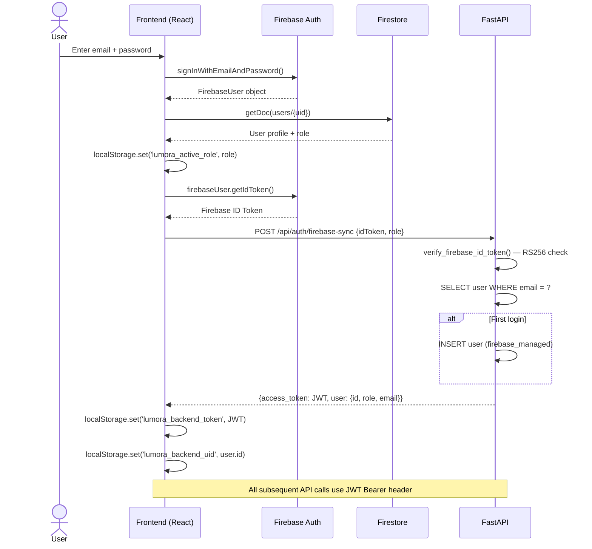

### 1B — Admin Login (Mock — No Real Authentication)

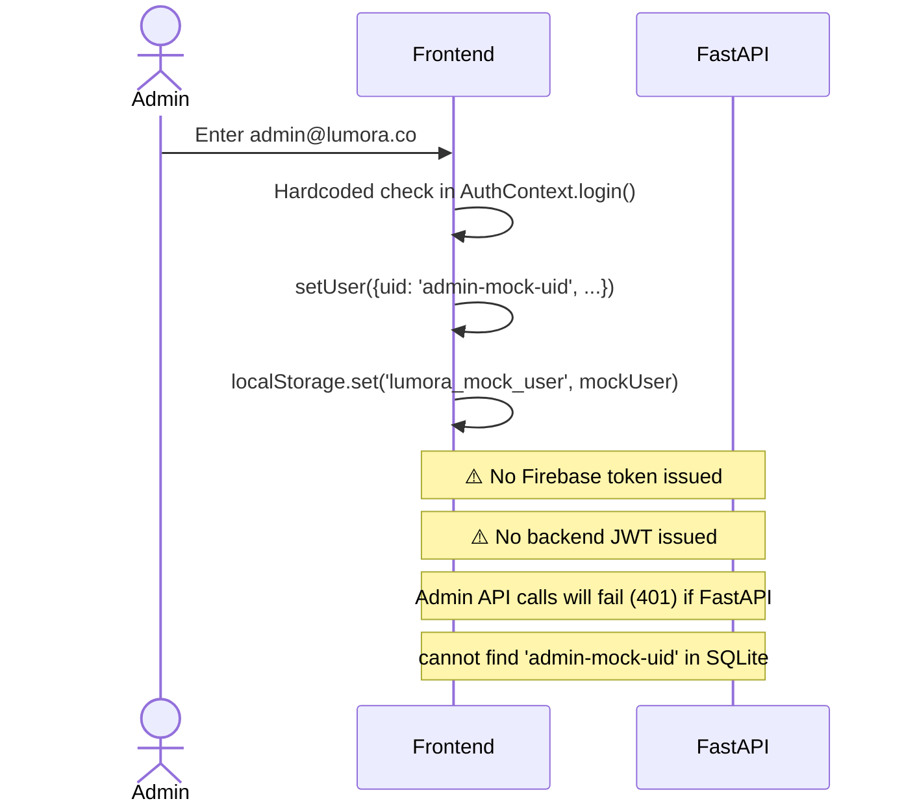

### 1C — Token Refresh Flow

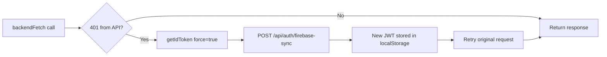

---

## 2. Product Lifecycle Flow

### 2A — Vendor Creates a Product

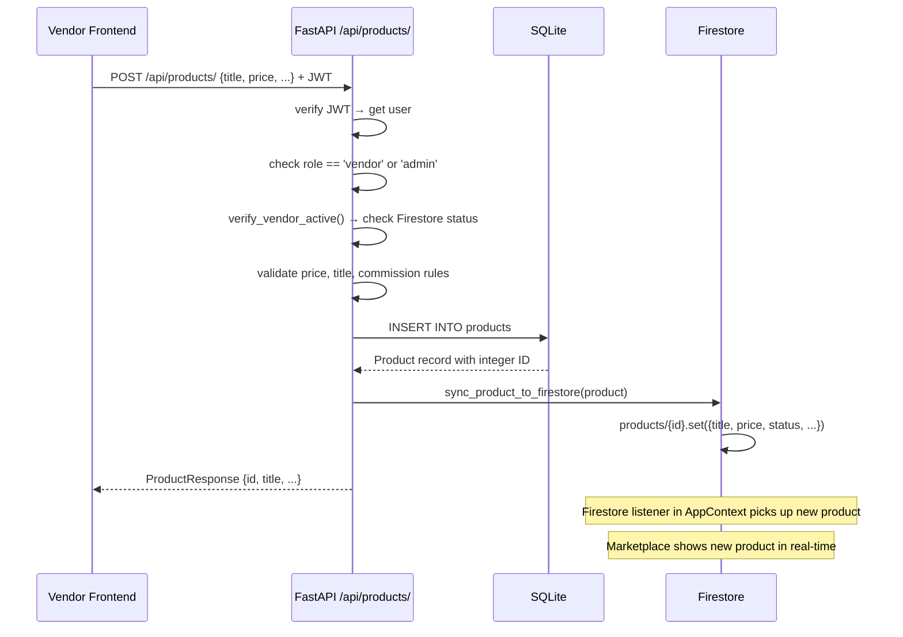

### 2B — Admin Creates/Updates a Product

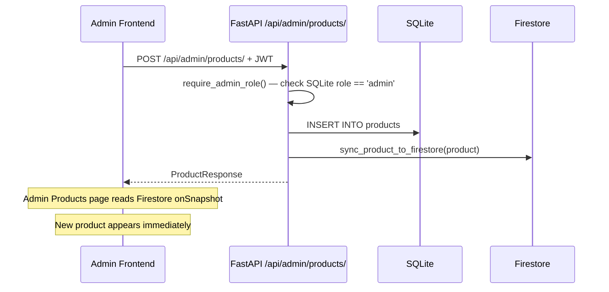

### 2C — Product Display Flow (Marketplace)

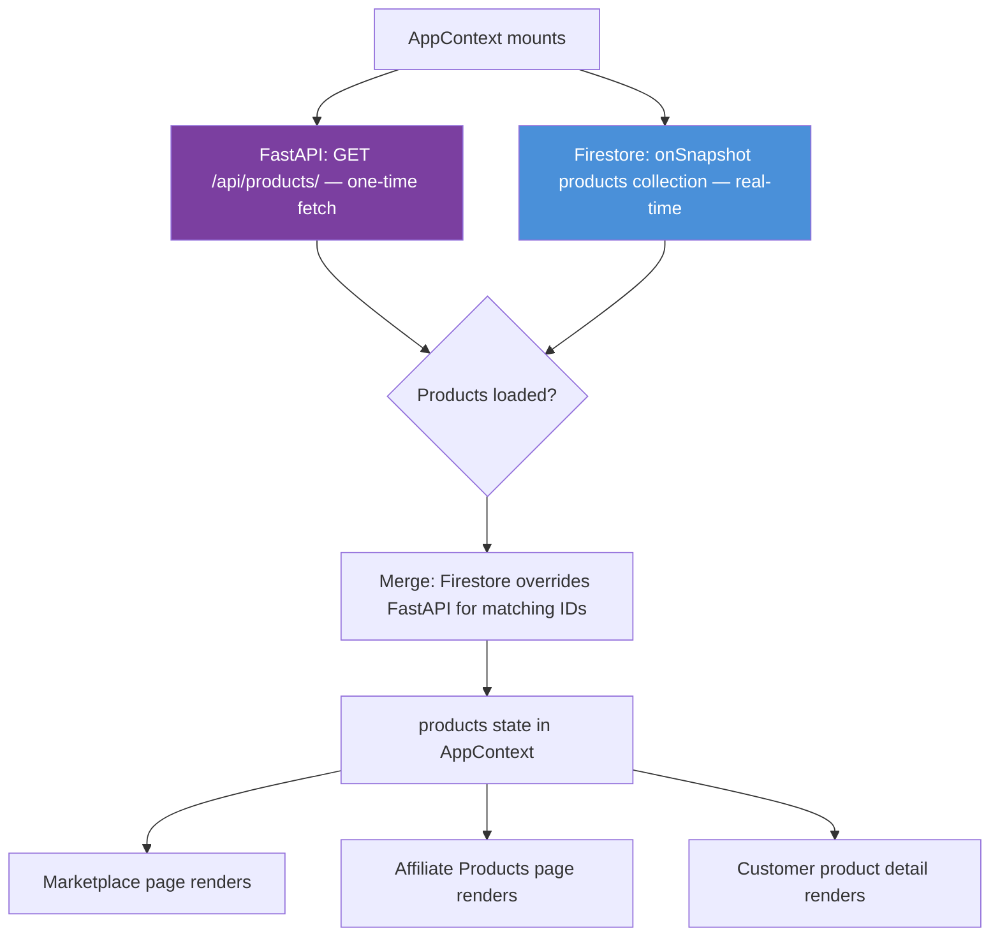

### 2D — Product Delete Flow

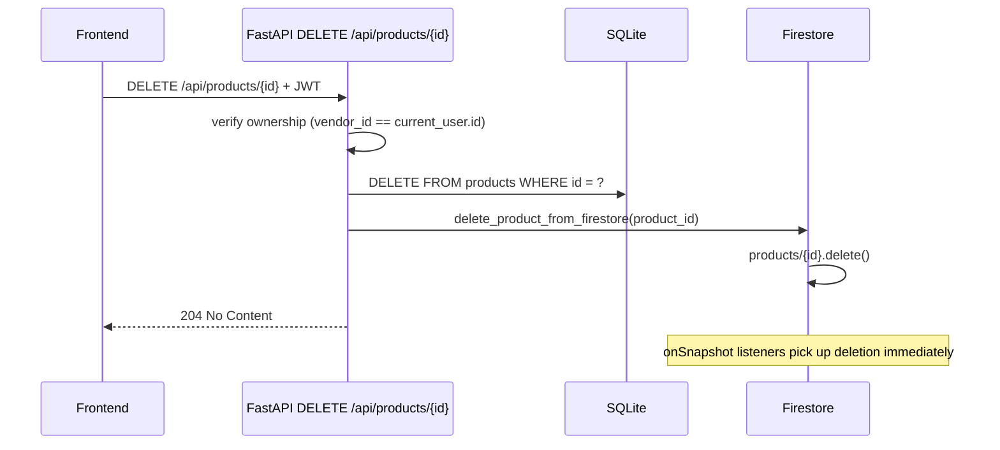

---

## 3. Purchase & Order Flow

### 3A — Customer Checkout (Current Implementation)

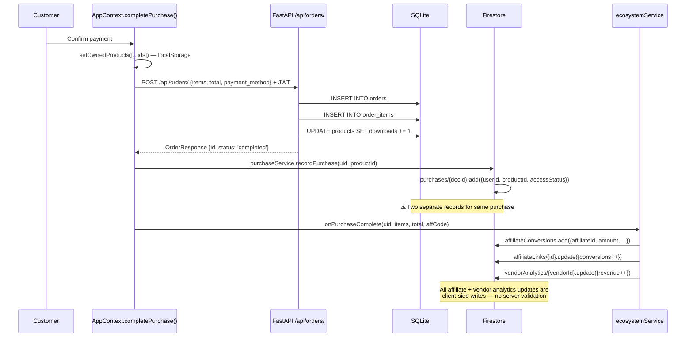

### 3B — Order Status Update (Admin)

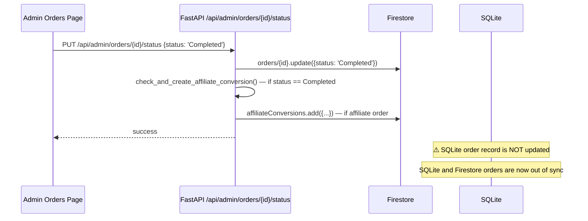

### 3C — Download Authorization Flow

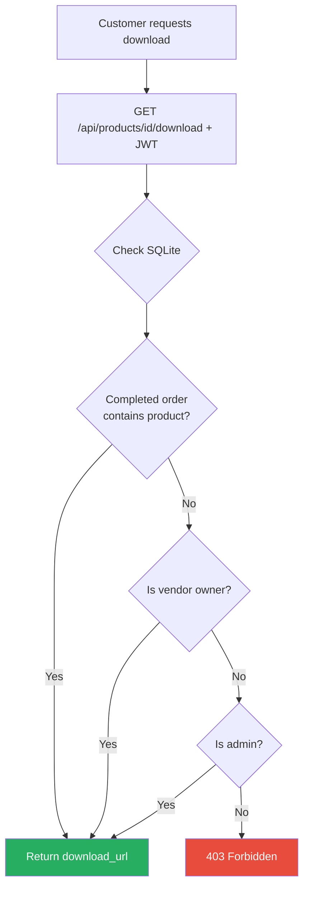

---

## 4. Vendor Management Flow

### 4A — Vendor Dashboard Data Flow

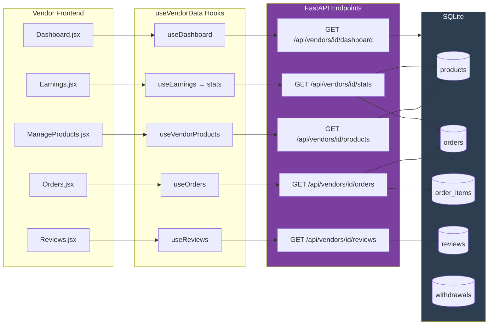

### 4B — Vendor Status Change Flow (Admin Action)

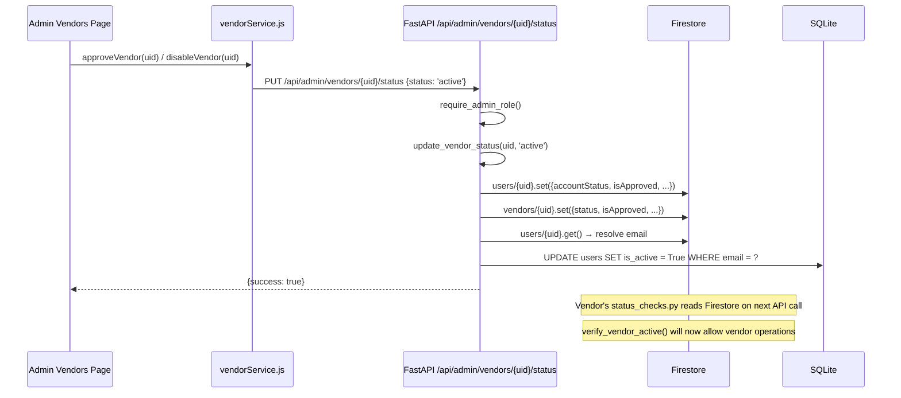

---

## 5. Affiliate System Flow

### 5A — Affiliate Profile Creation (Fully Client-Side)

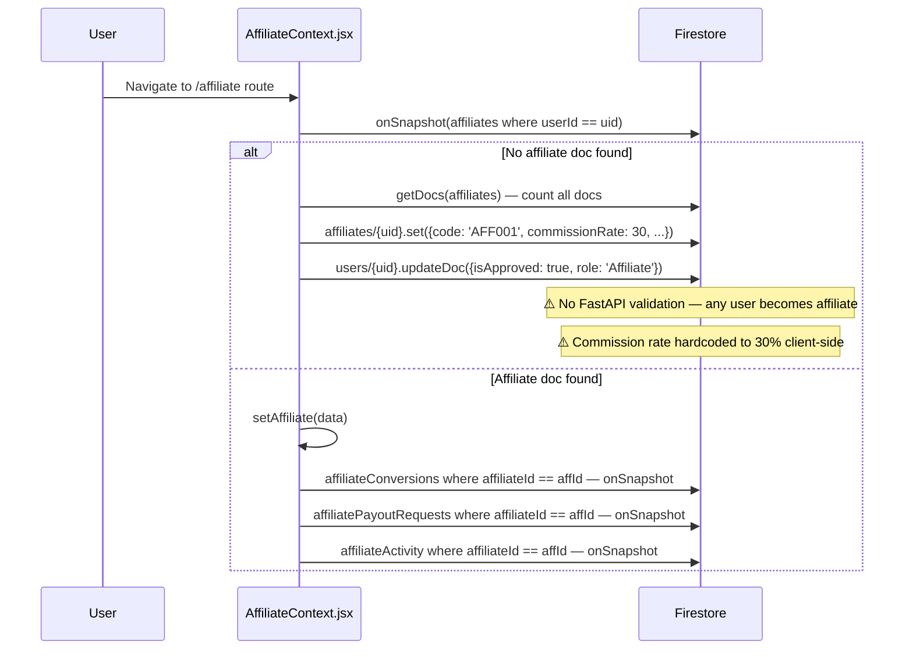

### 5B — Affiliate Referral & Conversion Flow

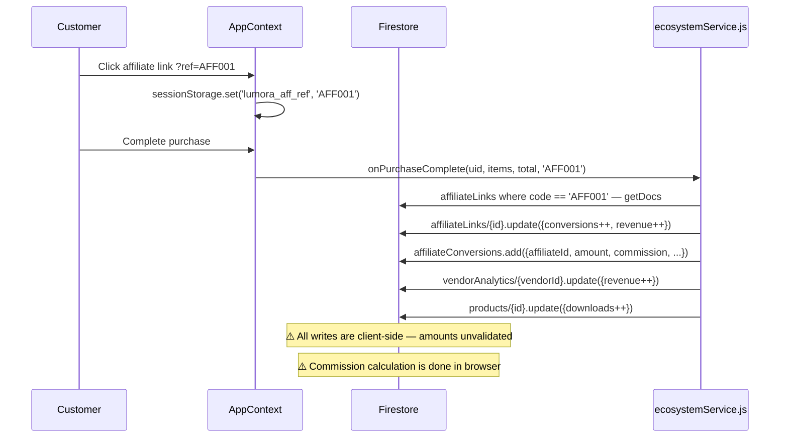

### 5C — Affiliate Payout Request Flow

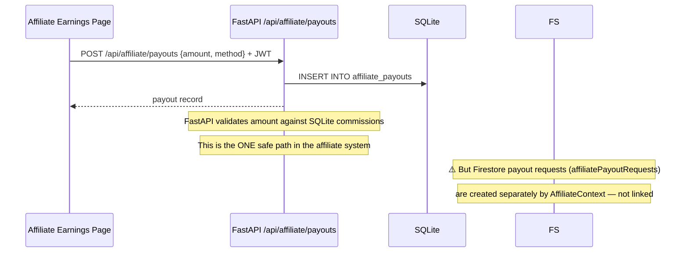

---

## 6. Admin Control Flow

### 6A — Admin Page Data Flow Overview

```mermaid
flowchart TD
    subgraph AdminPages["Admin Frontend Pages"]
        direction LR
        DASH[Dashboard.jsx]
        PROD[ProductsManagement.jsx]
        VEND[Vendors.jsx]
        CUST[CustomersManagement.jsx]
        ORD[OrdersManagement.jsx]
        ANA[Analytics.jsx]
        REP[Reports.jsx]
        REV[Reviews.jsx]
        SET[Settings.jsx]
        PAY[Payments.jsx]
    end

    subgraph Services["Frontend Services"]
        DS[dashboardService]
        AS[analyticsService]
        OS[orderService]
        RS[reportsService]
        RAS[reviewAnalyticsService]
        SS[settingsService]
        VS[vendorService]
        PS[paymentService]
    end

    subgraph FastAPI["FastAPI Admin Endpoints"]
        FA1[/api/admin/analytics/dashboard-full]
        FA2[/api/admin/orders/]
        FA3[/api/admin/reports/]
        FA4[/api/admin/reviews/dashboard]
        FA5[/api/admin/settings/]
        FA6[/api/admin/vendors/ & affiliates/]
        FA7[/api/admin/payments/]
    end

    subgraph FS["Firestore"]
        FSO[orders collection]
        FSP[products collection]
        FSU[users collection]
        FSPS[platformSettings/global]
        FSREP[reports collection]
        FSREV[reviews collection — via analytics service]
    end

    DASH --> DS --> FA1 --> FS
    DASH -.->|onSnapshot| FSO & FSREV
    PROD -.->|onSnapshot| FSP
    PROD --> FA_PROD[/api/admin/products/]
    VEND --> VS --> FA6 --> FS
    CUST -.->|onSnapshot| FSU & FSO
    ORD --> OS --> FA2 --> FSO
    ANA --> AS --> FA1 --> FS
    ANA -.->|onSnapshot| FSO & FSREV
    REP --> RS --> FA3 --> FSREP
    REP -.->|onSnapshot| FSREP
    REV --> RAS --> FA4 --> FS
    SET --> SS --> FSPS
    SET --> FA5 --> FSPS
    PAY --> PS --> FA7 --> FSO

    style FS fill:#e8f4f8
    style FastAPI fill:#f0e8f8
```

### 6B — Platform Pause/Resume Flow

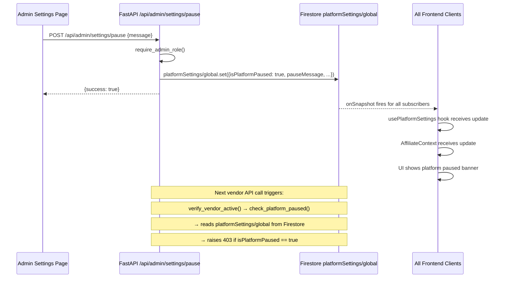

---

## 7. Platform Settings Flow

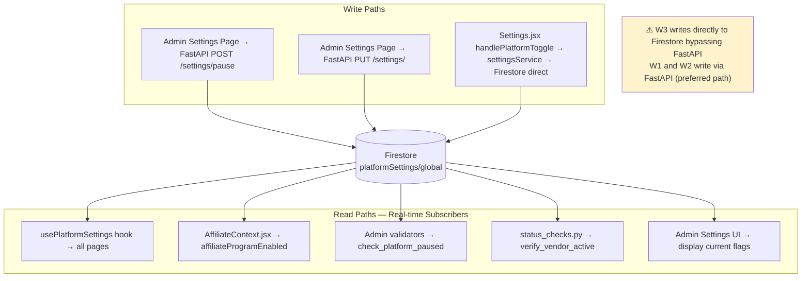

---

## 8. Real-time Listener Map

This table lists every `onSnapshot` / real-time Firestore listener in the frontend.

| File | Collection / Doc | Trigger | Updates |
|---|---|---|---|
| `AffiliateContext.jsx` | `platformSettings/global` | Always (mount) | `affiliateProgramEnabled` state |
| `AffiliateContext.jsx` | `users/{uid}` | Always (mount) | `isApproved`, `isSuspended`, `canPromote` |
| `AffiliateContext.jsx` | `affiliates` where `userId == uid` | Always (mount) | `affiliate` profile state |
| `AffiliateContext.jsx` | `affiliateConversions` where `affiliateId == affId` | After affiliate found | `conversions` state |
| `AffiliateContext.jsx` | `affiliatePayoutRequests` where `affiliateId == affId` | After affiliate found | `payouts` state |
| `AffiliateContext.jsx` | `affiliateActivity` where `affiliateId == affId` | After affiliate found | `activity` state |
| `AffiliateContext.jsx` | `notifications` where `userId == uid` | Always (mount) | `notifications` state |
| `AppContext.jsx` | `products` (all) | Mount | `products` state (merges with FastAPI data) |
| `CustomersManagement.jsx` | `users` (role=customer) | Mount | Customers list |
| `CustomersManagement.jsx` | `orders` (all) | Mount | Orders joined with customers |
| `dashboardService.js` | `orders` (all) | Subscribe call | Dashboard revenue stats |
| `dashboardService.js` | `reviews` (all) | Subscribe call | Dashboard review stats |
| `dashboardService.js` | `reports` (all) | Subscribe call | Dashboard report count |
| `analyticsService.js` | `orders` (all) | Subscribe call | Real-time order analytics |
| `analyticsService.js` | `reviews` (all) | Subscribe call | Real-time review analytics |
| `reportsService.js` | `reports` (all) | Subscribe call | Live report list |
| `settingsService.js` | `platformSettings/global` | Subscribe call | Platform feature flags |
| `usePlatformSettings.js` | `platformSettings/global` | Mount | Settings for any component |
| `paymentService.js` | `orders` (all) | Subscribe call | Payment telemetry |
| `paymentService.js` | `users` (all) | Subscribe call | Vendor list for payout calc |

### Listener Dependency Graph

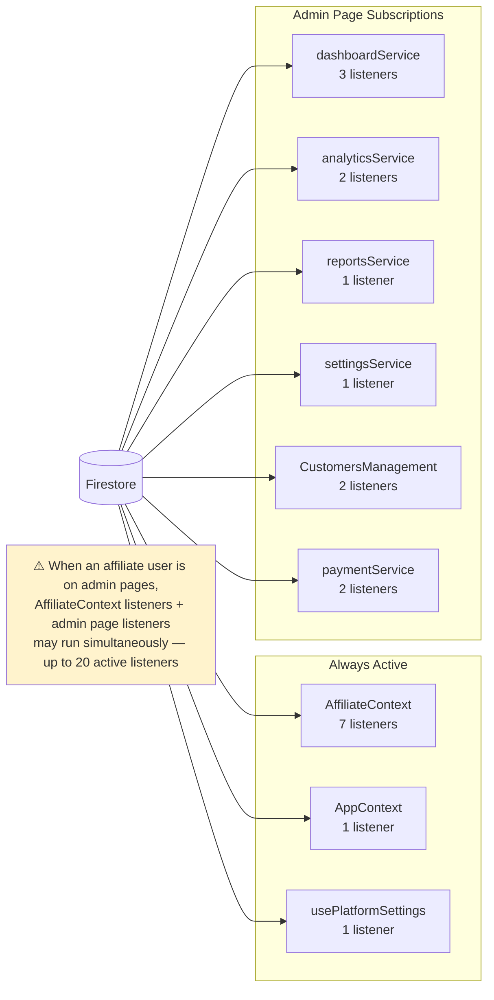
