# Lumora — Connectivity Flow Map
> Complete data flow diagrams for every major system in the platform.
> Date: July 2, 2026

---

## Table of Contents

1. [System Connectivity Overview](#1-system-connectivity-overview)
2. [Products Flow](#2-products-flow)
3. [Orders Flow](#3-orders-flow)
4. [Users & Roles Flow](#4-users--roles-flow)
5. [Vendor Control Flow](#5-vendor-control-flow)
6. [Affiliate Control Flow](#6-affiliate-control-flow)
7. [Payments Flow](#7-payments-flow)
8. [Global Pause Flow](#8-global-pause-flow)
9. [Platform Settings Flow](#9-platform-settings-flow)
10. [Referral Codes Flow](#10-referral-codes-flow)
11. [Analytics Flow](#11-analytics-flow)
12. [Full Dependency Graph](#12-full-dependency-graph)

---

## 1. System Connectivity Overview

```mermaid
graph TD
    subgraph Roles
        ADM[Admin]
        VEN[Vendor]
        AFF[Affiliate]
        CUS[Customer]
    end

    subgraph Gateway["FastAPI Write Gate"]
        AUTH[/api/auth]
        PROD[/api/products]
        ORD[/api/orders]
        VEND[/api/vendors]
        AFFAPI[/api/affiliate]
        ADMIN[/api/admin]
    end

    subgraph Stores
        SQL[(SQLite)]
        FS[(Firestore)]
    end

    ADM -->|JWT| ADMIN
    VEN -->|JWT| VEND
    VEN -->|JWT| PROD
    AFF -->|JWT| AFFAPI
    AFF -.->|direct SDK — bypass| FS
    CUS -->|JWT| ORD
    CUS -->|JWT| PROD

    ADMIN -->|read/write| FS
    ADMIN -->|write| SQL
    VEND -->|read/write| SQL
    PROD -->|write| SQL
    PROD -->|sync| FS
    ORD -->|write| SQL
    ORD -.->|missing sync| FS
    AFFAPI -->|read/write| SQL

    style FS fill:#1a73e8,color:#fff
    style SQL fill:#2c3e50,color:#fff
    style Gateway fill:#f0e8f8
```

---

## 2. Products Flow

### Write Path (Vendor or Admin Creates Product)

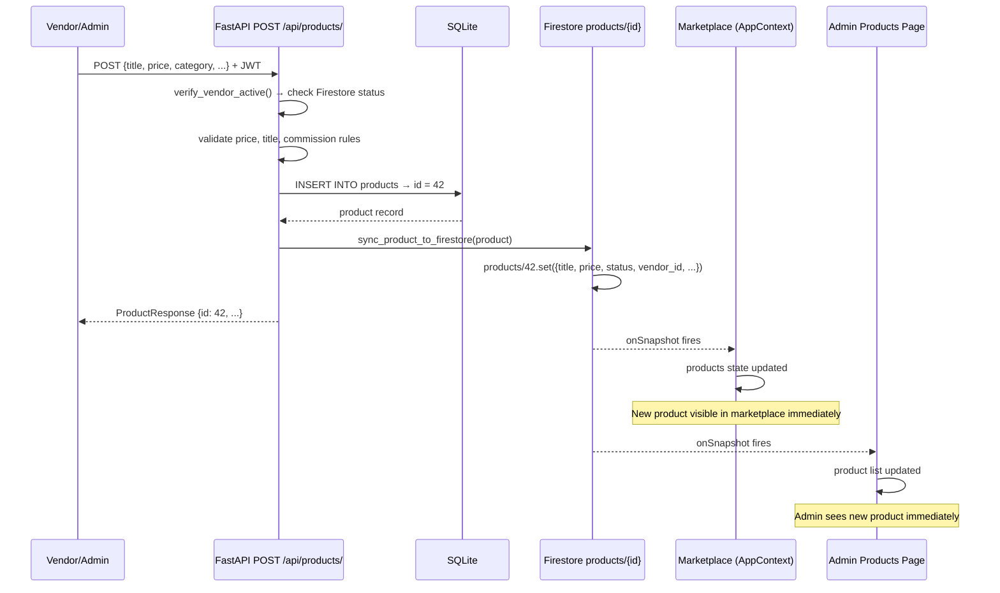

### Read Path (Marketplace)

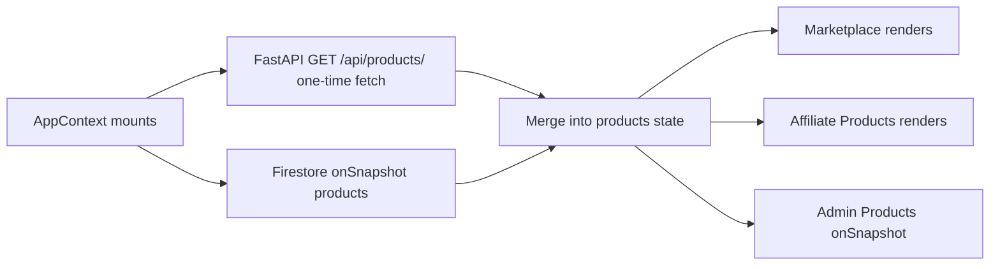

### Delete Path

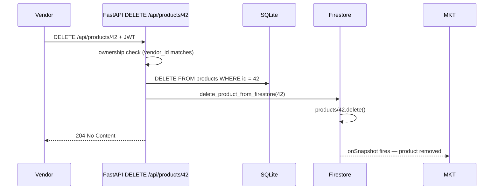

---

## 3. Orders Flow

### Current State (Broken)

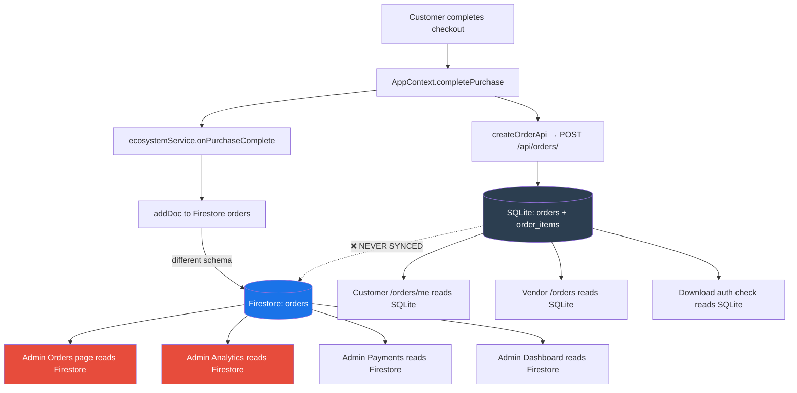

### What the Order Schema Looks Like in Each Store

| Field | SQLite (canonical) | Firestore (ecosystemService) |
|---|---|---|
| ID | integer auto-increment | `ORD-{timestamp}` string |
| user_id | integer FK | customerId (Firebase UID) |
| total_amount | decimal | totalUSD + totalINR |
| status | "completed" (default) | "completed" |
| items | order_items table | embedded array |
| created_at | datetime | ISO string |
| Product link | product_id (FK) | productId (Firestore doc ID string) |

**The two schemas are incompatible.** An admin order update via FastAPI touches Firestore; the same order in SQLite is never updated.

### Target State (After Fix)

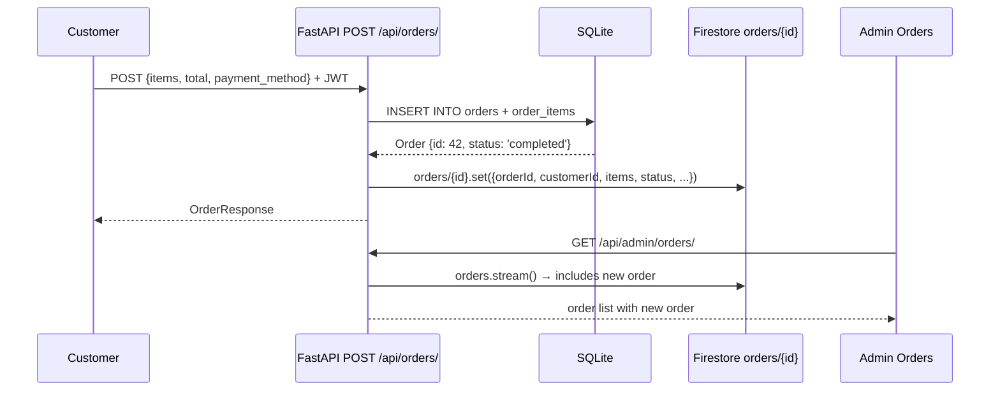

---

## 4. Users & Roles Flow

```mermaid
flowchart TD
    subgraph Registration
        R1[Customer registers] --> R2[Firebase createUser]
        R2 --> R3[Firestore users/{uid}.set role=customer]
        R3 --> R4[Firestore customers/{uid}.set]
        R2 --> R5[POST /api/auth/firebase-sync]
        R5 --> R6[SQLite INSERT users role=customer]
    end

    subgraph VendorReg["Vendor Registration"]
        V1[Vendor registers] --> V2[Firebase createUser]
        V2 --> V3[Firestore users/{uid} role=vendor]
        V2 --> V4[Firestore vendors/{uid}.set]
        V2 --> V5[POST /api/auth/firebase-sync role=vendor]
        V5 --> V6[SQLite INSERT users role=vendor]
    end

    subgraph AffReg["Affiliate Auto-Creation"]
        A1[User navigates /affiliate] --> A2[AffiliateContext mounts]
        A2 --> A3{affiliates where userId==uid?}
        A3 -->|not found| A4[Firestore affiliates/{uid}.set commissionRate=30]
        A4 --> A5[Firestore users/{uid}.update role=Affiliate]
        A3 -->|found| A6[load affiliate data via onSnapshot]
        Note over A4: ⚠️ No FastAPI call — no validation
    end
```

---

## 5. Vendor Control Flow

### Admin Enables / Disables Vendor

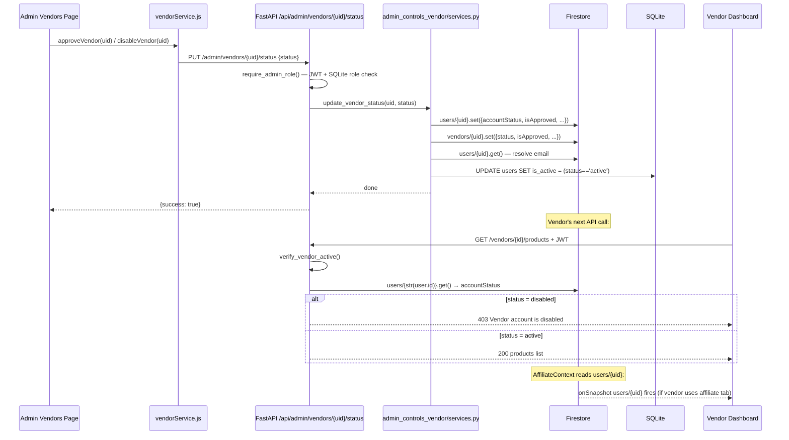

### Vendor Sees Status Change — Real-time Path

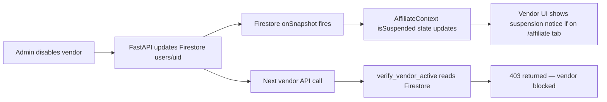

---

## 6. Affiliate Control Flow

### Admin Enables / Disables Affiliate

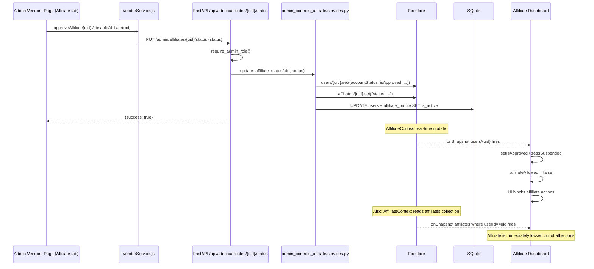

### Affiliate Conversion Creation — Current (Broken) vs Target

```mermaid
flowchart TD
    subgraph Current["Current State — Client-Side (Broken)"]
        P1[Customer purchases via ?ref=AFF001] --> P2[AppContext.completePurchase]
        P2 --> P3[ecosystemService.onPurchaseComplete]
        P3 --> P4[affiliateService.createConversionsForOrder]
        P4 --> P5[Firestore affiliateConversions.add<br/>commission calculated in browser]
        P4 --> P6[Firestore affiliates/id.update<br/>totalCommission++]
        P4 --> P7[Firestore affiliateLinks/id.update<br/>conversions++]
        style P5 fill:#e74c3c,color:#fff
    end

    subgraph Target["Target State — FastAPI Validated"]
        T1[Customer purchases via ?ref=AFF001] --> T2[POST /api/orders/ {ref_code}]
        T2 --> T3[FastAPI validates + INSERT SQLite orders]
        T3 --> T4[check_and_create_affiliate_conversion]
        T4 --> T5[Firestore affiliateConversions.add<br/>commission calculated server-side]
        T4 --> T6[Firestore affiliates/id.update]
        T5 --> T7[AffiliateContext onSnapshot picks up new conversion]
        style T5 fill:#27ae60,color:#fff
    end
```

---

## 7. Payments Flow

### Current State

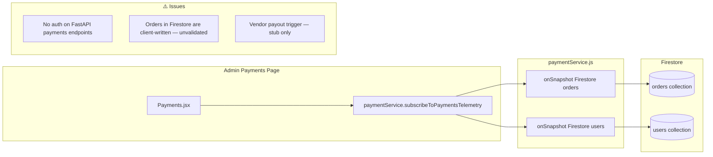

### Vendor Payout Trigger

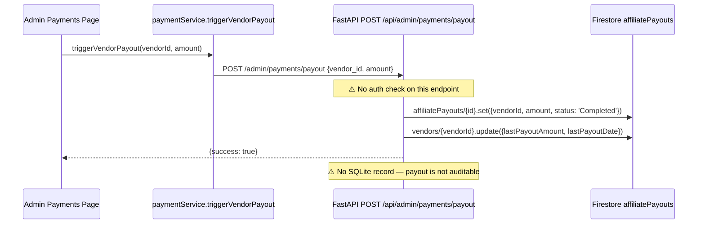

---

## 8. Global Pause Flow

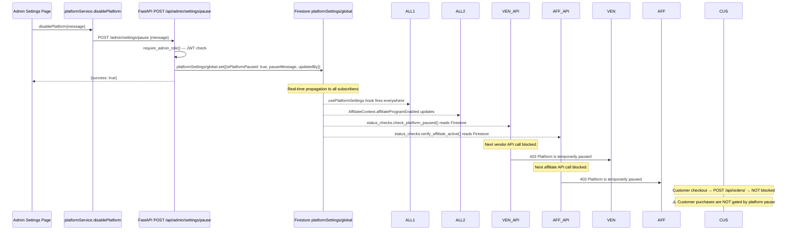

**Finding:** Customer orders go through `POST /api/orders/` which does NOT call `check_platform_paused()`. Only vendor and affiliate operations are blocked by the platform pause.

---

## 9. Platform Settings Flow

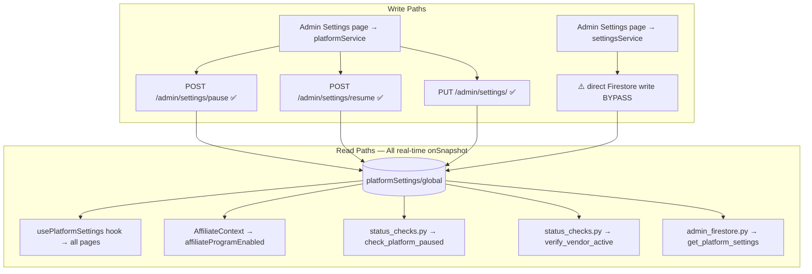

---

## 10. Referral Codes Flow

### Affiliate Referral Link Flow

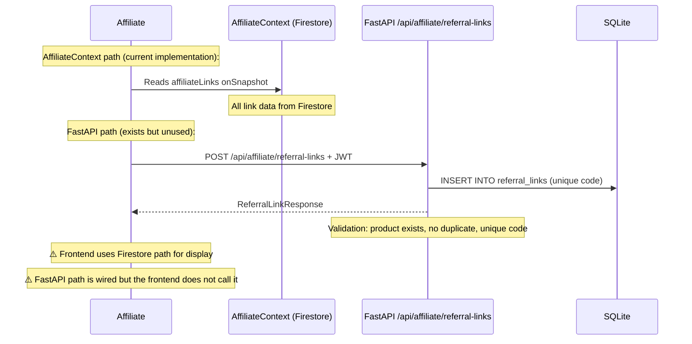

### Admin Referral Link (CampaignManager)

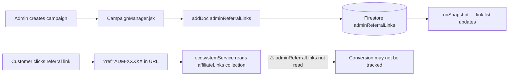

**Finding:** Admin referral links in `adminReferralLinks` are not read by `ecosystemService.js`. The ecosystem service looks up `affiliateLinks` collection. Admin campaigns are created in a separate, disconnected collection.

---

## 11. Analytics Flow

### Admin Dashboard Analytics

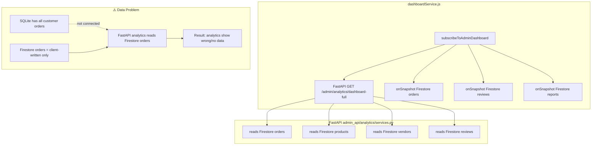

### Vendor Analytics (Working Correctly)

```mermaid
flowchart LR
    VA[Vendor Analytics.jsx] --> VH[useVendorData hooks]
    VH --> FA1[GET /vendors/id/orders]
    VH --> FA2[GET /vendors/id/products]
    FA1 --> SQL[(SQLite orders)]
    FA2 --> SQL
    SQL --> VH --> VA
    Note over VA: All real data from SQLite via FastAPI
    Note over VA: ⚠️ "Views" metrics are hardcoded multipliers
```

---

## 12. Full Dependency Graph

```mermaid
graph LR
    subgraph Admin
        ADM_DASH[Admin Dashboard]
        ADM_PROD[Admin Products]
        ADM_VEND[Admin Vendors]
        ADM_AFF[Admin Affiliates]
        ADM_ORD[Admin Orders]
        ADM_ANA[Admin Analytics]
        ADM_SET[Admin Settings]
        ADM_REP[Admin Reports]
        ADM_PAY[Admin Payments]
        ADM_CAM[Campaign Manager]
        ADM_PRO[Promotions]
    end

    subgraph Vendor
        VEN_DASH[Vendor Dashboard]
        VEN_PROD[Vendor Products]
        VEN_ORD[Vendor Orders]
    end

    subgraph Affiliate
        AFF_DASH[Affiliate Dashboard]
        AFF_EARN[Affiliate Earnings]
    end

    subgraph Customer
        CUS_MKT[Marketplace]
        CUS_ORD[Customer Orders]
        CUS_DL[Downloads]
    end

    subgraph FastAPI
        FA_APROD[/api/products]
        FA_AORD[/api/orders]
        FA_VEND[/api/vendors]
        FA_AFF[/api/affiliate]
        FA_ADMIN[/api/admin]
    end

    subgraph Firestore
        FS_PROD[(products)]
        FS_ORD[(orders)]
        FS_USR[(users/vendors/affiliates)]
        FS_SET[(platformSettings)]
        FS_REP[(reports)]
        FS_ACONV[(affiliateConversions)]
        FS_ADMIN[(adminReferralLinks<br/>adminPromotions)]
    end

    SQL_DB[(SQLite)]

    ADM_PROD --> FA_ADMIN --> FS_PROD
    ADM_PROD -.->|onSnapshot| FS_PROD
    ADM_VEND --> FA_ADMIN --> FS_USR
    ADM_AFF --> FA_ADMIN --> FS_USR
    ADM_ORD --> FA_ADMIN --> FS_ORD
    ADM_ANA --> FA_ADMIN --> FS_ORD
    ADM_SET --> FA_ADMIN --> FS_SET
    ADM_REP --> FA_ADMIN --> FS_REP
    ADM_PAY -.->|onSnapshot| FS_ORD
    ADM_CAM -.->|onSnapshot| FS_ADMIN
    ADM_PRO -.->|onSnapshot| FS_ADMIN

    VEN_DASH --> FA_VEND --> SQL_DB
    VEN_PROD --> FA_VEND --> SQL_DB
    VEN_ORD --> FA_VEND --> SQL_DB

    AFF_DASH --> FA_AFF --> SQL_DB
    AFF_EARN --> FA_AFF --> SQL_DB
    AFF_EARN -.->|AffiliateContext| FS_ACONV

    CUS_MKT -.->|onSnapshot| FS_PROD
    CUS_ORD --> FA_AORD --> SQL_DB
    CUS_DL --> FA_APROD --> SQL_DB

    FA_APROD --> SQL_DB
    FA_APROD --> FS_PROD

    style FS_ORD fill:#e74c3c,color:#fff
    style FA_ADMIN fill:#7b3fa0,color:#fff
    style SQL_DB fill:#2c3e50,color:#fff
```

*Red node = Firestore orders collection — broken data source.*
