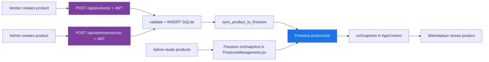
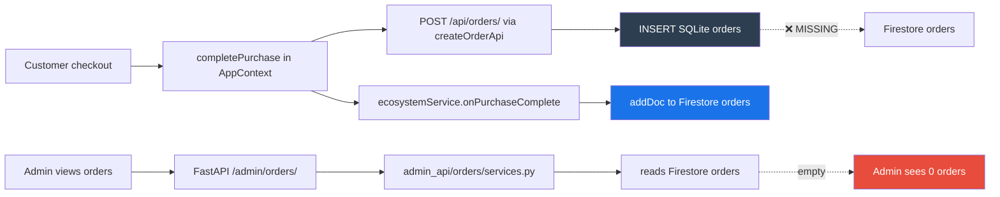
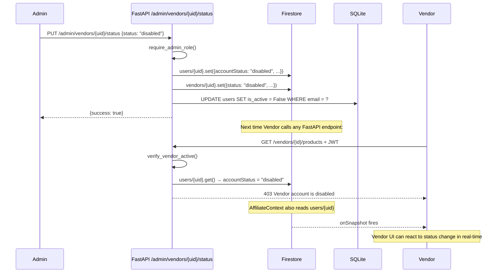
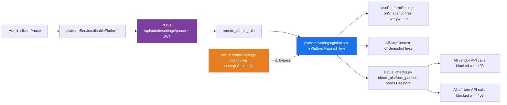

# Lumora — Hybrid Backend Analysis
> Detailed analysis of which parts of the platform use Firestore, FastAPI, or both.
> Includes consistency evaluation and recommendations per module.
> Date: July 2, 2026

---

## Table of Contents

1. [Hybrid Architecture Definition](#1-hybrid-architecture-definition)
2. [Module Classification](#2-module-classification)
3. [Consistency Evaluation by Feature](#3-consistency-evaluation-by-feature)
4. [Dual-Write Pattern Analysis](#4-dual-write-pattern-analysis)
5. [Firestore-Only Zones (Risk Assessment)](#5-firestore-only-zones-risk-assessment)
6. [FastAPI-Only Zones (Assessment)](#6-fastapi-only-zones-assessment)
7. [Recommended Classification for Every Module](#7-recommended-classification-for-every-module)

---

## 1. Hybrid Architecture Definition

Lumora uses three data layers:

| Layer | Role | Technology |
|---|---|---|
| **Firebase Auth** | Identity provider | Firebase Authentication |
| **Firestore** | Real-time read bus + admin-only collections | Google Cloud Firestore |
| **SQLite + FastAPI** | Canonical write store + business logic | SQLAlchemy + FastAPI |

The intended pattern is:

> **FastAPI is the write gate. Firestore is the read bus.**
> Every business-significant write goes through FastAPI → SQLite (canonical) → Firestore sync (real-time UI).

This pattern is correctly implemented for **products** and **vendor management**. It is missing or broken for **orders**, **affiliate commissions**, and **platform settings** (partial bypass).

---

## 2. Module Classification

```mermaid
quadrantChart
    title Lumora Module Architecture Classification
    x-axis "FastAPI Involvement" 0 --> 100
    y-axis "Firestore Involvement" 0 --> 100
    quadrant-1 "Hybrid (Correct)"
    quadrant-2 "Firestore Only"
    quadrant-3 "Neither (Client-only)"
    quadrant-4 "FastAPI Only (Correct)"
    Products CRUD: [80, 70]
    Vendor Dashboard: [95, 5]
    Admin Settings: [60, 85]
    Admin Reports: [65, 80]
    Affiliate System: [10, 90]
    Platform Settings Read: [5, 95]
    Admin Orders: [50, 85]
    Customer Orders: [90, 10]
    Auth Bridge: [70, 60]
    Admin Analytics: [55, 80]
    CampaignManager: [5, 95]
    Promotions: [5, 95]
    Payments Admin: [20, 85]
```

### Classification Summary

| Module | Classification | Correct? |
|---|---|---|
| **Products (marketplace read)** | Firestore onSnapshot | ✅ Correct for real-time display |
| **Products (vendor/admin write)** | FastAPI → SQLite + Firestore sync | ✅ Correct pattern |
| **Vendor Dashboard (all pages)** | FastAPI only | ✅ Correct |
| **Customer Orders** | FastAPI only | ✅ Correct |
| **Admin Products** | Hybrid (Firestore read + FastAPI write) | ✅ Correct |
| **Admin Vendors/Affiliates** | Hybrid (Firestore list + FastAPI status) | ✅ Correct |
| **Admin Settings** | Hybrid (FastAPI write + Firestore read) | ✅ Correct |
| **Admin Reports** | Hybrid (FastAPI actions + Firestore live) | ✅ Correct — use as template |
| **Admin Reviews** | FastAPI → Firestore proxy | ✅ Correct |
| **Admin Analytics** | FastAPI → Firestore reads | ⚠️ Works but source missing |
| **Admin Orders** | FastAPI → Firestore reads | ❌ Orders not in Firestore |
| **Admin Payments** | Firestore only (no auth) | ❌ Insecure |
| **Admin Dashboard** | Hybrid (FastAPI + Firestore subs) | ⚠️ Partial |
| **Admin Customers** | Firestore only (page ignores FastAPI endpoint) | ⚠️ Inconsistent |
| **Affiliate (frontend)** | Firestore only | ❌ Bypasses all validation |
| **Affiliate (FastAPI module)** | FastAPI only (disconnected) | ❌ Not used by frontend |
| **ecosystemService** | Firestore only (post-purchase) | ❌ Unvalidated client writes |
| **purchaseService** | Firestore only (duplicate records) | ❌ Duplicate of SQLite orders |
| **CampaignManager** | Firestore only | ⚠️ Acceptable for admin-only tool |
| **PromotionsManagement** | Firestore only | ⚠️ Acceptable for admin-only tool |
| **Platform Settings (read)** | Firestore onSnapshot | ✅ Correct |
| **Platform Settings (write via bypass)** | Firestore direct from settingsService | ❌ Bypasses FastAPI auth check |

---

## 3. Consistency Evaluation by Feature

### Products



**Verdict: ✅ Consistent.** Both write paths go through FastAPI. Read path uses Firestore. The dual-write pattern is correct.

---

### Orders



**Verdict: ❌ Broken.** Two separate write paths create two separate order records. FastAPI writes SQLite. `ecosystemService` writes Firestore. Admin reads only Firestore. The SQLite orders are invisible to the Admin.

**Root cause:** `POST /api/orders/` has no Firestore sync step. `ecosystemService.js` creates a Firestore `orders` doc client-side with a different schema than what FastAPI expects.

---

### Vendor Status Control



**Verdict: ✅ Consistent.** Admin action goes through FastAPI. FastAPI updates both Firestore (live status) and SQLite (is_active flag). Vendor is blocked on next API call. Real-time UI update possible via onSnapshot.

---

### Affiliate Status Control

Same pattern as Vendor. `PUT /api/admin/affiliates/{uid}/status` goes through FastAPI → updates Firestore `users` + `affiliates` + SQLite `is_active`. ✅ Consistent.

**However:** The affiliate frontend reads status from Firestore `affiliates` collection directly via AffiliateContext. This means the status update IS visible to the affiliate in real-time. ✅ This part works correctly.

---

### Platform Pause/Resume



**Verdict: ✅ Mostly correct.** FastAPI is the proper write gate. The bypass in `settingsService.js` is the only inconsistency — some setting toggles write directly to Firestore from the browser without going through FastAPI.

---

## 4. Dual-Write Pattern Analysis

The intended pattern — **FastAPI writes SQLite + syncs to Firestore** — is only implemented for products.

| Feature | SQLite → Firestore Sync? | Who Syncs |
|---|---|---|
| Products (create) | ✅ | `sync_product_to_firestore()` in products_router.py |
| Products (update) | ✅ | `sync_product_to_firestore()` in products_router.py |
| Products (delete) | ✅ | `delete_product_from_firestore()` in products_router.py |
| Orders (create) | ❌ Missing | Should sync in orders/routes.py POST / |
| Orders (status update) | ❌ Updates Firestore only | admin_api/orders/services.py — no SQLite update |
| Reviews (create) | ❌ Missing | SQLite only — admin analytics read Firestore reviews |
| Vendor status | ✅ | admin_controls_vendor/services.py |
| Affiliate status | ✅ | admin_controls_affiliate/services.py |
| Platform settings | ✅ via FastAPI | admin/routes/settings.py |

---

## 5. Firestore-Only Zones (Risk Assessment)

### High Risk

**`affiliateConversions` — client-side commission writes**

`ecosystemService.js` calculates commission amount in the browser and writes directly to Firestore. No server validation. Commission rates are hardcoded in the client. An attacker could modify the JavaScript to inflate commission values.

**`orders` (Firestore) — client-side order creation**

`ecosystemService.js` creates Firestore `orders` documents client-side. The order total, product name, and status are all controlled by the browser. Since admin analytics and order management read from this collection, fabricated orders would appear real in the admin panel.

**`affiliatePayoutRequests` — bypasses FastAPI payout endpoint**

`affiliateService.js` creates payout requests directly in Firestore. The validated `POST /api/affiliate/payouts` endpoint (which checks minimum amount, prevents duplicates, and validates against approved balance) is bypassed entirely.

**`affiliates` — auto-created by frontend with hardcoded commission**

`AffiliateContext.jsx` auto-creates an affiliate doc in Firestore for any logged-in user with `commissionRate: 30`, `status: 'active'`. No admin approval required. No backend validation.

### Medium Risk

**`promotionTransactions` — admin can mark paid directly in Firestore**

`PromotionsManagement.jsx` calls `updateDoc` directly on `promotionTransactions` to disburse cash. No server-side financial record. No audit trail in SQLite.

**`adminReferralLinks` — admin creates referral codes directly in Firestore**

`CampaignManager.jsx` writes referral codes directly to Firestore. Commission percentages set by the admin in the browser are stored without any backend validation.

**`settingsService.js` — feature flag bypass**

`settingsService.js` writes `platformSettings/global` directly from the browser for feature toggles (not pause/resume). The admin auth check in FastAPI is bypassed for this path.

---

## 6. FastAPI-Only Zones (Assessment)

The following modules are pure FastAPI (no Firestore involvement). All are working correctly.

| Module | Endpoints | Assessment |
|---|---|---|
| **Vendor system** | 14 endpoints | ✅ Best-designed module |
| **Customer orders** | 3 endpoints | ✅ Correct |
| **Customer downloads** | 1 endpoint | ✅ Secure ownership check |
| **Reviews CRUD** | 6 endpoints | ✅ Verified purchase check |
| **Cart / Wishlist** | All | ✅ |
| **Notifications** | All | ✅ |
| **File uploads** | 2 endpoints | ✅ JWT protected |
| **Affiliate (SQLAlchemy module)** | 13 endpoints | ✅ Correctly built, **not used by frontend** |

**Notable finding:** The FastAPI affiliate module (`/api/affiliate/*`) is complete, validated, and correct. It has duplicate prevention for payouts, balance checks, and validated commission records. The affiliate frontend ignores it entirely and uses Firestore instead.

---

## 7. Recommended Classification for Every Module

| Operation | Keep Firestore? | Keep FastAPI? | Change? | Reason |
|---|---|---|---|---|
| Products — marketplace read | ✅ onSnapshot | — | Keep | Real-time catalog updates |
| Products — create/update/delete | — | ✅ write gate | Keep | Validation + dual write |
| Orders — customer checkout | — | ✅ write gate | **Add Firestore sync** | Admin reads Firestore; SQLite is canonical |
| Orders — admin management | ✅ read via FastAPI | ✅ gateway | **Fix sync** | FastAPI must write SQLite too |
| Vendor Dashboard | — | ✅ pure FastAPI | Keep | Clean and correct |
| Vendor status (admin) | ✅ live status | ✅ write gate | Keep | Correct pattern |
| Affiliate (frontend) | ❌ remove direct writes | ✅ route through FastAPI | **Fix** | Security: client writes unvalidated |
| Affiliate (FastAPI module) | — | ✅ already built | **Wire up frontend** | The code exists, unused |
| Affiliate status (admin) | ✅ live status | ✅ write gate | Keep | Correct pattern |
| Platform settings — read | ✅ onSnapshot | — | Keep | Real-time flag propagation |
| Platform settings — write | — | ✅ FastAPI only | **Remove bypass** | settingsService bypass is a risk |
| Platform pause/resume | ✅ propagation | ✅ write gate | Keep | Correct pattern |
| Admin analytics | ✅ aggregation source | ✅ proxy/cache | **Fix data source** | Fix order sync first |
| Admin reports | ✅ live list | ✅ actions | Keep | Best implementation |
| Admin reviews | — | ✅ proxy | Keep | Correct |
| Admin payments | ✅ live data | ✅ add auth check | **Add auth** | Payment endpoints have no auth |
| CampaignManager | ✅ Firestore only | — | Acceptable | Admin-only, low financial risk |
| PromotionsManagement | ✅ Firestore only | — | Acceptable | Admin-only, consider SQLite audit trail |
| Customer purchases (Firestore) | ❌ remove | — | **Remove** | Duplicate of SQLite orders |
| Commission calculation | ❌ remove client-side | ✅ move to FastAPI | **Fix** | Financial data must be server-validated |
