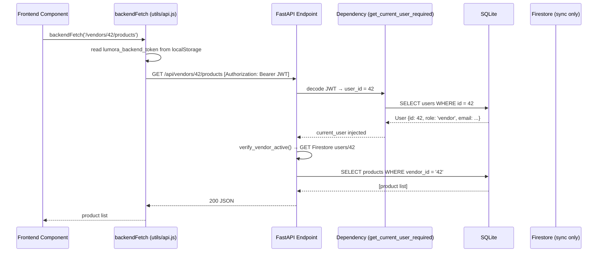
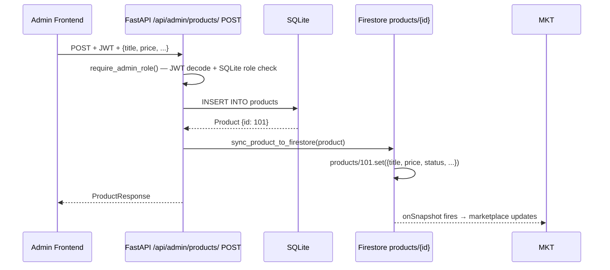
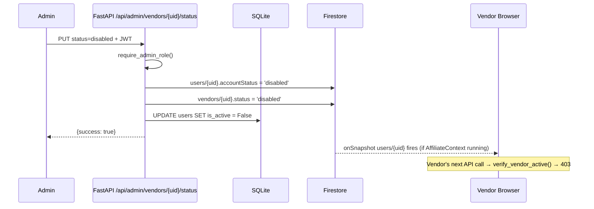
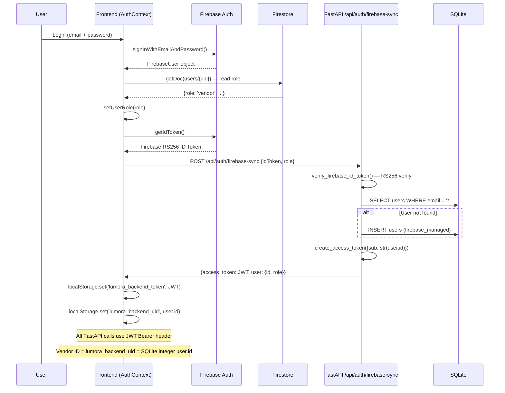
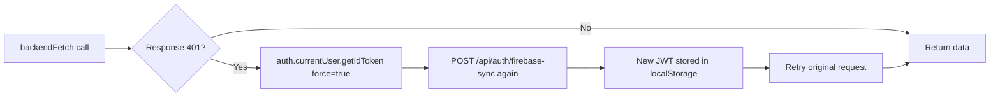
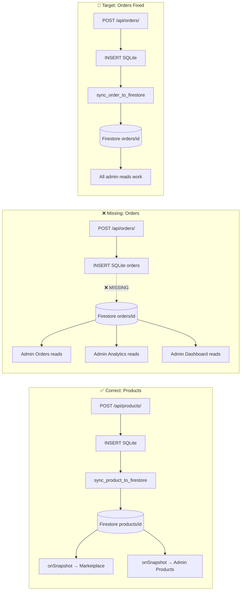

# Lumora — System Backend Architecture
> Complete backend architecture reference.
> Date: July 2, 2026

---

## Table of Contents

1. [Tech Stack](#1-tech-stack)
2. [Responsibility Boundaries](#2-responsibility-boundaries)
3. [Directory Structure](#3-directory-structure)
4. [Request Lifecycle](#4-request-lifecycle)
5. [Three-Layer Data Model](#5-three-layer-data-model)
6. [Authentication Architecture](#6-authentication-architecture)
7. [Real-time Architecture](#7-real-time-architecture)
8. [Dual-Write Pattern](#8-dual-write-pattern)

---

## 1. Tech Stack

| Layer | Technology | Role |
|---|---|---|
| **Identity** | Firebase Authentication | User identity, session tokens |
| **Real-time DB** | Google Cloud Firestore | Live UI updates, status propagation, dashboard feeds |
| **API Layer** | FastAPI (Python) | Business logic, validation, transactions, admin controls |
| **Canonical DB** | SQLite (SQLAlchemy) | Authoritative data store for orders, products, users, reviews |
| **File Storage** | Local filesystem + Cloudflare R2 | Product file uploads |
| **Frontend** | React + Vite + Tailwind | UI for Admin, Vendor, Affiliate, Customer portals |
| **Auth Bridge** | `POST /api/auth/firebase-sync` | Exchanges Firebase token for backend JWT |

---

## 2. Responsibility Boundaries

### FastAPI Owns

- All business logic validation (price constraints, commission rules, ownership checks)
- Every write that has financial consequences (orders, payouts, commissions)
- Admin controls: vendor enable/disable, affiliate enable/disable, product CRUD
- Platform actions: global pause/resume, feature flag writes, settings
- Transactions requiring multiple table writes (order + order_items + product.downloads)
- Authentication token issuance
- File uploads
- Download authorization (verified purchase check)
- Report generation and analytics aggregation
- Batch operations and bulk updates

### Firestore Owns

- Real-time dashboard KPI feeds (orders, reviews, reports)
- Live product catalog (onSnapshot for marketplace and admin)
- Vendor/affiliate status (read by frontend for live UI blocking)
- Platform settings propagation (isPlatformPaused, feature flags)
- Affiliate activity streams (conversions, payouts, activity logs)
- Admin campaign/promotion data
- Authentication audit logs
- All real-time listener data consumed by frontend

### Firebase Authentication Owns

- User identity (email/password, Google, GitHub)
- Session management and token refresh
- Email verification
- Password reset

### What Should NOT Happen

| Violation | Current Status | Must Fix? |
|---|---|---|
| Browser writes commission amounts to Firestore | ❌ Exists in ecosystemService.js | Yes — P2 |
| Browser creates affiliate profiles in Firestore | ❌ Exists in AffiliateContext.jsx | Yes — P2 |
| Admin writes feature flags directly to Firestore | ❌ Exists in settingsService.js | Yes — P2 |
| Admin payments endpoints have no auth check | ❌ Exists in admin_api/payments/ | Yes — P2 |
| Orders written to SQLite but admin reads Firestore | ❌ Missing sync | Yes — P1 |

---

## 3. Directory Structure

```
backend/
├── app/
│   ├── main.py                    FastAPI app — all routers registered
│   ├── dependencies.py            Shared JWT dependencies
│   ├── api/
│   │   ├── auth_router.py         Auth: register, login, firebase-sync, /me
│   │   ├── products_router.py     Product CRUD (public + vendor) + Firestore sync
│   │   ├── orders/                Order creation + read (SQLite only — NEEDS sync)
│   │   ├── vendors/               Full vendor dashboard API (pure FastAPI + SQLite)
│   │   ├── reviews/               Review CRUD with verified purchase check
│   │   ├── affiliate/             Complete affiliate system (SQLAlchemy)
│   │   ├── cart_router.py         Cart CRUD
│   │   ├── wishlist_router.py     Wishlist CRUD
│   │   ├── notifications_router.py Notifications
│   │   ├── upload_router.py       File uploads → local/R2
│   │   └── ...                    (messages, price-alerts, search, history, etc.)
│   ├── admin_api/
│   │   ├── routes.py              Aggregates ALL admin sub-routers under /api/admin/
│   │   ├── analytics/             Firestore reads → KPI aggregation
│   │   ├── orders/                Firestore reads/writes for admin order management
│   │   ├── customers/             Firestore reads for customer list
│   │   ├── payments/              Firestore reads + payout trigger (needs auth fix)
│   │   ├── reports/               Firestore reads/writes (working correctly)
│   │   └── reviews/               Firestore reads/moderate (working correctly)
│   ├── core/
│   │   ├── firebase.py            Firebase ID token verifier (RS256, no Admin SDK)
│   │   ├── security.py            JWT create/decode (HS256)
│   │   ├── config.py              Settings from .env
│   │   └── database.py            (vestigial — not used)
│   ├── db/
│   │   ├── database.py            SQLAlchemy engine
│   │   └── session.py             get_db dependency
│   ├── models/                    SQLAlchemy models (User, Product, Order, Review, etc.)
│   ├── schemas/                   Pydantic schemas
│   └── shared/
│       └── firebase/
│           └── connection.py      firebase_admin SDK init → exports db, firebase_connected
│
├── admin/
│   ├── routes/                    Admin CRUD routes (products, vendors, affiliates, etc.)
│   │   ├── products.py            SQLite CRUD + Firestore sync
│   │   ├── vendors.py             Firestore list + FastAPI status write
│   │   ├── affiliates.py          Firestore list + FastAPI status write
│   │   ├── settings.py            Firestore read/write for platform settings
│   │   ├── analytics.py           Shim → app/admin_api/analytics/
│   │   ├── customers.py           Shim → app/admin_api/customers/
│   │   ├── orders.py              Shim → app/admin_api/orders/
│   │   ├── reviews.py             Shim → app/admin_api/reviews/
│   │   └── reports.py             Shim → app/admin_api/reports/
│   ├── validators/
│   │   ├── admin_auth.py          require_admin_role dependency
│   │   └── status_checks.py       check_platform_paused, verify_vendor_active, verify_affiliate_active
│   └── firestore/
│       └── admin_firestore.py     sync_product_to_firestore, delete_product_from_firestore, get_platform_settings
│
├── admin_controls_vendor/         Vendor status update service
│   ├── routes.py                  PUT /{uid}/status (NOT MOUNTED — dead code)
│   ├── services.py                update_vendor_status → dual write Firestore + SQLite
│   ├── firestore.py               update_vendor_status_in_firestore, get_vendor_status_from_firestore
│   └── validators.py              check_vendor_enabled
│
└── admin_controls_affiliate/      Affiliate status update service
    ├── routes.py                  PUT /{uid}/status (NOT MOUNTED — dead code)
    ├── services.py                update_affiliate_status → dual write Firestore + SQLite
    ├── firestore.py               update_affiliate_status_in_firestore, get_affiliate_status_from_firestore
    └── validators.py              check_affiliate_enabled
```

```
frontend/src/
├── pages/
│   ├── admin/                     Admin portal pages
│   ├── vendor/                    Vendor portal pages
│   ├── affiliate/                 Affiliate portal pages
│   └── customer/                  Customer portal pages
├── context/
│   ├── AuthContext.jsx            Firebase Auth + Firestore user doc + backend sync
│   ├── AppContext.jsx             Products (FastAPI + Firestore), cart, orders, checkout
│   └── AffiliateContext.jsx       7 Firestore onSnapshot listeners (affiliate data)
├── services/                      Feature-specific data access layer
├── hooks/                         Reusable data hooks (useVendorData, usePlatformSettings)
├── api/                           Thin FastAPI wrapper functions (productApi, vendorApi, etc.)
└── utils/
    └── api.js                     backendFetch — JWT auto-attach + 401 refresh
```

---

## 4. Request Lifecycle

### Standard Authenticated Request (Vendor / Customer)



### Admin Request with Firestore Sync



### Real-time Status Propagation (Admin → Vendor)



---

## 5. Three-Layer Data Model

```mermaid
graph LR
    subgraph SQLite["SQLite — Canonical Store"]
        S1[users]
        S2[products]
        S3[orders]
        S4[order_items]
        S5[reviews]
        S6[withdrawals]
        S7[affiliate_profiles]
        S8[affiliate_commissions]
        S9[affiliate_payouts]
        S10[referral_links]
        S11[cart_items]
        S12[wishlist]
        S13[notifications]
    end

    subgraph Firestore["Firestore — Real-time Read Bus"]
        F1[users]
        F2[products]
        F3[orders ⚠️ not synced from SQLite]
        F4[vendors]
        F5[affiliates]
        F6[affiliateConversions ⚠️ client-written]
        F7[affiliateLinks ⚠️ client-written]
        F8[affiliateActivity ⚠️ client-written]
        F9[affiliatePayoutRequests ⚠️ client-written]
        F10[platformSettings/global]
        F11[reports]
        F12[reviews ⚠️ not synced from SQLite]
        F13[notifications]
        F14[adminReferralLinks]
        F15[adminPromotions]
        F16[vendorStats ⚠️ client-written]
        F17[vendorNotifications ⚠️ written but never read]
        F18[purchases ⚠️ duplicate of SQLite orders]
    end

    subgraph Sync["Sync State"]
        SYNCED[✅ Synced: products\nFastAPI writes both]
        PARTIAL[⚠️ Partial: users status\nAdmin controls sync both]
        BROKEN[❌ Broken: orders, reviews\nSQLite only, Firestore unsynced]
        CLIENTONLY[❌ Client-only: conversions,\nlinks, vendorStats\nNo FastAPI involvement]
    end
```



### Which SQLite Tables Sync to Firestore

| SQLite Table | Firestore Collection | Sync Direction | Sync Mechanism | Status |
|---|---|---|---|---|
| `products` | `products` | SQLite → Firestore | `sync_product_to_firestore()` on every CRUD | ✅ Working |
| `users.is_active` | `users.accountStatus` | Both synced | admin_controls services | ✅ Working |
| `orders` | `orders` | **Missing** | Should sync in POST /api/orders/ | ❌ Missing |
| `reviews` | `reviews` | **Missing** | Never synced | ❌ Missing |
| All others | — | No sync | N/A | N/A |

---

## 6. Authentication Architecture



### Token Refresh Flow



### Admin Auth Gap (Current Broken State)

```javascript
// AuthContext.jsx — Admin bypass
if (email === 'admin@lumora.co' || email === 'admin@gmail.com') {
  // Sets localStorage mock. No Firebase. No backend JWT.
  localStorage.setItem('lumora_mock_user', JSON.stringify(mockUser));
}
// Result: require_admin_role() returns 401 for all admin API calls
```

**Fix required:** Create a real admin user in SQLite with `role = 'admin'` and run the full firebase-sync flow, OR modify admin login to call `POST /api/auth/login` with stored admin credentials and issue a real JWT.

---

## 7. Real-time Architecture

### Active onSnapshot Listeners Map

| Listener Location | Collection | Trigger | State Updated |
|---|---|---|---|
| `AffiliateContext.jsx` | `platformSettings/global` | Always active | `affiliateProgramEnabled` |
| `AffiliateContext.jsx` | `users/{uid}` | Always active | `isApproved`, `isSuspended`, `canPromote` |
| `AffiliateContext.jsx` | `affiliates` where `userId==uid` | Always active | `affiliate` profile |
| `AffiliateContext.jsx` | `affiliateConversions` where `affiliateId==affId` | After affiliate found | `conversions` |
| `AffiliateContext.jsx` | `affiliatePayoutRequests` where `affiliateId==affId` | After affiliate found | `payouts` |
| `AffiliateContext.jsx` | `affiliateActivity` where `affiliateId==affId` | After affiliate found | `activity` |
| `AffiliateContext.jsx` | `notifications` where `userId==uid` | Always active | `notifications` |
| `AppContext.jsx` | `products` (all) | On mount | `products` state |
| `Admin ProductsManagement` | `products` (all) | On mount | product list |
| `Admin CustomersManagement` | `users`, `orders` | On mount | customer + order list |
| `dashboardService.js` | `orders`, `reviews`, `reports` | On subscribe call | Admin Dashboard KPIs |
| `analyticsService.js` | `orders`, `reviews` | On subscribe call | Admin Analytics |
| `reportsService.js` | `reports` | On subscribe call | Admin Reports list |
| `settingsService.js` | `platformSettings/global` | On subscribe call | Settings page |
| `usePlatformSettings.js` | `platformSettings/global` | On mount | Settings for any page |
| `paymentService.js` | `orders`, `users` | On subscribe call | Admin Payments telemetry |
| `CampaignManager.jsx` | `adminReferralLinks`, `adminAnalytics/global`, `adminAffiliateOrders` | On mount | Campaign data |
| `PromotionsManagement.jsx` | `adminPromotions`, `promotionParticipants`, `promotionTransactions` | On mount | Promotion data |

### Listener Correctness Audit

| Listener | Has Cleanup? | Correct Dependency Array? | Duplicate? | Status |
|---|---|---|---|---|
| AffiliateContext 7 listeners | ✅ return () => unsub() | ✅ [user] | ❌ unsubConv guard exists | ✅ |
| AppContext products listener | ✅ return () => unsubscribe() | ✅ [] | ❌ no | ✅ |
| Admin ProductsManagement | ✅ | ✅ [] | ❌ | ✅ |
| Admin CustomersManagement | ✅ | ✅ [] | ❌ | ✅ |
| dashboardService subscribe | ✅ returns unsub | N/A (service) | ❌ | ✅ |
| analyticsService subscribe | ✅ | N/A | ❌ | ✅ |
| reportsService subscribe | ✅ | N/A | ❌ | ✅ |
| paymentService subscribe | ✅ | N/A | ❌ | ✅ |
| CampaignManager 3 listeners | ✅ return cleanup | ✅ [] | ❌ | ✅ |
| PromotionsManagement 3 listeners | ✅ return cleanup | ✅ [] | ❌ | ✅ |

**All listeners have proper cleanup. No memory leaks identified.**

---

## 8. Dual-Write Pattern

The correct pattern — already implemented for products — must be extended to orders and reviews.



### `sync_product_to_firestore` as the Template

```python
# admin/firestore/admin_firestore.py — exists and works
def sync_product_to_firestore(product):
    if not firebase_connected or db is None:
        return
    try:
        doc_ref = db.collection("products").document(str(product.id))
        doc_ref.set({ ... }, merge=True)
    except Exception as e:
        print(f"[firestore-sync] Error: {e}")

# Pattern to replicate for orders:
def sync_order_to_firestore(order, items):
    if not firebase_connected or db is None:
        return
    try:
        doc_ref = db.collection("orders").document(str(order.id))
        doc_ref.set({
            "orderId": f"ORD-{order.id}",
            "customerId": str(order.user_id),
            "items": [{"productId": str(i.product_id), "price": i.price_paid} for i in items],
            "totalINR": order.total_amount,
            "status": order.status,
            "paymentMethod": order.payment_method,
            "createdAt": order.created_at.isoformat() + "Z",
        }, merge=True)
    except Exception as e:
        print(f"[firestore-sync] Error syncing order: {e}")
```
